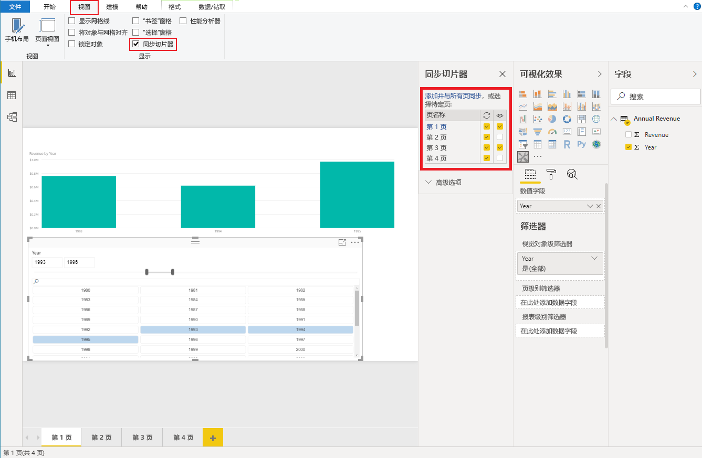

# <a name="sync-slicers-in-power-bi-visuals"></a>Power BI 视觉对象中的同步切片器

要支持[同步切片器](../../visuals/power-bi-visualization-slicers.md)功能，自定义切片器视觉对象必须使用 API 版本 1.13.0 或更高版本。

此外，需在 capabilities.json 文件中启用该选项，如下所示：

```json
{
    ...
    "supportsHighlight": true,
    "suppressDefaultTitle": true,
    "supportsSynchronizingFilterState": true,
    "sorting": {
        "default": {}
    }
}
```

更新 capabilities.json 文件后，可以在选择自定义切片器视觉对象时查看“同步切片器”选项窗格。

> [!NOTE]
> 同步切片器功能不支持多个字段。 如果切片器有多个字段（“类别”或“度量值”），则会禁用该功能 。



在“同步切片器”窗格中，可以看到切片器可见性以及切片器筛选可能会应用于多个报表页。