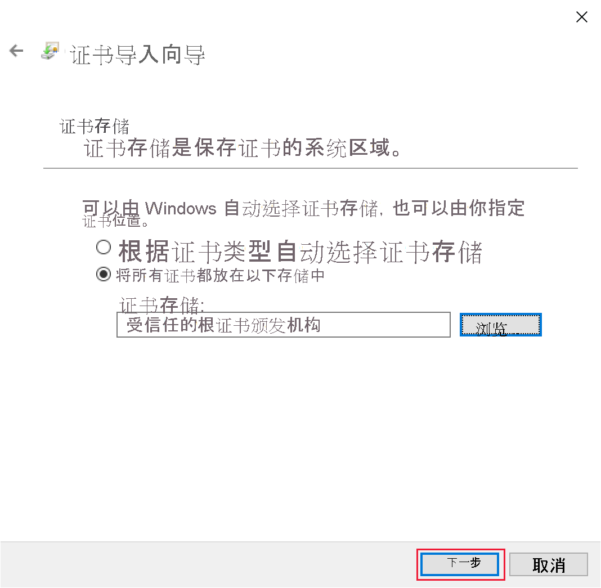
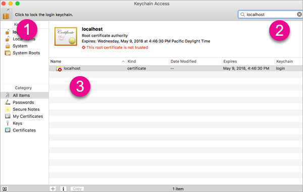
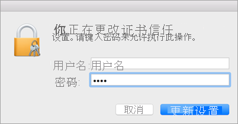

# <a name="set-up-your-environment-for-developing-a-power-bi-visual"></a>设置用于开发 Power BI 视觉对象的环境

本文介绍如何设置用于开发 Power BI 视觉对象的环境。

开始开发之前，需要安装 node.js 和 pbiviz 包。 还需要创建并安装证书。 设置本地环境后，需要配置 Power BI 服务，以便开发 Power BI 视觉对象。

本文将指导如何进行以下操作：
> [!div class="checklist"]
> * 安装 nodes.js。
> * 安装 pbiviz。
> * 创建和安装证书。
> * 设置 Power BI 服务以开发视觉对象。
> * 安装其他库（开发视觉对象所必需的步骤）。

## <a name="install-nodejs"></a>安装 Node.js

*Node.js* 是构建在 Chrome V8 JavaScript 引擎基础之上的 JavaScript 运行时。 它允许开发人员运行在 JavaScript 上创建的任何应用。

1. 若要安装 node.js，请在 Web 浏览器中导航到 [node.js](https://nodejs.org)。

2. 下载最新的 MSI 安装程序。

3. 运行安装程序，然后按安装步骤操作。 同意许可协议中的条款和所有默认设置。

4. 重新启动计算机。

## <a name="install-pbiviz"></a>安装 pbiviz

pbiviz 工具是使用 JavaScript 编写的，用于编译 pbiviz 包的视觉对象源代码。

pbiviz 包是一个压缩的 Power BI 视觉对象项目，其中包含所有所需的脚本和资产。

1. 打开 Windows PowerShell 并输入以下命令。

    ```powershell
    npm i -g powerbi-visuals-tools
    ```

## <a name="create-and-install-a-certificate"></a>创建和安装证书

要使客户端（你的计算机）和服务器（Power BI 服务）实现安全交互，需要[安全套接字层 (SSL) 证书](create-ssl-certificate.md)。 如果没有确保安全交互的证书，则浏览器将阻止这些交互。

# <a name="windows"></a>[Windows](#tab/windows)

此过程描述了启动证书导入向导的 PowerShell 命令运行过程。 按照以下步骤在向导中配置证书。

>[!IMPORTANT]
>在此过程中，不要关闭 PowerSell 窗口。

1. 打开 Windows PowerShell 并输入以下命令。

    ```powershell
    pbiviz --install-cert
    ```

    此命令执行两项操作：
    * 它将返回一个密码。 在本例中，密码是 9765328806094。
    * 它还将启动证书导入向导。
    
    >[!div class="mx-imgBorder"]
    >

2. 在证书导入向导中，验证存储位置是否设置为“当前用户”，然后选择“下一步”。

    >[!div class="mx-imgBorder"]
    >

3. 在“要导入的文件”窗口中，选择“下一步”。

4. 在“私钥保护”窗口的“密码”文本框中，粘贴在执行 PowerShell 命令（步骤 1）时收到的密码，然后选择“下一步”。 在本示例中，密码为 9765328806094。

    >[!div class="mx-imgBorder"]
    >

5. 在“证书存储”窗口中，选择“将所有证书都放入下列存储区中”选项，然后选择“浏览”。

    >[!div class="mx-imgBorder"]
    >

6. 在“选择证书存储区“  窗口，”选择“受信任的根证书颁发机构”  ，然后选择“确定”  。

    >[!div class="mx-imgBorder"]
    >

7. 选择“证书存储”窗口中的“下一步”。

    >[!div class="mx-imgBorder"]
    >

8. 在“完成证书导入向导”窗口中，验证设置，然后选择“完成”。

    >[!NOTE]
    >如果收到一条安全警告，选择“是”  。


# <a name="osx"></a>[OSX](#tab/sdk2osx)

1. 如果左上角的锁处于锁定状态，则选择它以解除锁定。 搜索 localhost，并双击该证书。

    

2. 选择“始终信任”  并关闭窗口。

    

3. 输入你的用户名和密码，然后选择“更新设置”。

    

4. 关闭已打开的任何浏览器。

> [!NOTE]
> 如果未能识别证书，请重启计算机。

---

## <a name="optional-verify-that-your-environment-is-set-up"></a>（可选）验证环境是否已设置完毕

确认已安装 Power BI 视觉对象工具包。 在 PowerShell 中，运行命令 `pbiviz`，然后查看输出，包括支持的命令列表。

>[!div class="mx-imgBorder"]
>

## <a name="set-up-power-bi-service-for-developing-a-visual"></a>设置 Power BI 服务以开发视觉对象

若要开发 Power BI 视觉对象，需要在 Power BI 服务中启用自定义视觉对象调试。 按照此部分中的说明启用此选项。

1. 登录到 [PowerBI.com](https://powerbi.microsoft.com/)。

2. 导航到“设置” > “设置” > “设置”。

    >[!div class="mx-imgBorder"]
    >

3. 在“常规”选项卡上，选择“开发人员”。 在“开发人员设置”中，选择“使用开发人员视觉对象启用自定义视觉对象调试”复选框，然后选择“应用”。

    >[!div class="mx-imgBorder"]
    >

## <a name="install-development-libraries"></a>安装开发库

若要开发自己的 Power BI 视觉对象，需要安装其他库。 本部分介绍如何安装这些库，并验证安装是否成功。

若要安装本文中列出的库，请打开 PowerShell 并输入每个组件的安装命令。

>[!NOTE]
>将这些库安装在计算机上后，可以将其用于任何 Power BI 视觉对象项目。 这是每台计算机的一次性安装步骤。


### <a name="d3-javascript-library"></a>D3 JavaScript 库

[D3](https://d3js.org/) 是用于在 Web 浏览器中生成动态、交互式数据可视化效果的 JavaScript 库。 它依赖于广泛实现的可缩放矢量图形 (SVG)、HTML5 和 CSS 标准。

```powershell
npm i d3@^5.0.0 --save
```

### <a name="typescript-definitions"></a>TypeScript 定义

安装 TypeScript 定义，以便在 [TypeScript](https://www.typescriptlang.org/)（JavaScript 的超集）中开发 Power BI 视觉对象。

```powershell
npm i @types/d3@^5.0.0 --save
```

### <a name="core-js"></a>core-js

[core-js](https://www.npmjs.com/package/core-js) 是适用于 JavaScript 的模块化标准库，其中包括 ECMAScript 的填充代码。

```powershell
npm i core-js@3.2.1 --save
```

### <a name="powerbi-visual-api"></a>powerbi-visual-api

安装 Power BI 视觉对象 API 定义。

```powershell
npm i powerbi-visuals-api --save-dev
```

### <a name="optional-verify-that-the-d3-library-is-installed"></a>验证是否已安装 D3 库（可选）

[Visual Studio Code](https://code.visualstudio.com/) (VS Code) 是用于开发 TypeScript 应用程序的理想集成开发环境 (IDE)。 在本部分中，我们将使用 VS Code 来验证是否已正确安装开发 Power BI 视觉对象所需的 D3 库。

>[!NOTE]
>本部分中所述的验证过程假设你有一个现有 Power BI 视觉对象项目。 如果你没有 Power BI 视觉对象项目，则可以按照[创建圆形卡片项目](develop-circle-card.md#create-a-development-project)说明创建一个。

1. 打开 VS Code。

    >[!TIP]
    >可以通过执行以下命令从 PowerShell 打开 VS Code：
    >
    >```powershell
    >code .
    >```
2. 在 VS Code 中，打开“文件”菜单，然后选择“打开文件夹”。

    >[!div class="mx-imgBorder"]
    >

3. 在“打开文件夹”窗口中，选择包含 Power BI 视觉对象项目的文件夹，然后选择“选择文件夹”。

    >[!div class="mx-imgBorder"]
    >

4. 在“资源管理器”窗格中，展开“node_modules”文件夹，并验证是否已安装 d3 库。

    >[!div class="mx-imgBorder"]
    >

5. 在“资源管理器”窗格中，展开“node_modules > @types > d3”，并验证是否已安装“index.t.ds”文件。

    >[!div class="mx-imgBorder"]
    >

## <a name="next-steps"></a>后续步骤

> [!div class="nextstepaction"]
> [创建 Power BI 圆形卡片视觉对象](develop-circle-card.md)

> [!div class="nextstepaction"]
> [创建 Power BI 条形图视觉对象](create-bar-chart.md)