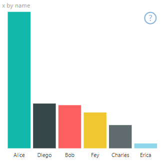
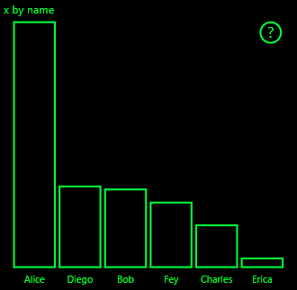
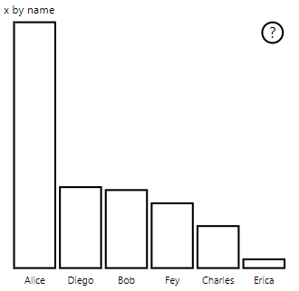

# <a name="high-contrast-mode-support"></a>高对比度模式支持

Windows 高对比度设置通过使用更加鲜明的颜色，使文本和应用更易于查看  。
详细了解 [Power BI 中的高对比度支持](https://powerbi.microsoft.com/blog/power-bi-desktop-june-2018-feature-summary/#highContrast)。

向视觉对象添加高对比度支持需要满足以下要求：

1. 初始化时：检测 Power BI 是否处于高对比度模式，如果是，则获取当前高对比度颜色。
2. 每次更新：更改视觉对象的呈现方式，使其更易于查看。

PowerBI-visuals-sampleBarChart 视觉对象具有高对比度支持的实现。

有关详细信息，请参阅 [PowerBI-visuals-sampleBarChart 视觉对象存储库](https://github.com/Microsoft/PowerBI-visuals-sampleBarChart/commit/61011c82b66ca0d3321868f1d089c65101ca42e6)

## <a name="on-init"></a>初始化时

`options.host` 的 colorPalette 成员具有高对比度模式的多个属性。 使用这些属性来确定高对比度模式是否处于活动状态，如果是，确定使用哪些颜色。

### <a name="detect-that-power-bi-is-in-high-contrast-mode"></a>检测 Power BI 是否处于高对比度模式

如果 `host.colorPalette.isHighContrast` 为 `true`，则高对比度模式处于活动状态，并且视觉对象应相应进行绘制。

### <a name="get-high-contrast-colors"></a>获取高对比度颜色

在高对比度模式中，视觉对象应限制为以下颜色：

* “前景”色用于绘制任何线条、图标、文本以及形状的轮廓或填充色  。
* “背景”色用于背景，以及作为轮廓形状的填充色  。
* “前景 - 选定”颜色用于指示选定或活动元素  。
* “超链接”颜色仅用于超链接文本  。

> [!NOTE]
> 如果需要辅助颜色，则可使用具有某一不透明度的前景色（Power BI 本机视觉对象使用 40% 的不透明度）。 请保守地使用它，以便于查看视觉对象详细信息。

可以在初始化过程中存储这些值：

```typescript
private isHighContrast: boolean;

private foregroundColor: string;
private backgroundColor: string;
private foregroundSelectedColor: string;
private hyperlinkColor: string;
//...

constructor(options: VisualConstructorOptions) {
    this.host = options.host;
    let colorPalette: ISandboxExtendedColorPalette = host.colorPalette;
    //...
    this.isHighContrast = colorPalette.isHighContrast;
    if (this.isHighContrast) {
        this.foregroundColor = colorPalette.foreground.value;
        this.backgroundColor = colorPalette.background.value;
        this.foregroundSelectedColor = colorPalette.foregroundSelected.value;
        this.hyperlinkColor = colorPalette.hyperlink.value;
    }
```

或者，可以在初始化期间存储 `host` 对象并在更新过程中访问相关 `colorPalette` 属性。

## <a name="on-update"></a>更新时

高对比度支持的特定实现因视觉对象而异，具体取决于图形设计的详细信息。 通常，高对比度模式需要采用与默认设置略有不同的设计，目的是便于通过有限的颜色来区分重要的详细信息。

下面是 Power BI 本机视觉对象遵循的一些准则：

* 所有数据点使用相同颜色（前景）。
* 所有文本、轴、箭头和线条等。 都使用前景色。
* 较粗的形状绘制为轮廓，具有粗笔划（至少两个像素）和背景填充色。
* 如果具有相关性，数据点使用不同标记形状进行区分，数据行使用不同长划线进行区分。
* 突出显示某个数据元素时，所有其他元素都会将自身的不透明度更改为 40%。
* 对于切片器，活动筛选器元素使用“前景 - 选定”颜色。

例如，在示例条形图中，所有条形都采用两个像素粗的前景轮廓和背景填充色进行绘制。 将其外观与默认颜色和几个高对比度主题进行比较：





下面是已更改为支持高对比度的 `visualTransform` 函数中的一个位置，在 `update` 过程中，它将作为呈现的一部分被调用：

### <a name="before"></a>先于

```typescript
for (let i = 0, len = Math.max(category.values.length, dataValue.values.length); i < len; i++) {
    let defaultColor: Fill = {
        solid: {
            color: colorPalette.getColor(category.values[i] + '').value
        }
    };

    barChartDataPoints.push({
        category: category.values[i] + '',
        value: dataValue.values[i],
        color: getCategoricalObjectValue<Fill>(category, i, 'colorSelector', 'fill', defaultColor).solid.color,
        selectionId: host.createSelectionIdBuilder()
            .withCategory(category, i)
            .createSelectionId()
    });
}
```

### <a name="after"></a>晚于

```typescript
for (let i = 0, len = Math.max(category.values.length, dataValue.values.length); i < len; i++) {
    const color: string = getColumnColorByIndex(category, i, colorPalette);

    const selectionId: ISelectionId = host.createSelectionIdBuilder()
        .withCategory(category, i)
        .createSelectionId();

    barChartDataPoints.push({
        color,
        strokeColor,
        strokeWidth,
        selectionId,
        value: dataValue.values[i],
        category: `${category.values[i]}`,
    });
}

//...

function getColumnColorByIndex(
    category: DataViewCategoryColumn,
    index: number,
    colorPalette: ISandboxExtendedColorPalette,
): string {
    if (colorPalette.isHighContrast) {
        return colorPalette.background.value;
    }

    const defaultColor: Fill = {
        solid: {
            color: colorPalette.getColor(`${category.values[index]}`).value,
        }
    };

    return getCategoricalObjectValue<Fill>(category, index, 'colorSelector', 'fill', defaultColor).solid.color;
}
```
