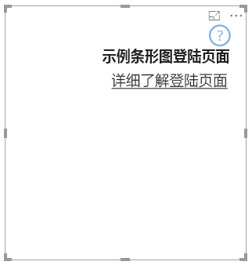

# <a name="add-a-landing-page-to-your-power-bi-visuals"></a>向 Power BI 视觉对象添加登陆页面

使用 API 2.3.0，可将登陆页面添加到 Power BI 视觉对象。 为此，请将 `supportsLandingPage` 添加到功能中，并将其设置为 true。 在向其添加数据之前，此操作会初始化并更新你的视觉对象。 由于视觉对象不再显示水印，因此只要没有数据，你就可以设计自己的登陆页面以在视觉对象中显示。

```typescript
export class BarChart implements IVisual {
    //...
    private element: HTMLElement;
    private isLandingPageOn: boolean;
    private LandingPageRemoved: boolean;
    private LandingPage: d3.Selection<any>;

    constructor(options: VisualConstructorOptions) {
            //...
            this.element = options.element;
            //...
    }

    public update(options: VisualUpdateOptions) {
    //...
        this.HandleLandingPage(options);
    }

    private HandleLandingPage(options: VisualUpdateOptions) {
        if(!options.dataViews || !options.dataViews.length) {
            if(!this.isLandingPageOn) {
                this.isLandingPageOn = true;
                const SampleLandingPage: Element = this.createSampleLandingPage(); //create a landing page
                this.element.appendChild(SampleLandingPage);
                this.LandingPage = d3.select(SampleLandingPage);
            }

        } else {
                if(this.isLandingPageOn && !this.LandingPageRemoved){
                    this.LandingPageRemoved = true;
                    this.LandingPage.remove();
                }
        }
    }
```

示例登陆页面如下图所示：


