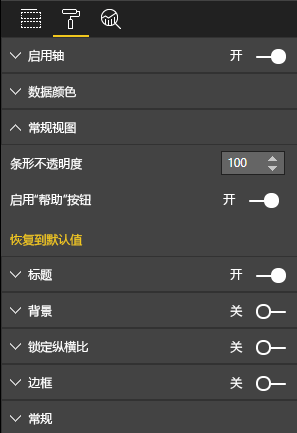

# <a name="launch-url"></a>启动 URL

通过将实际工作委托给 Power BI，启动 URL 时允许打开新的浏览器标签页（或窗口）。

## <a name="sample"></a>示例

```typescript
   this.host.launchUrl('https://powerbi.microsoft.com');
```

## <a name="usage"></a>使用情况

使用 `host.launchUrl()` API 调用，将目标 URL 作为字符串参数传递：

```typescript
this.host.launchUrl('http://some.link.net');
```

## <a name="restrictions"></a>限制

* 仅使用绝对路径，不使用相对路径。 `http://some.link.net/subfolder/page.html` 可以打开，`/page.html` 则无法打开。
* 目前仅支持 `http` 和 `https` 协议。 请避免使用 `ftp` 和 `mailto` 等协议。

## <a name="best-practices"></a>最佳做法

1. 大多数情况，最好只打开一个链接作为对用户显式操作的响应。 使用户轻松了解单击链接或按钮会打开新的标签页。在无用户操作的情况下触发 `launchUrl()` 调用或者因另一操作意外触发此调用会让用户感到困惑或沮丧。
2. 如果链接对视觉对象的正常运行无关紧要，建议为报表的作者提供一种禁用和隐藏链接的方法。 这对于一些 Power BI 特殊用例尤其有用，例如将报表嵌入第三方应用程序或将报表发布到 Web。
3. 避免从循环、视觉对象的 `update` 函数或者任何其他经常重复使用的代码内触发 `launchUrl()` 调用。

## <a name="step-by-step-example"></a>分步操作示例

### <a name="adding-a-link-launching-element"></a>添加链接启动元素

已在视觉对象的 `constructor` 函数中添加以下代码行：

```typescript
    this.helpLinkElement = this.createHelpLinkElement();
    options.element.appendChild(this.helpLinkElement);
```

此外，还添加了一个创建和附加 anchor 元素的私有函数：

```typescript
private createHelpLinkElement(): Element {
    let linkElement = document.createElement("a");
    linkElement.textContent = "?";
    linkElement.setAttribute("title", "Open documentation");
    linkElement.setAttribute("class", "helpLink");
    linkElement.addEventListener("click", () => {
        this.host.launchUrl("https://docs.microsoft.com/power-bi/developer/custom-visual-develop-tutorial");
    });
    return linkElement;
};
```

最后，visual.less 文件中的一个条目定义链接元素的样式：

```less
.helpLink {
    position: absolute;
    top: 0px;
    right: 12px;
    display: block;
    width: 20px;
    height: 20px;
    border: 2px solid #80B0E0;
    border-radius: 20px;
    color: #80B0E0;
    text-align: center;
    font-size: 16px;
    line-height: 20px;
    background-color: #FFFFFF;
    transition: all 900ms ease;

    &:hover {
        background-color: #DDEEFF;
        color: #5080B0;
        border-color: #5080B0;
        transition: all 250ms ease;
    }

    &.hidden {
        display: none;
    }
}
```

### <a name="adding-a-toggling-mechanism"></a>添加切换机制

这需要添加一个静态对象（请参阅[静态对象教程](https://microsoft.github.io/PowerBI-visuals/docs/concepts/objects-and-properties)），以便报表作者切换链接元素的可见状态（默认为隐藏状态）。
`showHelpLink` 布尔值静态对象已添加到 `capabilities.json` 对象条目中：

```typescript
"objects": {
    "generalView": {
            "displayName": "General View",
            "properties":
                "showHelpLink": {
                    "displayName": "Show Help Button",
                    "type": {
                        "bool": true
                    }
                }
            }
        }
    }
```



在视觉对象的 `update` 函数中添加了以下代码行：

```typescript
if (settings.generalView.showHelpLink) {
    this.helpLinkElement.classList.remove("hidden");
} else {
    this.helpLinkElement.classList.add("hidden");
}
```

visual.less 中定义了 `hidden` 类，用于控制元素的显示。
