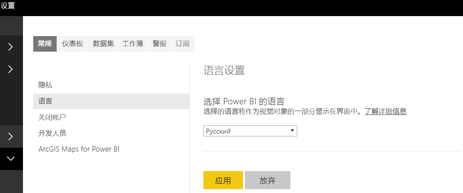

# <a name="add-the-locale-in-power-bi-for-power-bi-visuals"></a>在 Power BI 中为 Power BI 视觉对象添加区域设置

视觉对象可以检索 Power BI 区域设置，以将其内容本地化为相关语言。

阅读有关 [Power BI 支持的语言和国家/地区](./../../fundamentals/supported-languages-countries-regions.md)的详细信息

例如，在 Sample Bar Chart 视觉对象中获取区域设置。


其中的每个条形图都是使用不同的区域设置（英语、巴斯克语和印地语）创建的，并显示在工具提示中。

> [!NOTE]
> API 1.10.0 和更高版本支持视觉对象代码中的本地化管理器。

## <a name="get-the-locale"></a>获取区域设置

在视觉对象的初始化过程中，`locale` 作为字符串进行传递。 如果在 Power BI 中更改了区域设置，则将使用新的区域设置再次生成视觉对象。 可以使用区域设置在 SampleBarChart 中找到完整的示例代码

BarChart 构造函数现有区域设置成员，可在构造函数中使用主机区域设置实例将该成员实例化。

```typescript
private locale: string;
...
this.locale = options.host.locale;
```

受支持的区域设置：

区域设置字符串 | 语言
--------------|----------------------
ar-SA | العربية（阿拉伯语）
bg-BG | български（保加利亚语）
ca-ES | català（加泰罗尼亚语）
cs-CZ | čeština（捷克语）
da-DK | dansk（丹麦语）
de-DE | Deutsche（德语）
el-GR | ελληνικά（希腊语）
en-US | English（英语）
es-ES | español 服务（西班牙语）
et-EE | eesti（爱沙尼亚语）
eU-ES | Euskal（巴斯克语）
fi-FI | suomi（芬兰语）
fr-FR | français（法语）
gl-ES | galego（加利西亚语）
he-IL | עברית（希伯来语）
hi-IN | हिन्दी（印地语）
hr-HR | hrvatski（克罗地亚语）
hu-HU | magyar（匈牙利语）
id-ID | Bahasa Indonesia（印度尼西亚语）
it-IT | italiano（意大利语）
ja-JP | 日本の（日语）
kk-KZ | Қазақ（哈萨克语）
ko-KR | 한국의（韩语）
lt-LT | Lietuvos（立陶宛语）
lv-LV | Latvijas（拉脱维亚语）
ms-MY | Bahasa Melayu（马来语）
nb-NO | norsk（挪威语）
nl-NL | Nederlands（荷兰语）
pl-PL | polski（波兰语）
pt-BR | português（葡萄牙语）
pt-PT | português（葡萄牙语）
ro-RO | românesc（罗马尼亚语）
ru-RU | русский（俄语）
sk-SK | slovenský（斯洛伐克语）
sl-SI | slovenski（斯洛文尼亚语）
sr-Cyrl-RS | српски（塞尔维亚语）
sr-Latn-RS | srpski（塞尔维亚语）
sv-SE | svenska（瑞典语）
th-TH | ไทย（泰语）
tr-TR | Türk（土耳其语）
uk-UA | український（乌克兰语）
vi-VN | t Việt（越南语）
zh-CN | 中国（简体中文）
zh-TW | 中國（繁体中文）

> [!NOTE]
> 在 PowerBI Desktop 中，区域设置属性将包含所安装的 PowerBI Desktop 的语言。

## <a name="localizing-the-property-pane-for-power-bi-visuals"></a>本地化 Power BI 视觉对象的“属性”窗格

可对“属性”窗格中的字段进行本地化，以提供更加完整和一致的体验。 该操作可使自定义视觉对象的行为类似于任何其他 Power BI 核心视觉对象。

例如，使用 `pbiviz new` 命令创建的未本地化的自定义视觉对象将在“属性”窗格中显示以下字段：


类别数据和度量数据均在 capability.json 文件中定义为 `displayName`。

## <a name="how-to-localize-capabilities"></a>如何实现功能本地化

首先为功能中要本地化的每个显示名称添加一个显示名称键。 在本示例中：

```json
{
    "dataRoles": [
        {
            "displayName": "Category Data",
            "displayNameKey": "VisualCategoryDataNameKey1",
            "name": "category",
            "kind": "Grouping"
        },
        {
            "displayName": "Measure Data",
            "displayNameKey": "VisualMeasureDataNameKey2",
            "name": "measure",
            "kind": "Measure"
        }
    ]
}
```

然后添加一个名为 stringResources 的目录。 该目录将包含所有不同的字符串资源文件，这些文件基于你希望视觉对象支持的区域设置。 在此目录下，需要为你希望支持的每个区域设置添加 JSON 文件。 这些文件包含要替换的每个 displayNameKey 的区域设置信息和本地化的字符串值。

在我们的示例中，假设我们要支持阿拉伯语和希伯来语。 我们将需要按以下方式添加两个 JSON 文件：


每个 JSON 文件定义一个区域设置（此文件必须是上面支持的列表中的区域设置之一），其中包含所需显示名称键的字符串值。 在我们的示例中，希伯来语字符串资源文件如下所示：

```json
{
    "locale": "he-IL",
    "values": {
        "VisualCategoryDataNameKey1": "קטגוריה",
        "VisualMeasureDataNameKey2": "יחידות מידה"
    }
}
```

下面介绍了使用本地化管理器的所有必需步骤。

> [!NOTE]
> 目前，调试开发视觉对象不支持本地化

## <a name="setup-environment"></a>设置环境

### <a name="desktop"></a>桌面

对于桌面使用，请从 https://powerbi.microsoft.com 下载 Power BI Desktop 的本地化版本。

### <a name="web-service"></a>Web 服务

如果在服务中使用 Web 客户端（浏览器），请在设置中更改语言：



## <a name="resource-file"></a>资源文件

将 resource.resjson 文件添加到一个文件夹中，该文件夹以将在 stringResources 文件夹中使用的区域设置命名。 本例中为 en-US 和 ru-RU。


然后，将要使用的所有本地化字符串添加到上一步中添加的 resources.resjson 文件中。

```json
{
    ...
    "Role_Legend": "Обозначения",
    "Role_task": "Задача",
    "Role_StartDate": "Дата начала",
    "Role_Duration": "Длительность"
    ...
}
```

本例为 resources.resjson 文件的 en-US 版：

```json
{
    ...
    "Role_Legend": "Legend",
    "Role_task": "Task",
    "Role_StartDate": "Start date",
    "Role_Duration": "Duration"
    ...
}
```

新的 localizationManager 实例将在视觉对象代码中创建 localizationManager 实例，如下所示

```typescript
private localizationManager: ILocalizationManager;

constructor(options: VisualConstructorOptions) {
    this.localizationManager = options.host.createLocalizationManager();
}
```

## <a name="localizationmanager-usage-sample"></a>localizationManager 使用示例

现在，你可以使用在 resources.resjson 中定义的字符串键参数调用本地化管理器的 getDisplayName 函数，以在代码内的任何位置获取所需的字符串：

```typescript
let legend: string = this.localization.getDisplayName("Role_Legend");
```

对于 en-US，返回“Legend”，对于 ru-RU，返回“Обозначения”

## <a name="next-steps"></a>后续步骤

* [阅读如何使用格式化实用工具提供本地化格式](utils-formatting.md)
