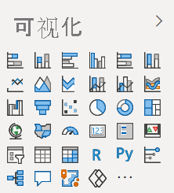

# Power BI 中的视觉对象

Power BI 附带了许多现成的 Power BI 视觉对象。 这些视觉对象可在 [Power BI Desktop ](https://powerbi.microsoft.com/desktop/)和 [Power BI 服务](https://app.powerbi.com)的可视化效果窗格中使用，可用于创建和编辑 Power BI 内容。

可以通过 Microsoft [AppSource](https://nam06.safelinks.protection.outlook.com/?url=https%3A%2F%2Fappsource.microsoft.com%2Fen-us%2Fmarketplace%2Fapps%3Fpage%3D1%26product%3Dpower-bi-visuals&data=02%7C01%7CKesem.Sharabi%40microsoft.com%7C6d9286afacb3468d4cde08d740b76694%7C72f988bf86f141af91ab2d7cd011db47%7C1%7C0%7C637049028749147718&sdata=igWm0e1vXdgGcbyvngQBrHQVAkahPnxPC1ZhUPntGI8%3D&reserved=0) 或 Power BI 获取更多 Power BI 视觉对象。 这些视觉对象由 Microsoft 和 Microsoft 合作伙伴创建，并由 AppSource 验证团队进行测试和验证。

你还可以开发自己的 Power BI 视觉对象，供你、你的组织或整个 Power BI 社区使用。

## 默认 Power BI 视觉对象

可在 Power BI Desktop 和 Power BI 服务中的“可视化效果”窗格中提供这些现成 Power BI 视觉对象 。

若要从“视觉化效果”窗格中取消固定 Power BI 视觉对象，请右键单击该视觉对象然后选择“取消固定”。

若要在“可视化效果”窗格中还原默认 Power BI 视觉对象，单击“导入自定义视觉对象”，然后选择“还原默认视觉对象” 。 

## AppSource Power BI 视觉对象

Microsoft 和社区成员已将 Power BI 视觉对象公布到[ AppSource](https://appsource.microsoft.com/marketplace/apps?product=power-bi-visuals)。 你可以下载这些视觉对象，然后将其添加到 Power BI 报表。 这些 Power BI 视觉对象都已经过测试并通过 Microsoft 的功能和质量审核。

>[!NOTE]
>* 使用通过我们的 SDK 创建的 Power BI 视觉对象，你可以从位于 Power BI 租户的地理区域、符合性边界或国家云实例之外的第三方或其他服务中导入数据或向其发送数据。
>* Power BI 认证的视觉对象是 AppSource 中的视觉对象，通过进一步测试可检查视觉对象是否访问外部服务或资源。
>* 导入来自 AppSource 的 Power BI 视觉对象后，视觉对象可能会自动更新，而不显示任何其他通知。

### 什么是 AppSource？

[AppSource](https://appsource.microsoft.com/marketplace/apps?product=power-bi-visuals) 是可以在其中查找与 Microsoft 软件相关的应用、加载项和扩展的地方。 AppSource 为 Microsoft 365、Azure、Dynamics 365、Cortana 和 Power BI 等产品的数百万用户提供解决方案，帮助他们更有见地且更高效地完成工作。

### 已认证的 Power BI 视觉对象

已认证的 Power BI 视觉对象是 [AppSource](https://nam06.safelinks.protection.outlook.com/?url=https%3A%2F%2Fappsource.microsoft.com%2Fen-us%2Fmarketplace%2Fapps%3Fpage%3D1%26product%3Dpower-bi-visuals&data=02%7C01%7CKesem.Sharabi%40microsoft.com%7C6d9286afacb3468d4cde08d740b76694%7C72f988bf86f141af91ab2d7cd011db47%7C1%7C0%7C637049028749147718&sdata=igWm0e1vXdgGcbyvngQBrHQVAkahPnxPC1ZhUPntGI8%3D&reserved=0) 中满足由 Microsoft Power BI 团队测试和批准的某些指定代码要求的视觉对象。 测试旨在检查并确认视觉对象不会访问外部服务或资源。

若要查看已认证的 Power BI 视觉对象列表或提交自己的 Power BI 视觉对象，请参阅[已认证的 Power BI 视觉对象](power-bi-custom-visuals-certified.md)。

### Power BI 视觉对象示例

AppSource 上的每个 Power BI 视觉对象都有一个数据示例，用于说明该视觉对象的工作原理。 若要下载该示例，请在 [AppSource](https://nam06.safelinks.protection.outlook.com/?url=https%3A%2F%2Fappsource.microsoft.com%2Fen-us%2Fmarketplace%2Fapps%3Fpage%3D1%26product%3Dpower-bi-visuals&data=02%7C01%7CKesem.Sharabi%40microsoft.com%7C6d9286afacb3468d4cde08d740b76694%7C72f988bf86f141af91ab2d7cd011db47%7C1%7C0%7C637049028749147718&sdata=igWm0e1vXdgGcbyvngQBrHQVAkahPnxPC1ZhUPntGI8%3D&reserved=0) 中选择 Power BI 视觉对象，并从“试用示例”部分，单击“示例报告”链接。

## 组织商店

Power BI 管理员批准 Power BI 视觉对象并将其部署到其组织中。 这使报表作者可以轻松发现、更新和使用这些 Power BI 视觉对象。 管理员可以通过更新版本、禁用和启用 Power BI 视觉对象等操作轻松管理这些视觉对象。

若要访问组织商店，请在“可视化效果”窗格中单击“导入自定义视觉对象”，然后选择“从市场导入”，再在“Power BI 视觉对象”窗口的顶部，选择“我的组织”选项卡 。

[详细了解可组织的视觉对象](power-bi-custom-visuals-organization.md)。

## 视觉对象文件

Power BI 视觉对象是包含代码的包，这些代码用于呈现提供给它们的数据。 任何人都可以创建自定义视觉对象并将其打包为之后可导入 Power BI 报表的单个 `.pbiviz` 文件。

若要导入 Power BI 视觉对象，请在“可视化效果”窗格中单击“导入自定义视觉对象”，然后选择“从文件导入” 。

如果你是 Web 开发人员，并有兴趣创建自己的视觉对象，然后将其添加到 AppSource，可以了解如何[开发 Power BI 圆形卡片视觉对象](develop-circle-card.md)以及[将 Power BI 视觉对象发布到 AppSource](office-store.md)。

> [!WARNING]
> Power BI 视觉对象可能包含存在安全或隐私风险的代码。 请确保创建者和 Power BI 视觉对象源可信，然后将其导入报表。

## 后续步骤

>[!div class="nextstepaction"]
>[开发 Power BI 圆形卡片视觉对象](develop-circle-card.md)

>[!div class="nextstepaction"]
>[Power BI 视觉对象项目结构](visual-project-structure.md)

>[!div class="nextstepaction"]
>[Power BI 视觉对象指南](guidelines-powerbi-visuals.md)

>[!div class="nextstepaction"]
>[常见问题](power-bi-custom-visuals-faq.md)

>[!div class="nextstepaction"]
>[Power BI 社区](https://community.powerbi.com/)