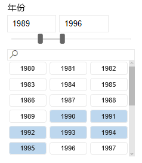
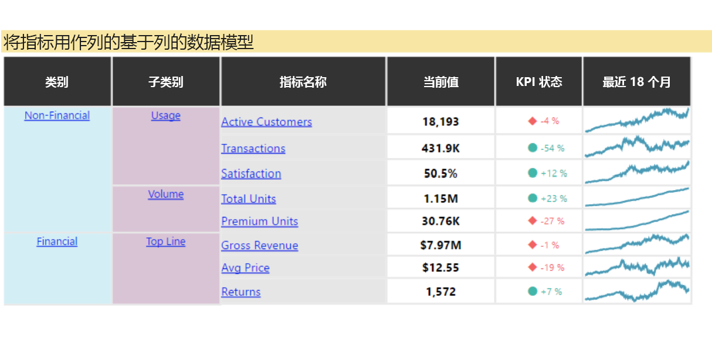
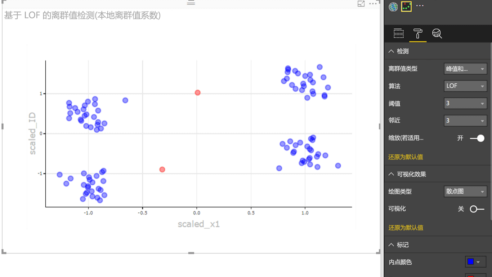

# Power BI 视觉对象示例

可以从 GitHub 下载、使用和修改这些 Power BI 视觉对象。 这些示例演示如何处理使用 Power BI 进行开发时的常见情况。

## 切片器

切片器用于限制在报表的其他可视化效果中显示的部分数据。 切片器是用于在 Power BI 中筛选数据的多种方式之一。

|   |  | |
| ------------- | ------------- | -------------|
| [Chiclet 切片器](https://github.com/Microsoft/powerbi-visuals-chicletslicer/)   显示充当其他视觉对象上画布内筛选器的图像或文本按钮 | [时间线切片器](https://github.com/Microsoft/powerbi-visuals-timeline/)  按日期筛选的图形日期范围选择器 | [切片器示例](https://github.com/Microsoft/powerbi-visuals-sampleslicer/)  演示高级筛选 API 的使用情况

## 图表

利用我们的库，包括条形图、饼图、Word 云和其他工具激发灵感。

|   |  | |
| ------------- | ------------- | -------------|
| [星状体图](https://github.com/Microsoft/powerbi-visuals-asterplot/)   标准环形图上的色环，使用第二个值来驱动扫描角 | [子弹图](https://github.com/Microsoft/powerbi-visuals-bulletchart/)  包含额外视觉对象元素的条形图，可提供用于跟踪目标的上下文 | [和弦](https://github.com/Microsoft/powerbi-visuals-chord/)  一种显示矩阵中数据之间关系的图形方法
|  | |  
| [点图](https://github.com/Microsoft/powerbi-visuals-dotplot/)  精美呈现频率分布情况 | [双 KPI](https://github.com/Microsoft/powerbi-visuals-dualkpi/)  针对一段时间内的两个度量值进行有效可视化，在联合时间表上显示其趋势 | [增强散点图](https://github.com/Microsoft/powerbi-visuals-enhancedscatter/)  现有散点图的改进
| | | 
| [力学图](https://github.com/Microsoft/powerbi-visuals-forcegraph/)  具有曲线路径的力布局关系图。用于显示实体之间的连接 | [甘特图](https://github.com/Microsoft/powerbi-visuals-gantt/)  条形图，用于说明项目时间线或资源计划 | [热度地图表](https://github.com/Microsoft/powerbi-visuals-heatmap/)  使用表中的颜色轻松直观地比较数据
|  |  |  
| [直方图](https://github.com/Microsoft/powerbi-visuals-histogram/)  直观呈现连续间隔或特定时间段内的数据分布情况 | [点线图](https://github.com/Microsoft/powerbi-visuals-linedotchart/)  带有动画点的动画折线图，用于吸引观众关注数据 | [马赛克图](https://github.com/Microsoft/powerbi-visuals-mekkochart/)  将 100% 堆积柱形图和 100% 堆积条形图合并到一个视图中
|  |  |  
| [多 KPI](https://github.com/microsoft/PowerBI-visuals-MultiKPI/)   带有关键 KPI 的强大多 KPI 可视化效果，同时提供多个支持数据的迷你图 | [Power KPI](https://github.com/microsoft/PowerBI-visuals-PowerKPI/)  强大的 KPI 指示器，自带多线图表和标签，用于显示当前日期、值和差异 | [Power KPI 矩阵](https://github.com/microsoft/PowerBI-visuals-PowerKPIMatrix/)  在简洁、易于阅读的列表中监视平衡记分卡和数量不限的指标和 KPI
| |  |  
| [脉冲图](https://github.com/Microsoft/powerbi-visuals-pulsechart/)  使用关键事件添加批注的折线图，非常适合于讲述数据案例| [雷达图](https://github.com/Microsoft/powerbi-visuals-radarchart/)  通过分类轴绘制多个度量值，有助于比较属性 | [桑基图](https://github.com/Microsoft/powerbi-visuals-sankey/)  系列的宽度与流的数量成比例的流程图
|  | | 
| [Stream 关系图](https://github.com/Microsoft/powerbi-visuals-streamgraph/)  具有平滑插值的堆积面积图，通常用于显示一段时间内的值 | [旭日图](https://github.com/Microsoft/powerbi-visuals-sunburst/)  多级环形图，用于可视化分层数据| [飓风图](https://github.com/Microsoft/powerbi-visuals-tornado/)  比较两个组之间变量的相对重要性
 | 
 | [Word Cloud](https://github.com/Microsoft/powerbi-visuals-wordcloud/)  通过数据中的常用文本创建有趣的视觉对象

## WebGL

WebGL 允许 Web 内容使用基于 OpenGL ES 2.0 的 API 在 HTML 画布中进行 2D 和 3D 渲染。

| |
| ------------- |
| [全球地图](https://github.com/Microsoft/powerbi-visuals-globemap/)  在交互式 3D 地图上标注位置

## R 视觉对象

这些示例演示如何利用 R 视觉对象和 R 脚本的分析和视觉功能。

| | | |
|------------- |------------- |------------- |------------- |
| [关联规则](https://github.com/Microsoft/powerbi-visuals-assorules/)  使用 if-then 语句发现表面上不相关数据之间的关系 | [群集](https://github.com/Microsoft/powerbi-visuals-clustering-kmeans/)  使用 k 平均值算法查找数据中的相似性组 | [具有离群值的群集](https://github.com/microsoft/PowerBI-visuals-dbscan/)  查找数据中的相似性组和离群值
|  |  |  
| [相关性绘图](https://github.com/Microsoft/powerbi-visuals-corrplot/)  突出显示数据表中最相关的变量 | [决策树图](https://github.com/Microsoft/powerbi-visuals-decision-tree/)  使用递归分区确定统计概率的示意性树形框图 | [预测 TBATS](https://github.com/Microsoft/powerbi-visuals-forcasting-tbats/)  使用 TBATS 模型对具有多个季节性的序列进行时间序列预测
|  |  |  
| [通过 ARIMA 预测](https://github.com/Microsoft/powerbi-visuals-forcastingarima/)  使用自动回归集成移动平均预测基于历史数据的未来值 (ARIMA) | [漏斗图](https://github.com/Microsoft/powerbi-visuals-funnel/)  使用漏斗图查找数据中的离群值 | [离群值检测](https://github.com/Microsoft/powerbi-visuals-outliers-det/)  使用最适当的方法和绘图查找数据中的离群值
|  |  | 
| [样条图图表](https://github.com/Microsoft/powerbi-visuals-spline/)  可视化和了解干扰性数据 | [时序分解图表](https://github.com/Microsoft/powerbi-visuals-timeseriesdecomposition/)  使用“使用 Loess 的季节性和趋势分解”了解时序部分 | [时序预测图表](https://github.com/Microsoft/powerbi-visuals-forcasting-exp/)  基于之前观察到的值，使用指数平滑模型来预测未来的值

## 后续步骤

要尝试创建 Power BI 视觉对象，请参阅[教程：开发 Power BI 视觉对象](custom-visual-develop-tutorial.md)。
