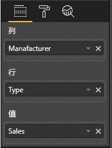

# <a name="add-interactivity-into-visual-by-power-bi-visuals-selections"></a>通过 Power BI 视觉对象选择将交互性添加到视觉对象

Power BI 提供了两种在视觉对象选择和筛选之间进行交互的方法。 下面的示例演示了如何在一个视觉对象中选择任何项，并通知报表中有关新选择状态的其他视觉对象。

`Selection` 对象对应于接口：

```typescript
export interface ISelectionId {
    equals(other: ISelectionId): boolean;
    includes(other: ISelectionId, ignoreHighlight?: boolean): boolean;
    getKey(): string;
    getSelector(): Selector;
    getSelectorsByColumn(): SelectorsByColumn;
    hasIdentity(): boolean;
}
```

## <a name="how-to-use-selectionmanager-to-select-data-points"></a>如何使用 SelectionManager 选择数据点

视觉宿主对象提供了创建选择管理器实例的方法。 选择管理器负责选择、清除选择、显示上下文菜单、存储当前选择以及检查选择状态。 选择管理器有针对这些操作的对应方法。

### <a name="create-an-instance-of-the-selection-manager"></a>创建选择管理器的实例

要使用选择管理器，需要创建选择管理器的实例。 通常，视觉对象会在可视对象的 `constructor` 中创建选择管理器实例。

```typescript
export class Visual implements IVisual {
    private target: HTMLElement;
    private host: IVisualHost;
    private selectionManager: ISelectionManager;
    // ...
    constructor(options: VisualConstructorOptions) {
        this.host = options.host;
        // ...
        this.selectionManager = this.host.createSelectionManager();
    }
    // ...
}
```

### <a name="create-an-instance-of-the-selection-builder"></a>创建选择生成器的实例

创建选择管理器实例时，需要为视觉对象的每个数据点创建 `selections`。 视觉宿主对象提供 `createSelectionIdBuilder` 方法为每个数据点生成选择。 此方法会返回带 `powerbi.visuals.ISelectionIdBuilder` 接口的对象实例：

```typescript
export interface ISelectionIdBuilder {
    withCategory(categoryColumn: DataViewCategoryColumn, index: number): this;
    withSeries(seriesColumn: DataViewValueColumns, valueColumn: DataViewValueColumn | DataViewValueColumnGroup): this;
    withMeasure(measureId: string): this;
    withMatrixNode(matrixNode: DataViewMatrixNode, levels: DataViewHierarchyLevel[]): this;
    withTable(table: DataViewTable, rowIndex: number): this;
    createSelectionId(): ISelectionId;
}
```

此对象具有可为不同类型的数据视图映射创建 `selections` 的对应方法。

> [!NOTE]
> 在 Power BI 视觉对象的 API 2.5.0 上引入了 `withTable` 和 `withMatrixNode` 方法。
> 如果需要将选择用于表或矩阵数据视图映射，则需要将 API 版本更新为 2.5.0 或更高版本。

### <a name="create-selections-for-categorical-data-view-mapping"></a>为分类数据视图映射创建选择

让我们回顾一下如何在示例数据集的分类数据视图映射上表示选择：

| 制造商 | 类型 | 值 |
| - | - | - |
| Chrysler | 国产汽车 | 28883 |
| Chrysler | 国产卡车 | 117131 |
| Chrysler | 进口汽车 | 0 |
| Chrysler | 进口卡车 | 6362 |
| Ford | 国产汽车 | 50032 |
| Ford | 国产卡车 | 122446 |
| Ford | 进口汽车 | 0 |
| Ford | 进口卡车 | 0 |
| GM | 国产汽车 | 65426 |
| GM | 国产卡车 | 138122 |
| GM | 进口汽车 | 197 |
| GM | 进口卡车 | 0 |
| Honda | 国产汽车 | 51450 |
| Honda | 国产卡车 | 46115 |
| Honda | 进口汽车 | 2932 |
| Honda | 进口卡车 | 0 |
| Nissan | 国产汽车 | 51476 |
| Nissan | 国产卡车 | 47343 |
| Nissan | 进口汽车 | 5485 |
| Nissan | 进口卡车 | 1430 |
| Toyota | 国产汽车 | 55643 |
| Toyota | 国产卡车 | 61227 |
| Toyota | 进口汽车 | 20799 |
| Toyota | 进口卡车 | 23614 |

视觉对象使用以下数据视图映射：

```json
{
    "dataRoles": [
        {
            "displayName": "Columns",
            "name": "columns",
            "kind": "Grouping"
        },
        {
            "displayName": "Rows",
            "name": "rows",
            "kind": "Grouping"
        },
        {
            "displayName": "Values",
            "name": "values",
            "kind": "Measure"
        }
    ],
    "dataViewMappings": [
        {
            "categorical": {
                "categories": {
                    "for": {
                        "in": "columns"
                    }
                },
                "values": {
                    "group": {
                        "by": "rows",
                        "select": [
                            {
                                "for": {
                                    "in": "values"
                                }
                            }
                        ]
                    }
                }
            }
        }
    ]
}
```

在此示例中，`Manufacturer` 为 `columns`，`Type` 为 `rows`。 有按 `rows` (`Type`) 分组值创建的序列。

而且，视觉对象还可以通过 `Manufacturer` 和 `Type` 来切分数据。

例如，当用户按 `Manufacturer` 选择 `Chrysler` 时，其他视觉对象应显示以下数据：

| 制造商 | 类型 | 值 |
| - | - | - |
| **Chrysler** | 国产汽车 | 28883 |
| **Chrysler** | 国产卡车 | 117131 |
| **Chrysler** | 进口汽车 | 0 |
| **Chrysler** | 进口卡车 | 6362 |

当用户按 `Type` 选择 `Import Car` 时（按系列选择数据），其他视觉对象应显示以下数据：

| 制造商 | 类型 | 值 |
| - | - | - |
| Chrysler | **进口汽车** | 0 |
| Ford | **进口汽车** | 0 |
| GM | **进口汽车** | 197 |
| Honda | **进口汽车** | 2932 |
| Nissan | **进口汽车** | 5485 |
| Toyota | **进口汽车** | 20799 |


需要填写视觉对象数据篮。



其中 `Manufacturer` 为类别（列）、`Type` 为序列（行）、`Value` 为序列 `Values`。

> [!NOTE]
> 序列需要 `Values`，因为根据数据视图映射，视觉对象期望 `Values` 按 `Rows` 数据进行分组。

#### <a name="create-selections-for-categories"></a>为类别创建选择

```typescript
// categories
const categories = dataView.categorical.categories;

// create label for 'Manufacturer' column
const p = document.createElement("p") as HTMLParagraphElement;
p.innerText = categories[0].source.displayName.toString();
this.target.appendChild(p);

// get count of category elements
const categoriesCount = categories[0].values.length;

// iterate all categories to generate selection and create button elements to use selections
for (let categoryIndex = 0; categoryIndex < categoriesCount; categoryIndex++) {
    const categoryValue: powerbi.PrimitiveValue = categories[0].values[categoryIndex];

    const categorySelectionId = this.host.createSelectionIdBuilder()
        .withCategory(categories[0], categoryIndex) // we have only one category (only one `Manufacturer` column)
        .createSelectionId();
    this.dataPoints.push({
        value: categoryValue,
        selection: categorySelectionId
    });
    console.log(categorySelectionId);

    // create button element to apply selection on click
    const button = document.createElement("button") as HTMLButtonElement;
    button.value = categoryValue.toString();
    button.innerText = categoryValue.toString();
    button.addEventListener("click", () => {
        // handle click event to apply correspond selection
        this.selectionManager.select(categorySelectionId);
    });
    this.target.appendChild(button);
}
```

在示例代码中，你可以看到我们会循环访问所有类别。 每次迭代时，我们都会通过调用选择生成器的 `createSelectionIdBuilder` 方法调用 `withCategory` 来为每个类别创建下一个选择。 `createSelectionId` 方法用作返回生成的 `selection` 对象的最终方法。

在 `withCategory` 方法中，我们将传递 `category` 的列，在示例中为 `Manufacturer`，也是类别元素的索引。

#### <a name="create-selections-for-series"></a>为序列创建选择

```typescript
// get groupped values for series
const series: powerbi.DataViewValueColumnGroup[] = dataView.categorical.values.grouped();

// create label for 'Type' column
const p2 = document.createElement("p") as HTMLParagraphElement;
p2.innerText = dataView.categorical.values.source.displayName;
this.target.appendChild(p2);

// iterate all series to generate selection and create button elements to use selections
series.forEach( (ser: powerbi.DataViewValueColumnGroup) => {
    // create selection id for series
    const seriesSelectionId = this.host.createSelectionIdBuilder()
        .withSeries(dataView.categorical.values, ser)
        .createSelectionId();

    this.dataPoints.push({
        value: ser.name,
        selection: seriesSelectionId
    });

    // create button element to apply selection on click
    const button = document.createElement("button") as HTMLButtonElement;
    button.value =ser.name.toString();
    button.innerText = ser.name.toString();
    button.addEventListener("click", () => {
        // handle click event to apply correspond selection
        this.selectionManager.select(seriesSelectionId);
    });
    this.target.appendChild(button);
});
```

### <a name="create-selections-for-table-data-view-mapping"></a>为表数据视图映射创建选择

表数据视图映射的示例

```json
{
    "dataRoles": [
        {
            "displayName": "Values",
            "name": "values",
            "kind": "GroupingOrMeasure"
        }
    ],
    "dataViewMappings": [
        {
            "table": {
                "rows": {
                    "for": {
                        "in": "values"
                    }
                }
            }
        }
    ]
}
```

若要为表数据视图映射的每一行创建选择，则需要调用选择生成器的 `withTable` 方法。

```typescript
public update(options: VisualUpdateOptions) {
    const dataView = options.dataViews[0];
    dataView.table.rows.forEach((row: DataViewTableRow, rowIndex: number) => {
        this.target.appendChild(rowDiv);
        const selection: ISelectionId = this.host.createSelectionIdBuilder()
            .withTable(dataView.table, rowIndex)
            .createSelectionId();
    }
}
```

视觉对象代码将循环访问表中的行，每行都会调用 `withTable` 表方法。 `withTable` 方法的参数是表行的 `table` 对象和索引。

### <a name="create-selections-for-matrix-data-view-mapping"></a>为矩阵数据视图映射创建选择

```typescript
public update(options: VisualUpdateOptions) {
    const host = this.host;
    const rowLevels: powerbi.DataViewHierarchyLevel[] = dataView.matrix.rows.levels;
    const columnLevels: powerbi.DataViewHierarchyLevel[] = dataView.matrix.rows.levels;

    // iterate rows hierarchy
    nodeWalker(dataView.matrix.rows.root, rowLevels);
    // iterate columns hierarchy
    nodeWalker(dataView.matrix.columns.root, columnLevels);

    function nodeWalker(node: powerbi.DataViewMatrixNode, levels: powerbi.DataViewHierarchyLevel[]) {
        const nodeSelection = host.createSelectionIdBuilder().withMatrixNode(node, levels);

        if (node.children && node.children.length) {
            node.children.forEach(child => {
                nodeWalker(child, levels);
            });
        }
    }
}
```

在示例中，以递归方式为每个节点和子节点调用 `nodeWalker`。

`nodeWalker` 会在每次调用时创建 `nodeSelection` 对象。 每个 `nodeSelection` 表示对应节点的 `selection`。

## <a name="select-datapoints-to-slice-other-visuals"></a>选择数据点以切分其他视觉对象

在用于分类数据视图映射的选择的示例代码中，你看到已为按钮元素创建了单击处理程序。 该处理程序调用选择管理器的 `select` 方法，并传递选择对象。

```typescript
button.addEventListener("click", () => {
    // handle click event to apply correspond selection
    this.selectionManager.select(categorySelectionId);
});
```

`select` 方法的接口是

```typescript
interface ISelectionManager {
    // ...
    select(selectionId: ISelectionId | ISelectionId[], multiSelect?: boolean): IPromise<ISelectionId[]>;
    // ...
}
```

你可以看到，`select` 可以接受选择的数组。 这意味着视觉对象可以选择多个数据点。 第二个参数 `multiSelect` 负责多选。 如果值为 true，则 Power BI 不会清除之前的选择状态并应用当前选择，否则将重置前一选择。

使用 `multiSelect` 处理单击事件时 Ctrl 按钮状态的典型场景。

```typescript
button.addEventListener("click", (mouseEvent) => {
    const multiSelect = (mouseEvent as MouseEvent).ctrlKey;
    this.selectionManager.select(seriesSelectionId, multiSelect);
});
```

## <a name="next-steps"></a>后续步骤

* [阅读如何使用选择将视觉对象属性绑定到数据点](objects-properties.md#objects-selector)

* [阅读如何处理书签切换的选择](bookmarks-support.md#visuals-with-selection)

* [阅读如何为视觉对象数据点添加上下文菜单](context-menu.md)

* [阅读如何使用 InteractivityUtils 将选择添加到 Power BI 视觉对象](utils-interactivity-selections.md)
