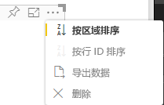

# <a name="sorting-options-for-power-bi-visuals"></a>Power BI 视觉对象的排序选项

本文介绍了“排序”选项如何指定 Power BI 视觉对象的排序行为  。 

排序功能需要以下参数之一。

## <a name="default-sorting"></a>默认排序

`default` 选项是最简单的形式。 它支持对“DataMappings”部分显示的数据进行排序。 此选项支持按用户对数据映射进行排序并可指定排序方向。

```json
    "sorting": {
        "default": {   }
    }
```



## <a name="implicit-sorting"></a>隐式排序

隐式排序是通过数组参数 `clauses` 进行排序，该参数描述了每个数据角色的排序。 `implicit` 意味着视觉对象的用户无法更改排序顺序。 Power BI 不会在视觉对象的菜单中显示排序选项。 但是，Power BI 会根据指定的设置对数据进行排序。

`clauses` 参数可以包含多个具有如下两个参数的对象：

- `role`：确定用于排序的 `DataMapping`
- `direction`：确定排序方向（1 为升序，2 为降序）

```json
    "sorting": {
        "implicit": {
            "clauses": [
                {
                    "role": "category",
                    "direction": 1
                },
                {
                    "role": "measure",
                    "direction": 2
                }
            ]
        }
    }
```

## <a name="custom-sorting"></a>自定义排序

自定义排序意味着开发人员在视觉对象代码中管理排序。
