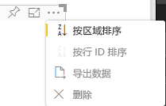

# <a name="sorting-options"></a>排序选项

`Sorting` 可指定视觉对象的默认排序行为。
此功能需要下述其中一项参数：

## <a name="default-sorting"></a>默认排序

`default` 选项是最简单的形式。 它支持对“DataMappings”部分显示的数据进行排序。
此选项支持按用户对“DataMappings”排序并可指定排序方向。

```json
    "sorting": {
        "default": {   }
    }
```



## <a name="implicit-sorting"></a>隐式排序

`implicit` 通过数组参数 `clauses` 进行排序，该参数描述了每个数据角色的排序。
`implicit` 意味着视觉对象的用户无法更改排序顺序。
Power BI 不会在视觉对象的菜单中显示排序选项。 但是，Power BI 会根据指定的设置对数据进行排序。

`clauses` 参数可以包含多个具有如下两个参数的对象：

- `role` - 确定用于排序的 `DataMapping`。

- `direction` - 确定排序方向（1 为升序，2 为降序）。

```json
    "sorting": {
        "implicit": {
            "clauses": [
                {
                    "role": "category",
                    "direction": 1
                },
                {
                    "role": "measure",
                    "direction": 2
                }
            ]
        }
    }
```

## <a name="custom-sorting"></a>自定义排序

`custom` 意味着开发人员可通过视觉对象的代码管理排序。
