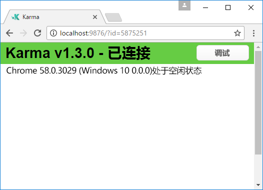
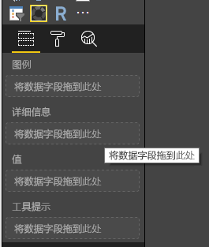
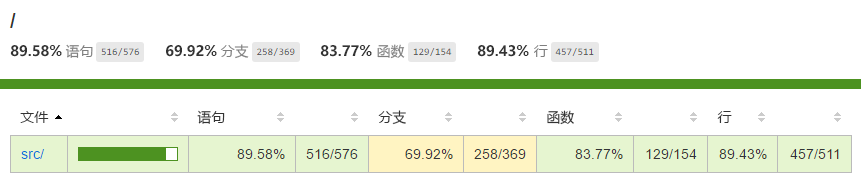

# <a name="tutorial-add-unit-tests-for-power-bi-visual-projects"></a>教程：为 Power BI 视觉对象项目添加单元测试

本教程介绍为 Power BI 视觉对象编写单元测试的相关基础知识。

在本教程中，我们将考虑

* 如果使用测试运行程序 karma.js 测试框架 jasmine.js
* 如何使用 powerbi-visuals-utils-testutils 包
* 如何借助 Mocks 和 Fakes 集来简化 Power BI 视觉对象的单元测试。

## <a name="prerequisites"></a>先决条件

* 你拥有 Power BI 视觉对象项目
* 经过配置的 Node.JS 环境

## <a name="install-and-configure-karmajs-and-jasmine"></a>安装并配置 karma.js 和 jasmine

将所需库添加到 package.json 中的 `devDependencies` 部分：

```json
"@babel/polyfill": "^7.2.5",
"@types/d3": "5.5.0",
"@types/jasmine": "2.5.37",
"@types/jasmine-jquery": "1.5.28",
"@types/jquery": "2.0.41",
"@types/karma": "3.0.0",
"@types/lodash-es": "4.17.1",
"coveralls": "3.0.2",
"istanbul-instrumenter-loader": "^3.0.1",
"jasmine": "2.5.2",
"jasmine-core": "2.5.2",
"jasmine-jquery": "2.1.1",
"jquery": "3.1.1",
"karma": "3.1.1",
"karma-chrome-launcher": "2.2.0",
"karma-coverage": "1.1.2",
"karma-coverage-istanbul-reporter": "^2.0.4",
"karma-jasmine": "2.0.1",
"karma-junit-reporter": "^1.2.0",
"karma-sourcemap-loader": "^0.3.7",
"karma-typescript": "^3.0.13",
"karma-typescript-preprocessor": "0.4.0",
"karma-webpack": "3.0.5",
"puppeteer": "1.17.0",
"style-loader": "0.23.1",
"ts-loader": "5.3.0",
"ts-node": "7.0.1",
"tslint": "^5.12.0",
"webpack": "4.26.0"
```

请查看下方说明，了解有关该包的详细信息。

保存 `package.json` 并在 `package.json` 位置的命令行上执行：

```cmd
npm install
```

包管理器将安装添加到 `package.json` 的所有新包

为运行单元测试，需要配置测试运行程序和 `webpack` 配置。可在此处查找配置示例

`test.webpack.config.js` 示例：

```typescript
const path = require('path');
const webpack = require("webpack");

module.exports = {
    devtool: 'source-map',
    mode: 'development',
    optimization : {
        concatenateModules: false,
        minimize: false
    },
    module: {
        rules: [
            {
                test: /\.tsx?$/,
                use: 'ts-loader',
                exclude: /node_modules/
            },
            {
                test: /\.json$/,
                loader: 'json-loader'
            },
            {
                test: /\.tsx?$/i,
                enforce: 'post',
                include: /(src)/,
                exclude: /(node_modules|resources\/js\/vendor)/,
                loader: 'istanbul-instrumenter-loader',
                options: { esModules: true }
            },
            {
                test: /\.less$/,
                use: [
                    {
                        loader: 'style-loader'
                    },
                    {
                        loader: 'css-loader'
                    },
                    {
                        loader: 'less-loader',
                        options: {
                            paths: [path.resolve(__dirname, 'node_modules')]
                        }
                    }
                ]
            }
        ]
    },
    externals: {
        "powerbi-visuals-api": '{}'
    },
    resolve: {
        extensions: ['.tsx', '.ts', '.js', '.css']
    },
    output: {
        path: path.resolve(__dirname, ".tmp/test")
    },
    plugins: [
        new webpack.ProvidePlugin({
            'powerbi-visuals-api': null
        })
    ]
};
```

`karma.conf.ts` 示例

```typescript
"use strict";

const webpackConfig = require("./test.webpack.config.js");
const tsconfig = require("./test.tsconfig.json");
const path = require("path");

const testRecursivePath = "test/visualTest.ts";
const srcOriginalRecursivePath = "src/**/*.ts";
const coverageFolder = "coverage";

process.env.CHROME_BIN = require("puppeteer").executablePath();

import { Config, ConfigOptions } from "karma";

module.exports = (config: Config) => {
    config.set(<ConfigOptions>{
        mode: "development",
        browserNoActivityTimeout: 100000,
        browsers: ["ChromeHeadless"], // or Chrome to use locally installed Chrome browser
        colors: true,
        frameworks: ["jasmine"],
        reporters: [
            "progress",
            "junit",
            "coverage-istanbul"
        ],
        junitReporter: {
            outputDir: path.join(__dirname, coverageFolder),
            outputFile: "TESTS-report.xml",
            useBrowserName: false
        },
        singleRun: true,
        plugins: [
            "karma-coverage",
            "karma-typescript",
            "karma-webpack",
            "karma-jasmine",
            "karma-sourcemap-loader",
            "karma-chrome-launcher",
            "karma-junit-reporter",
            "karma-coverage-istanbul-reporter"
        ],
        files: [
            "node_modules/jquery/dist/jquery.min.js",
            "node_modules/jasmine-jquery/lib/jasmine-jquery.js",
            {
                pattern: './capabilities.json',
                watched: false,
                served: true,
                included: false
            },
            testRecursivePath,
            {
                pattern: srcOriginalRecursivePath,
                included: false,
                served: true
            }
        ],
        preprocessors: {
            [testRecursivePath]: ["webpack", "coverage"]
        },
        typescriptPreprocessor: {
            options: tsconfig.compilerOptions
        },
        coverageIstanbulReporter: {
            reports: ["html", "lcovonly", "text-summary", "cobertura"],
            dir: path.join(__dirname, coverageFolder),
            'report-config': {
                html: {
                    subdir: 'html-report'
                }
            },
            combineBrowserReports: true,
            fixWebpackSourcePaths: true,
            verbose: false
        },
        coverageReporter: {
            dir: path.join(__dirname, coverageFolder),
            reporters: [
                // reporters not supporting the `file` property
                { type: 'html', subdir: 'html-report' },
                { type: 'lcov', subdir: 'lcov' },
                // reporters supporting the `file` property, use `subdir` to directly
                // output them in the `dir` directory
                { type: 'cobertura', subdir: '.', file: 'cobertura-coverage.xml' },
                { type: 'lcovonly', subdir: '.', file: 'report-lcovonly.txt' },
                { type: 'text-summary', subdir: '.', file: 'text-summary.txt' },
            ]
        },
        mime: {
            "text/x-typescript": ["ts", "tsx"]
        },
        webpack: webpackConfig,
        webpackMiddleware: {
            stats: "errors-only"
        }
    });
};
```

如有需要，可修改此配置。

`karma.conf.js` 的某些设置：

* `recursivePathToTests` 变量定位测试代码的位置。

* `srcRecursivePath` 变量在编译后定位输出的 JS 代码。

* `srcCssRecursivePath` 变量在使用样式编译 less 文件后定位输出的 CSS。

* `srcOriginalRecursivePath` 变量定位视觉对象的源代码。

* `coverageFolder` - 变量确定覆盖率报表的创建位置。

配置的某些属性：

* `singleRun: true` - 测试在 CI 系统上运行。 只需一次就足够了。
可更改为 `false` 以调试测试。 Karma 将持续运行浏览器，并允许使用控制台进行调试。

* `files: [...]` - 在此数组中，可以设置要加载到浏览器的文件。
通常有源文件、测试用例、库（jasmine、测试 utils）。 如有需要，可添加和列出其他文件。

* `preprocessors` - 这部分配置用于配置动作，这些操作在单元测试执行之前执行。 会有将 TypeScript 预编译为 JS 以及准备源映射文件的操作，并会生成代码覆盖率报表。 可禁用 `coverage` 以调试测试。 覆盖率会生成测试覆盖率检查代码的附加代码，导致测试调试变得复杂。

可在 karma.js 的[文档](https://karma-runner.github.io/1.0/config/configuration-file.html)中找到的所有配置的说明 

为方便使用，可将测试命令添加到 `scripts`：

```json
{
    "scripts": {
        "pbiviz": "pbiviz",
        "start": "pbiviz start",
        "typings":"node node_modules/typings/dist/bin.js i",
        "lint": "tslint -r \"node_modules/tslint-microsoft-contrib\"  \"+(src|test)/**/*.ts\"",
        "pretest": "pbiviz package --resources --no-minify --no-pbiviz --no-plugin",
        "test": "karma start"
    }
    ...
}
```

现在已可开始编写单元测试了。

## <a name="simple-unit-test-for-check-dom-element-of-the-visual"></a>用于检查视觉对象 DOM 元素的简单单元测试

为测试视觉对象，须创建一个视觉对象的实例。

### <a name="creating-visual-instance-builder"></a>创建视觉对象实例生成器

使用下一个代码将 `visualBuilder.ts` 文件添加到 `test` 文件夹中：

```typescript
import {
    VisualBuilderBase
} from "powerbi-visuals-utils-testutils";

import {
    BarChart as VisualClass
} from "../src/visual";

import  powerbi from "powerbi-visuals-api";
import VisualConstructorOptions = powerbi.extensibility.visual.VisualConstructorOptions;

export class BarChartBuilder extends VisualBuilderBase<VisualClass> {
    constructor(width: number, height: number) {
        super(width, height);
    }

    protected build(options: VisualConstructorOptions) {
        return new VisualClass(options);
    }

    public get mainElement() {
        return this.element.children("svg.barChart");
    }
}
```

`build` 方法可用于创建视觉对象实例。 `mainElement` 是一个 get 方法，可在视觉对象中返回 "root" DOM 元素的实例。 Getter（可选）可使编写单元测试更容易。

那么，我们有了一个视觉对象实例的生成器。 现在来编写测试用例。 这个测试用例将用于检查视觉对象显示时创建的那些 SVG 元素。

### <a name="creating-typescript-file-to-write-test-cases"></a>创建用于编写测试用例的 TypeScript 文件

使用以下代码为测试用例添加 `visualTest.ts` 文件：

```typescript
import powerbi from "powerbi-visuals-api";

import { BarChartBuilder } from "./VisualBuilder";

import {
    BarChart as VisualClass
} from "../src/visual";

import VisualBuilder = powerbi.extensibility.visual.test.BarChartBuilder;

describe("BarChart", () => {
    let visualBuilder: VisualBuilder;
    let dataView: DataView;

    beforeEach(() => {
        visualBuilder = new VisualBuilder(500, 500);
    });

    it("root DOM element is created", () => {
        expect(visualBuilder.mainElement).toBeInDOM();
    });
});
```

有几种方法要调用。

* [`describe`](https://jasmine.github.io/api/2.6/global.html#describe) 方法描述测试用例。 在 jasmine 框架的上下文中，通常会调用一套或一组规范。

* 每次调用 `it` 方法之前都会调用 `beforeEach` 方法，前者在 [`describe`](https://jasmine.github.io/api/2.6/global.html#beforeEach) 方法中定义。

* `it` 定义单个规范。[`it`](https://jasmine.github.io/api/2.6/global.html#it) 方法应包含一个或多个 `expectations`。

* [`expect`](https://jasmine.github.io/api/2.6/global.html#expect) - 方法创建规范预期。如果所有预期均通过而未发生任何失败，规范就会成功。

* `toBeInDOM` - 这是一个匹配程序方法。 有关匹配程序，可阅读 jasmine 框架的[文档](https://jasmine.github.io/api/2.6/matchers.html)，了解相关信息。

在官方[文档](https://jasmine.github.io/)中阅读有关 jasmine 框架的详细信息  。

之后，可在命令行工具中键入命令，运行单元测试。

此测试检查是否创建了视觉对象的根 SVG 元素。

### <a name="launch-unit-tests"></a>启动单元测试

若要运行单元测试，可在命令行工具中键入此命令。

```cmd
npm run test
```

`karma.js` 运行 Chrome 浏览器并执行测试用例。



> [!NOTE]
> Google Chrome 须安装在本地。

在命令行中，将得到以下输出：

```cmd
> karma start

23 05 2017 12:24:26.842:WARN [watcher]: Pattern "E:/WORKSPACE/PowerBI/PowerBI-visuals-sampleBarChart/data/*.csv" does not match any file.
23 05 2017 12:24:30.836:WARN [karma]: No captured browser, open http://localhost:9876/
23 05 2017 12:24:30.849:INFO [karma]: Karma v1.3.0 server started at http://localhost:9876/
23 05 2017 12:24:30.850:INFO [launcher]: Launching browser Chrome with unlimited concurrency
23 05 2017 12:24:31.059:INFO [launcher]: Starting browser Chrome
23 05 2017 12:24:33.160:INFO [Chrome 58.0.3029 (Windows 10 0.0.0)]: Connected on socket /#2meR6hjXFmsE_fjiAAAA with id 5875251
Chrome 58.0.3029 (Windows 10 0.0.0): Executed 1 of 1 SUCCESS (0.194 secs / 0.011 secs)

=============================== Coverage summary ===============================
Statements   : 27.43% ( 65/237 )
Branches     : 19.84% ( 25/126 )
Functions    : 43.86% ( 25/57 )
Lines        : 20.85% ( 44/211 )
================================================================================
```

### <a name="how-to-add-static-data-for-unit-tests"></a>如何为单元测试添加静态数据

在 `test` 文件夹中创建 `visualData.ts` 文件。 使用以下代码：

```typescript
import powerbi from "powerbi-visuals-api";
import DataView = powerbi.DataView;

import {
    testDataViewBuilder,
    getRandomNumbers
} from "powerbi-visuals-utils-testutils";

export class SampleBarChartDataBuilder extends TestDataViewBuilder {
    public static CategoryColumn: string = "category";
    public static MeasureColumn: string = "measure";

    public constructor() {
        super();
        ...
    }

    public getDataView(columnNames?: string[]): DataView {
        let dateView: any = this.createCategoricalDataViewBuilder([
            ...
        ],
        [
            ...
        ], columnNames).build();

        // there's client side computed maxValue
        let maxLocal = 0;
        this.valuesMeasure.forEach((item) => {
                if (item > maxLocal) {
                    maxLocal = item;
                }
        });
        (<any>dataView).categorical.values[0].maxLocal = maxLocal;
    }
}
```

`SampleBarChartDataBuilder` 类扩展 `TestDataViewBuilder` 并实现抽象方法 `getDataView`。

将数据放入数据字段 Bucket 时，Power BI 会根据数据生成类别 `dataview` 对象。



在单元测试中，你没有可用于重现它的 Power BI 核心函数。 但你需要将静态数据映射到类别 `dataview`。 可借助 `TestDataViewBuilder` 类实现此操作。

[阅读有关 DataViewMapping 的详细信息](https://github.com/Microsoft/PowerBI-visuals/blob/master/Capabilities/DataViewMappings.md)

在 `getDataView` 方法中，只需使用数据调用 `createCategoricalDataViewBuilder` 方法即可。

在 `sampleBarChart` 视觉对象 [capabilities.json](https://github.com/Microsoft/PowerBI-visuals-sampleBarChart/blob/master/capabilities.json#L2) 中，我们有 dataRoles 和 dataViewMapping 对象：

```json
"dataRoles": [
    {
        "displayName": "Category Data",
        "name": "category",
        "kind": "Grouping"
    },
    {
        "displayName": "Measure Data",
        "name": "measure",
        "kind": "Measure"
    }
],
"dataViewMappings": [
    {
        "conditions": [
            {
                "category": {
                    "max": 1
                },
                "measure": {
                    "max": 1
                }
            }
        ],
        "categorical": {
            "categories": {
                "for": {
                    "in": "category"
                }
            },
            "values": {
                "select": [
                    {
                        "bind": {
                            "to": "measure"
                        }
                    }
                ]
            }
        }
    }
],
```

若要生成相同的映射，必须将以下参数设置为 `createCategoricalDataViewBuilder` 方法：

```typescript
([
    {
        source: {
            displayName: "Category",
            queryName: SampleBarChartData.ColumnCategory,
            type: ValueType.fromDescriptor({ text: true }),
            roles: {
                Category: true
            },
        },
        values: this.valuesCategory
    }
],
[
    {
        source: {
            displayName: "Measure",
            isMeasure: true,
            queryName: SampleBarChartData.MeasureColumn,
            type: ValueType.fromDescriptor({ numeric: true }),
            roles: {
                Measure: true
            },
        },
        values: this.valuesMeasure
    },
], columnNames)
```

其中有 `this.valuesCategory` 类别的数组。

```ts
public valuesCategory: string[] = ["Monday", "Tuesday", "Wednesday", "Thursday", "Friday", "Saturday", "Sunday"];
```

和每个类别的 `this.valuesMeasure` 度量值数组。 示例：

```ts
public valuesMeasure: number[] = [742731.43, 162066.43, 283085.78, 300263.49, 376074.57, 814724.34, 570921.34];
```

现在，可在单元测试中使用 `SampleBarChartDataBuilder` 类。

`powerbi-visuals-utils-testutils` 包中定义的 `ValueType` 类。 且 `createCategoricalDataViewBuilder` 方法需要 `lodash` 库。

将这些包添加到依赖项中。

在 `package.json` 中的 `devDependencies` 部分

```json
"lodash-es": "4.17.1",
"powerbi-visuals-utils-testutils": "2.2.0"
```

调用

```cmd
npm install
```

以安装 `lodash-es` 库。

现在，可再次运行单元测试。 必须得到此输出

```cmd
> karma start

23 05 2017 16:19:54.318:WARN [watcher]: Pattern "E:/WORKSPACE/PowerBI/PowerBI-visuals-sampleBarChart/data/*.csv" does not match any file.
23 05 2017 16:19:58.333:WARN [karma]: No captured browser, open http://localhost:9876/
23 05 2017 16:19:58.346:INFO [karma]: Karma v1.3.0 server started at http://localhost:9876/
23 05 2017 16:19:58.346:INFO [launcher]: Launching browser Chrome with unlimited concurrency
23 05 2017 16:19:58.394:INFO [launcher]: Starting browser Chrome
23 05 2017 16:19:59.873:INFO [Chrome 58.0.3029 (Windows 10 0.0.0)]: Connected on socket /#NcNTAGH9hWfGMCuEAAAA with id 3551106
Chrome 58.0.3029 (Windows 10 0.0.0): Executed 1 of 1 SUCCESS (1.266 secs / 1.052 secs)

=============================== Coverage summary ===============================
Statements   : 56.72% ( 135/238 )
Branches     : 32.54% ( 41/126 )
Functions    : 66.67% ( 38/57 )
Lines        : 52.83% ( 112/212 )
================================================================================
```

须看到 Chrome 浏览器已启动且带有视觉对象。


深度关注覆盖率摘要。 打开 `coverage\index.html` 以了解有关当前代码覆盖率的详细信息



或在 `src` 文件夹范围内


在文件范围内，可查看源代码。 如果在运行单元测试期间未执行某个代码，则 `Coverage` utils 会将行背景标记为红色。


> [!IMPORTANT]
> 但代码覆盖并不意味会实现好的视觉对象功能覆盖。 一个简单的单元测试在 `src\visual.ts` 中提供超过 96% 的覆盖率。

## <a name="next-steps"></a>后续步骤

视觉对象就绪时，可将视觉对象提交至发布。

[阅读有关向 AppSource 发布视觉对象的详细信息](../office-store.md)
