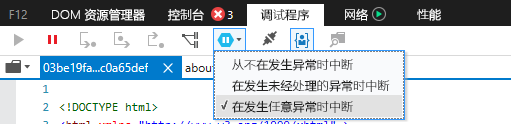
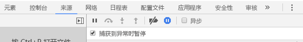

# <a name="how-to-debug-power-bi-visuals"></a>如何调试 Power BI 视觉对象

本页介绍了在生成视觉对象时进行调试的一些提示与技巧。 其中不仅介绍了基本步骤，还介绍了标准前端应用和 Power BI 视觉对象调试的区别。
阅读本文后，你将能够在 Chrome 和 Microsoft Edge 中使用断点、记录异常和捕获异常来调试 Power BI 视觉对象。

## <a name="using-breakpoints"></a>使用断点

由于每次更新视觉对象时都会完全重载视觉对象的 JavaScript，因此在调试视觉对象刷新后，添加的任何断点都会丢失。 解决方法是，在代码中使用 `debugger` 语句。 建议在代码中使用 `debugger` 时禁用自动重载。

```typescript
public update(options: VisualUpdateOptions) {
    console.log('Visual update', options);
    debugger;
    this.target.innerHTML = `<p>Update count: <em>${(this.updateCount</em></p>`;
}
```


## <a name="showing-exceptions"></a>显示异常

处理视觉对象时，可看到 Power BI 服务“使用”所有错误。 这是 Power BI 有意为之的一种功能，以防运行不正常的视觉对象导致整个应用变得不稳定。

解决方法是，添加代码来捕获和记录异常，或将调试器设置为在捕获到异常时中断。


## <a name="log-exceptions"></a>记录异常

若要在 Power BI 视觉对象中记录异常，请将以下代码添加到视觉对象中，以定义异常日志记录修饰器。

```typescript
export function logExceptions(): MethodDecorator {
    return function (target: Object, propertyKey: string, descriptor: TypedPropertyDescriptor<any>): TypedPropertyDescriptor<any> {
        return {
            value: function () {
                try {
                    return descriptor.value.apply(this, arguments);
                } catch (e) {
                    console.error(e);
                    throw e;
                }
            }
        }
    }
}
```
然后，可以对任何函数使用此修饰器，从而查看错误日志记录。

```typescript
@logExceptions()
public update(options: VisualUpdateOptions) {
```

## <a name="break-on-exceptions"></a>在捕获到异常时中断

还可以将浏览器设置为，在捕获到异常时中断。 每当错误发生时，此设置都会停止执行代码，你可以从中断处进行调试。

### <a name="edge"></a>Edge

1. 打开开发人员工具 (F12)。
2. 转到“调试器”  选项卡。
3. 单击“在捕获到异常时中断”  图标（带有暂停符号的六边形）。
4. 选中“在捕获到任意异常时中断”  。



## <a name="chrome"></a>Chrome

1. 打开开发人员工具 (F12)。
2. 转到“源”选项卡  。
3. 单击“在捕获到异常时中断”  图标（带有暂停符号的停止标志）。
4. 选中“在捕获到异常时暂停”  复选框。



## <a name="next-steps"></a>后续步骤
* [排除 Power BI 视觉对象故障](power-bi-custom-visuals-troubleshoot.md)
* 有关详细信息和常见问题解答，请参阅 [Power BI 视觉对象常见问题解答](power-bi-custom-visuals-faq.md#organizational-power-bi-visuals)
