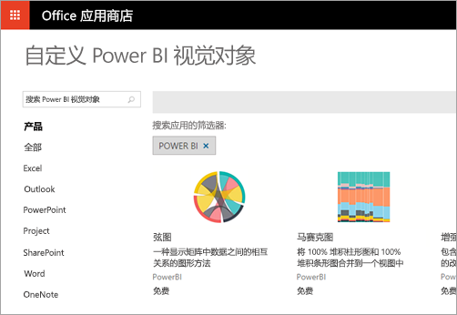
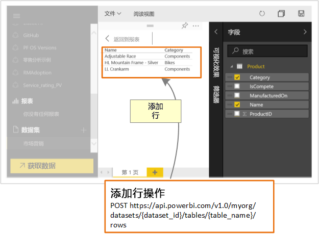

# 开发人员可以使用 Power BI 做什么？

开发人员有不同选项来尝试将 Power BI 内容包含在应用程序中。 作为开发人员，可以使用这些选项，包括“使用 Power BI 嵌入”、“自定义视觉对象”和“将数据推送到 Power BI”。

## 嵌入 Power BI 内容

Azure (PaaS) 中的 Power BI 服务 (SaaS) 和 Power BI 嵌入式服务具有用于嵌入仪表板和报表的 API。 此功能意味着，在嵌入内容时，可以访问最新的 Power BI 功能，如仪表板、网关和应用工作区。

可使用[嵌入安装程序工具](https://aka.ms/embedsetup)快速开始并下载示例应用程序。

选择最适合你的解决方案：

* 通过[为客户嵌入内容](embedding.md#embedding-for-your-customers)，可为没有 Power BI 帐户的用户嵌入仪表板和报表。 运行[为客户嵌入](https://aka.ms/embedsetup/AppOwnsData)解决方案。

* 通过[为组织嵌入内容](embedding.md#embedding-for-your-organization)，可以扩展 Power BI 服务。 运行[为组织嵌入](https://aka.ms/embedsetup/UserOwnsData)解决方案。

若要详细了解如何使用 Power BI 进行嵌入，请参阅[使用 Power BI 进行嵌入](embedding.md)。

## 开发自定义视觉对象

可以使用 Power BI 的自定义视觉对象创建为你或贵公司量身定做的唯一视觉对象类型。 通常这些自定义视觉对象由开发人员创建。 它们是在 Power BI 附带的大量视觉对象不能完全满足你的需求时构建的。

可以通过自定义视觉对象创建视觉对象，以便在 Power BI 报表中使用。 自定义视觉对象将写入 TypeScript，即 JavaScript 的超集。 TypeScript 支持某些高级功能并提前获取 ES6/ES7 功能。 视觉对象样式使用层叠样式表 (CSS) 进行处理。 为方便起见，我们使用 Less 预编译器，该编译器支持某些高级功能，例如嵌套、变量、条件、循环和其他功能。 如果不想使用其中任何一种功能，可以在 less 文件中编写普通 CSS。

若要开始详细了解自定义视觉对象开发，请参阅[开发 Power BI 自定义视觉对象](custom-visual-develop-tutorial.md)。

## 使用 API 自动化

Power BI 显示可从众多不同数据源创建和实时更新的交互式仪表板。 通过使用支持 REST 调用的任何编程语言，可以实时创建与 Power BI 仪表板集成的应用。 此外可以将 Power BI 磁贴和报表集成到应用。

开发人员还可以构建他们自己的数据可视化效果（可用于交互报表和仪表板）。

若要查看可以使用 Power BI API 执行的一些操作，请参阅[开发人员可以使用 Power BI API 执行哪些操作](overview-of-power-bi-rest-api.md)？

## 后续步骤

[使用 Power BI 嵌入](embedding.md)  

[开发 Power BI 自定义视觉对象](https://microsoft.github.io/PowerBI-visuals/docs/step-by-step-lab/developing-a-power-bi-custom-visual/)

[开发人员可以使用 Power BI API 做什么？](overview-of-power-bi-rest-api.md)

[Power BI 开发人员中心](https://powerbi.microsoft.com/developers/)