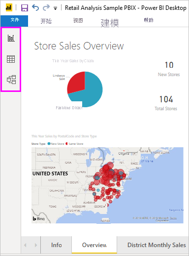
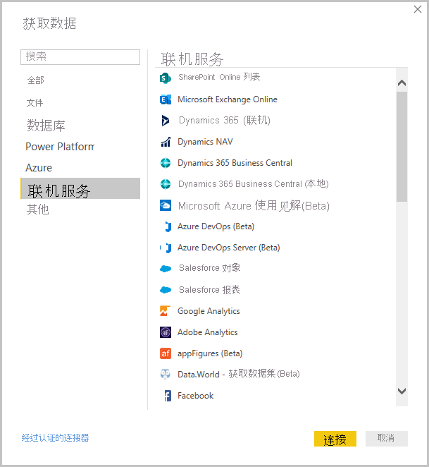
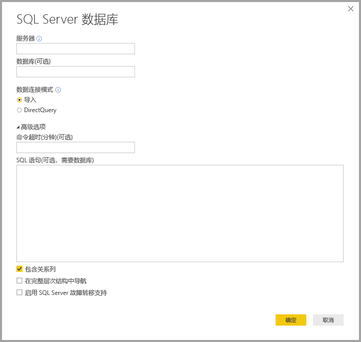
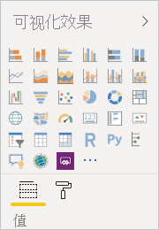

# 什么是 Power BI Desktop？

Power BI Desktop 是一款可在本地计算机上安装的免费应用程序，可用于连接到数据、转换数据并实现数据的可视化效果  。 使用Power BI Desktop，你可以连接到许多不同的数据源，并将其合并（通常称为建模）到数据模型中  。 通过此数据模型，可生成视觉对象，以及可作为报表与组织内其他人共享的视觉对象集合。 致力于商业智能项目的大多数用户使用 Power BI Desktop 创建报表，然后使用 Power BI 服务与其他人共享其报表  。

Power BI Desktop 的最常见用途如下：

* 连接到数据
* 转换和清除该数据，以创建数据模型
* 创建视觉对象，如提供数据的可视化表示形式的图表或图形
* 在一个或多个报表页上创建作为视觉对象集合的报表
* 使用 Power BI 服务与其他人共享报表

最常负责此类任务的人员通常被视为“数据分析师”（有时称为“分析师”）或“商业智能专业人员”（通常称为“报表创建者”）    。 但是，不将自己视为分析师或报表创建者的许多人使用 Power BI Desktop 创建引人注目的报表，或拉取来自各个源的数据并生成可与其同事和组织共享的数据模型。

Power BI Desktop 中提供三个视图，你可以在画布的左侧选择它们。 视图显示的顺序如下所示：
* **报表**：在此视图中，创建报表和视觉对象，并花费大部分时间执行创建操作。
* **数据**：在此视图中，查看与报表关联的数据模型中使用的表、度量值和其他数据，并转换数据以便在报表的模型中充分利用。
* **模型**：在此视图中，查看和管理数据模型中各表之间的关系。

下图显示了在画布左侧显示的三个视图：

 

## 连接到数据
要开始使用 Power BI Desktop，第一步为连接到数据。 可从 Power BI Desktop 连接到多个不同数据源。 

连接到数据：

1. 在“开始”功能区，选择“获取数据” > “更多”    。 

   此时将显示“获取数据”窗口，其中显示了 Power BI Desktop 可连接到的多个类别  。

   

2. 选择数据类型时，系统会提示输入 Power BI Desktop 代表你连接到数据源所需的 URL 和凭据等信息。

   

3. 连接到一个或多个数据源后，你可能希望转换数据，因此这样做对你非常有用。

## 转换和清除数据、创建模型

在 Power BI Desktop 中，可以使用内置 [Power Query 编辑器](https://docs.microsoft.com/power-bi/desktop-query-overview)清除并转换数据。 使用 Power Query 编辑器可以对数据进行更改，如更改数据类型、删除列或合并来自多个源的数据。 这有点像雕刻：你从大块粘土（即数据）着手，然后根据需要进行刮削或添加其他部分，直到粘土形状（数据形态）符合你的要求。 

启动 Power Query 编辑器：

- 在“主页”功能区中，选择“编辑查询” > “编辑查询”    。

   此时显示“Power Query 编辑器”窗口  。

   

Power Query 编辑器将记录转换数据（例如重命名表、转换数据类型或删除列）的每一个步骤。 每当此查询连接到数据源时，这些步骤都会执行，使数据始终以指定的方式进行调整。

下图显示已调整并转换为模型的查询的“Power Query 编辑器”窗口  。

 

数据符合你的要求后，即可创建视觉对象。 

## 创建视觉对象 

拥有数据模型后，即可将字段拖动到报表画布上以创建视觉对象   。 视觉对象是模型中的数据的图形表示形式。 可以在 Power BI Desktop 中选择多个不同类型的视觉对象。 以下视觉对象显示一个简单的柱形图。 

创建或更改视觉对象： 

- 在“可视化对象”窗格中，选择视觉对象图标  。 

   

   如果已在报表画布上选择一个视觉对象，则选定的视觉对象将更改为所选的类型。 

   如果在画布上未选择任何视觉对象，将根据你的选择创建新的视觉对象。

## 创建报表

通常，你会想要创建视觉对象集合，这些视觉对象可显示已用于在 Power BI Desktop 中创建模型的数据的各个方面。 一个 Power BI Desktop 文件中的视觉对象集合称为“报表”  。 报表可以有一个或多个页面，就像 Excel 文件可以有一个或多个工作表。 

借助 Power BI Desktop，可以使用来自多个源的数据创建复杂且视觉效果丰富的报表，即可与组织中的其他人共享的多合一报表。

在下图中，你将看到 Power BI Desktop 报表的首页，名为“概述”（如图像底部附近的选项卡所示）  。 

## 共享报表

准备好与其他人共享报表后，可以将报表发布到 Power BI 服务，并使其可供组织中拥有 Power BI 许可证的任何人使用  。 

发布 Power BI Desktop 报表： 

1. 从“主页”功能区选择“发布”   。

   

   Power BI Desktop 使用你的 Power BI 帐户将你连接到 Power BI 服务。 

2. Power BI 会提示你选择要在 Power BI 服务中共享报表的位置，例如工作区、团队工作区或 Power BI 服务中的其他位置。 

   必须具有 Power BI 许可证才能将报表共享到 Power BI 服务。

## 后续步骤

要开始使用 Power BI Desktop，首先需要下载并安装应用程序。 获取 Power BI Desktop 的方法有两种：

* [通过 Windows 应用商店获取 Power BI Desktop](https://aka.ms/pbidesktopstore)
* [从 Web 下载 Power BI Desktop](https://docs.microsoft.com/power-bi/desktop-get-the-desktop#download-power-bi-desktop-directly)

