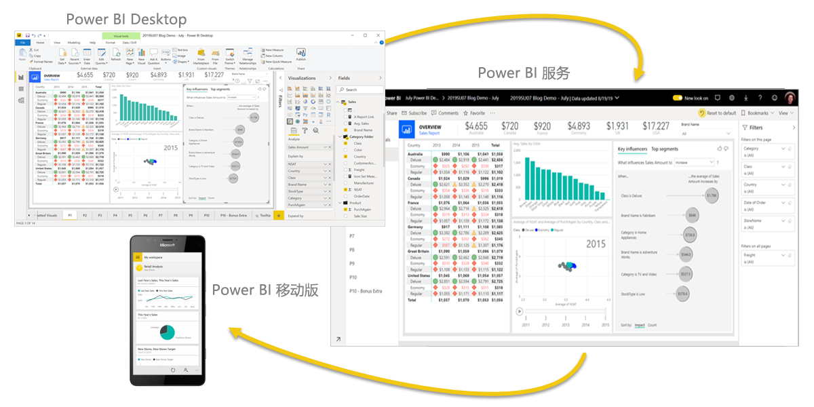
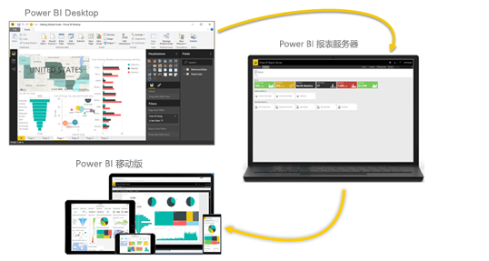

# 什么是 Power BI？
**Power BI** 是软件服务、应用和连接器的集合，它们协同工作以将相关数据来源转换为连贯的视觉逼真的交互式见解。 数据可以是 Excel 电子表格，也可以是基于云和本地混合数据仓库的集合。 使用 Power BI，可以轻松连接到数据源，可视化并发现重要内容，并根据需要与任何人共享。

## Power BI 的组成部分
Power BI 包括： 
- 名为 Power BI Desktop 的 Windows 桌面应用程序 
- 名为 Power BI 服务的联机 SaaS（软件即服务）   。 
- 适用于 Windows、iOS 和 Android 设备的 Power BI 移动应用 

Power BI Desktop、服务和移动应用这三个元素旨在让你能够采用适合你及你的角色且最有效的方式来创建、共享和使用业务见解。

使用第四个元素 Power BI 报表服务器  ，在 Power BI Desktop 中创建 Power BI 报表后，可以将其发布到本地报表服务器。 详细了解 [Power BI 报表服务器](#on-premises-reporting-with-power-bi-report-server)。

## Power BI 如何与你的角色匹配
使用 Power BI 的方式取决于你在项目中的角色或你所在的团队。 不同角色的其他用户可能以不同方式使用 Power BI。

例如，你可能主要使用 Power BI 服务来查看报表和仪表板  。 但是，负责处理数字和生成业务报表的同事可能主要使用 Power BI Desktop 来创建报表，然后将这些报表发布到 Power BI 服务中（你可在此处查看这些报表）  。 而另一位负责销售的同事可能主要使用 Power BI 手机应用来监视销售配额的进度和深入了解新的潜在销售顾客的详细信息  。

如果你是开发人员，可以使用 Power BI API 将数据推送到数据集或将仪表板和报表嵌入到你自己的自定义应用程序。 有关于新视觉对象的意见或建议？ 自行生成并与他人共享。  

你还可能会在不同时间使用 Power BI 的每个元素，具体视你尝试实现的目标或你在给定项目中的角色而定。

如何使用 Power BI 取决于 Power BI 的哪个功能或服务是适用的最佳工具。 例如，可以使用 Power BI Desktop 来为自己团队创建有关客户参与统计信息的报表，也可以在 Power BI 服务的实时仪表板中查看库存和生产进度。 Power BI 的每个部分都可供使用，这正是 Power BI 极具灵活性和吸引力的原因所在。

浏览与你的角色相关的文档：
- 适用于[设计者](desktop-what-is-desktop.md)的 Power BI Desktop 
- 面向[*使用者*](../consumer/end-user-consumer.md)的 Power BI
- 面向[*管理员*](../admin/service-admin-administering-power-bi-in-your-organization.md)的 Power BI
- 面向开发人员  的 Power BI
    * [Power BI 嵌入式分析](../developer/embedded/embedding.md)
    * [Azure 中的 Power BI Embedded 是指什么？](../developer/embedded/azure-pbie-what-is-power-bi-embedded.md)
    * [Power BI 中的视觉对象](../developer/visuals/power-bi-custom-visuals.md)
    * [开发人员可以使用 Power BI API 做什么？](../developer/automation/overview-of-power-bi-rest-api.md)

## Power BI 中的工作流
Power BI 中的常见工作流始于连接到数据源并在 Power BI Desktop 中生成报表。 然后，将该报表从 Power BI Desktop 发布到 Power BI 服务并进行共享，以便使用 Power BI 服务和移动设备的最终用户可以查看报表并与之交互。
此工作流很常见，展示了三个主要的 Power BI 元素如何相互补充。

以下是 [Power BI Desktop 与 Power BI 服务比较](../fundamentals/service-service-vs-desktop.md)的详情。

## 使用 Power BI 报表服务器处理本地报表

但是，如果你未准备好迁移到云，而且需要用公司防火墙保护报表，那该怎么办？  请继续阅读。

你可使用 Power BI 报表服务器提供的各种现成工具和服务在本地创建、部署和管理 Power BI 移动报表和分页报表。

Power BI 报表服务器是在防火墙后面部署的解决方案，然后以不同方式将报表交付给正确用户，无论是在 Web 浏览器、移动设备还是以电子邮件方式查看它们。 Power BI 报表服务器与云中的 Power BI 兼容，因此可以在就绪时转到云。 

详细了解 [Power BI 报表服务器](../report-server/get-started.md)。

## 后续步骤
- [快速入门：了解如何使用 Power BI 服务](../service-the-new-power-bi-experience.md)   
- [教程：Power BI 服务入门](service-get-started.md)
- [快速入门：连接到 Power BI Desktop 中的数据](../connect-data/desktop-quickstart-connect-to-data.md)
