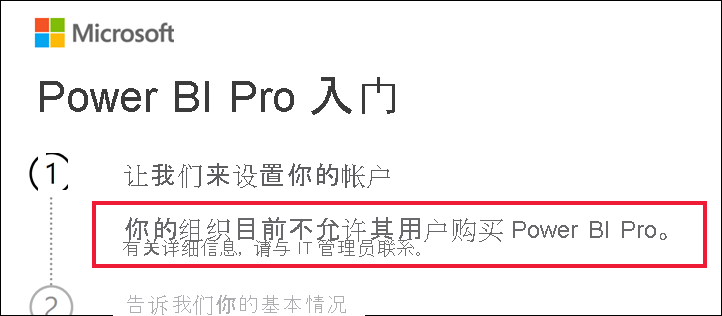

# 禁用 Power BI Pro 购买后应执行的操作

你已尝试购买 Power BI Pro 并收到一条消息，指示你的组织不允许其用户执行此操作。 由于各种原因，某些组织会阻止成员进行 Power BI Pro 自助式购买操作。  例如，你的组织可能制定了一项策略，即所有许可证和订阅均由集中式 IT 部门或支持人员管理。 

## 解决方案
要完成购买，请与 IT 部门或支持人员联系，并要求他们[按照这些说明向你提供许可证](../admin/service-admin-manage-licenses.md)。

## 后续步骤
[按许可证类型列出的 Power BI 功能](service-features-license-type.md)