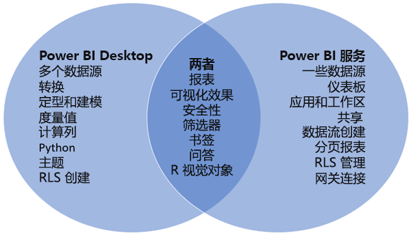

# 比较 Power BI Desktop 和 Power BI 服务

在维恩图中比较 Power BI Desktop 和 Power BI 服务，中间的区域显示两者的重叠方式。 可以在 Power BI Desktop 或服务中执行某些任务。 维恩图的两侧显示了应用程序和服务的独特功能。  

“Power BI Desktop”是一个完整的数据分析和报表创建工具，可以在本地计算机上免费安装该工具。 它包括查询编辑器，可以在其中连接到许多不同的数据源，并将其（通常称为建模）合并到数据模型中。 然后根据该数据模型设计报表。 请参阅 [Power BI Desktop 入门指南](desktop-getting-started.md)了解整个过程。

“PowerBI 服务”是基于云的服务。 它支持团队和组织的轻量级报表编辑和协作。 也可以连接到 Power BI 服务中的数据源，但建模不可以。

致力于商业智能项目的大多数 Power BI 报表设计器都使用“Power BI Desktop”创建 Power BI 报表，然后使用“Power BI 服务”开展协作并分发报表。

Power BI 服务还在 Power BI Premium 容量支持的工作区中托管分页报表。 使用 Power BI 报表生成器创建分页报表。 请参阅“Power BI Premium 中的分页报表是什么？”一文中的[比较 Power BI 报表和分页报表](../paginated-reports/paginated-reports-report-builder-power-bi.md#compare-power-bi-reports-and-paginated-reports) 以了解详细信息。

## 编辑 Power BI 报表

在应用程序和服务中，可以生成和编辑 Power BI 报表。 报表可以有一个或多个页面，带有视觉对象和视觉对象的集合。 添加书签、按钮、筛选器和钻取，以增强报表中的导航功能。

Power BI Desktop 中和服务中的报表编辑器类似。 它们由三个部分组成：  

1. 顶部导航窗格，在 Power BI Desktop 和服务中有所不同    
2. 报表画布     
3. “字段”、“可视化效果”和“筛选器”窗格  

此视频显示 Power BI Desktop 中的报表编辑器。 

<iframe width="560" height="315" src="https://www.youtube.com/embed/IkJda4O7oGs" frameborder="0" allowfullscreen></iframe>

## 使用 Power BI 服务

### 协作

创建报表后，可以将其保存到 Power BI 服务中的“工作区”，你和你的同事可以在其中进行协作。 基于这些报表生成“仪表板”。 然后，你可以与组织内外的报表使用者共享这些仪表板和报表。 报表使用者可在 Power BI 服务的阅读视图，而不是编辑视图中查看它们。 报表使用者无法访问报告创建者可用的所有功能。  你还可以共享数据集，让其他人从中生成自己的报表。 详细了解[在 Power BI 服务中进行协作](../collaborate-share/service-new-workspaces.md)。

### 数据流自助数据准备

数据流有助于组织统一来自不同来源的数据并为建模做好数据准备。 分析人员可以使用熟悉的自助服务工具轻松创建数据流。 分析师通过定义数据源连接、ETL 逻辑、刷新计划等来引入、转换、集成和丰富大数据。 详细了解[数据流自助数据准备](../transform-model/service-dataflows-overview.md)。

## 后续步骤

[什么是 Power BI Desktop？](desktop-what-is-desktop.md)

在 Power BI 服务中[创建报表](../create-reports/service-report-create-new.md)

[报表设计器的基本概念](service-basic-concepts.md)

更多问题？ [尝试参与 Power BI 社区](https://community.powerbi.com/)
