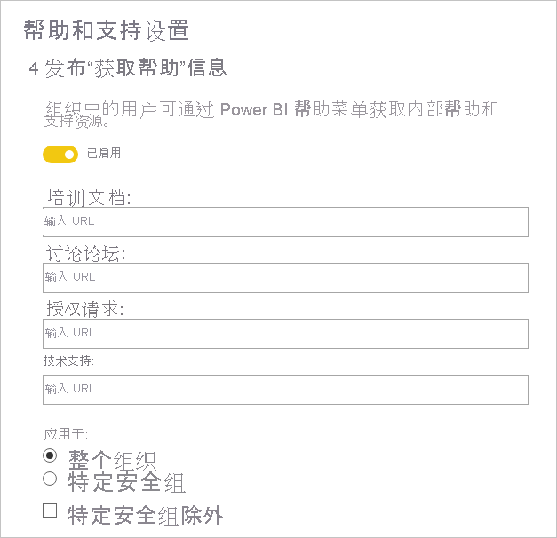
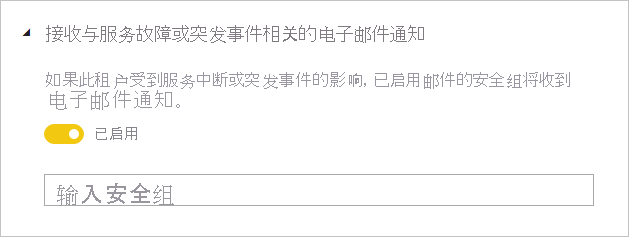
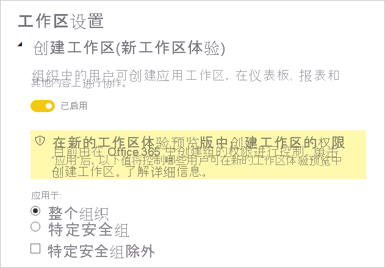
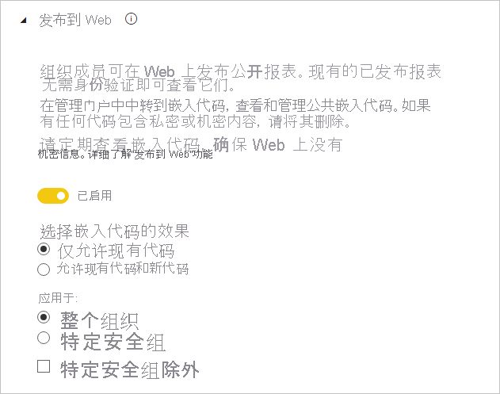
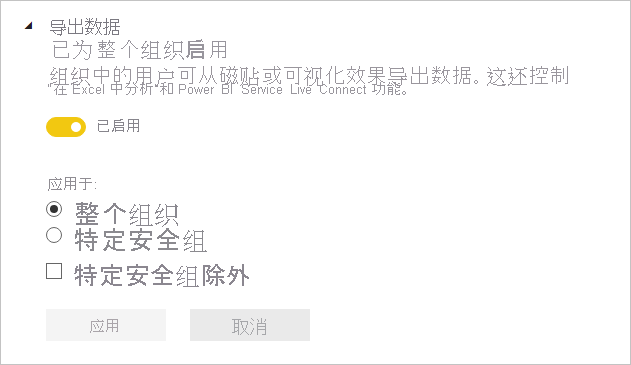
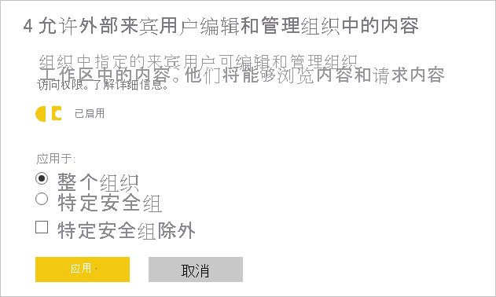

# 租户管理员设置指南

本文的目标读者是 Power BI 管理员，他们负责在组织中设置和配置 Power BI 环境。

我们提供有关特定租户设置的指导，介绍哪些设置可帮助改进 Power BI 体验、哪些设置可能使你的组织面临风险。 建议始终使租户配置与组织的策略和流程保持一致。

[租户设置](../service-admin-portal.md#tenant-settings)在[管理门户](https://app.powerbi.com/admin-portal/tenantSettings)中进行管理，可以由 [Power BI 服务管理员](../service-admin-administering-power-bi-in-your-organization.md#administrator-roles-related-to-power-bi)进行配置。 许多租户设置可以将功能和特性限制于一组有限的用户。 因此，建议首先熟悉设置以计划所需的安全组。 你可能会发现可以将同一安全组应用于多个设置。

## 改进 Power BI 体验

### 发布“获取帮助”信息

建议使用 [Microsoft Teams](/microsoftteams) 或其他协作平台建立与 Power BI 相关的内部站点。 这些站点可用于存储培训文档、主持讨论、请求许可证或响应求助。

如果执行此操作，建议为整个组织启用“发布‘获取帮助’信息”设置   。 它可以在“帮助和支持设置”组中找到  。 可以为以下内容设置 URL：

- 培训文档
- 讨论论坛
- 授权请求
- 技术支持

这些 URL 将成为 Power BI 帮助菜单中的链接。

> [!NOTE]
> 提供“授权请求”URL 将阻止单个用户注册免费的 60 天 Power BI Pro 试用版  。 会将这些用户导向内部站点，提供有关如何获得（免费或 Pro）许可证的信息。

## 管理风险

### 接收与服务中断或突发事件相关的电子邮件通知

如果你的租户受到服务中断或突发事件的影响，可以通过电子邮件通知你。 这样，你就可以主动响应事件。

建议启用“接收与服务中断或突发事件相关的电子邮件通知”设置  。 它可以在“帮助和支持设置”组中找到  。 分配一个或多个“启用了邮件的”安全组  。

### 信息保护

信息保护允许在从 Power BI 服务导出数据时强制执行保护设置，如加密或水印。

有两个租户设置与信息保护相关。 默认为整个组织禁用这两项设置。

如果需要处理和保护敏感数据，建议启用这些设置。 有关详细信息，请参阅 [Power BI 中的数据保护](../admin/service-security-data-protection-overview.md)。

### 创建工作区

可以限制用户创建工作区。 这样，你就可以管控组织中创建的内容。

> [!NOTE]
> 目前处于旧工作区体验过渡到新体验的时期。 此租户设置仅适用于新体验。

默认为整个组织启用“创建工作区”设置  。 它位于“工作区设置”组中  。

建议分配一个或多个安全组。 可以授权或拒绝这些组创建工作区  。

请确保在文档中包含说明，以使用户（没有工作区创建权限的用户）知道如何请求新的工作区。

### 与外部用户共享内容

用户可以与组织外部的人员共享报表和仪表板。

默认为整个组织启用“与外部用户共享内容”设置  。 它位于“导出和共享设置”组中  。

建议分配一个或多个安全组。 可以授权或拒绝这些组与外部用户共享内容  。

### 发布到 Web

[发布到 Web](../service-publish-to-web.md) 功能允许在 Web 上发布公开报表。 如果使用不当，可能有在 Web 上实时公开保密信息的风险。

默认为整个组织启用“发布到 Web”设置，但限制非管理员用户创建嵌入代码  。 它位于“导出和共享设置”组中  。

如果启用，建议分配一个或多个安全组。 可以授权或拒绝这些组发布报表  。

此外，还可以选择嵌入代码的工作方式。 默认设置为“只允许现有代码”  。 这意味着将要求用户与 Power BI 管理员联系以创建嵌入代码。

还建议定期查看[发布到 Web 嵌入代码](https://app.powerbi.com/admin-portal/embedCodes)。 如果代码会导致发布私密或机密信息，请删除这些代码。

### 导出数据

可以限制用户从仪表板磁贴或报表视觉对象导出数据。

默认为整个组织启用“导出数据”设置  。 它位于“导出和共享设置”组中  。

建议分配一个或多个安全组。 可以授权或拒绝这些组发布报表  。

> [!IMPORTANT]
> 禁用此设置还会限制使用[在 Excel 中分析](../service-analyze-in-excel.md)和 Power BI 服务[实时连接](../desktop-report-lifecycle-datasets.md#using-a-power-bi-service-live-connection-for-report-lifecycle-management)功能。

> [!NOTE]
> 如果允许用户导出数据，可以通过强制执行[数据保护](../admin/service-security-data-protection-overview.md)来添加保护层。 配置后，将阻止未经授权用户导出带有敏感标签的内容。

### 允许外部来宾用户编辑和管理组织中的内容

外部来宾用户可以编辑和管理 Power BI 内容。 有关详细信息，请参阅[使用 Azure AD B2B 将 Power BI 内容分发给外部来宾用户](../service-admin-azure-ad-b2b.md)。

默认为整个组织禁用“允许外部来宾用户编辑和管理组织中的内容”设置  。 它位于“导出和共享设置”组中  。

如果需要授权外部用户编辑和管理内容，建议分配一个或多个安全组。 可以授权或拒绝这些组发布报表  。

### 开发人员设置

有两个租户设置与[嵌入 Power BI 内容](../developer/embedded/embedding.md)相关。 它们分别是：

- 在应用中嵌入内容（默认启用）
- 允许服务主体使用 Power BI API（默认禁用）

如果不打算使用开发人员 API 来嵌入内容，建议禁用它们。 或者，至少配置可执行此操作的特定安全组。

## 后续步骤

有关本文的详细信息，请参阅以下资源：

- [什么是 Power BI 管理？](../service-admin-administering-power-bi-in-your-organization.md)
- [在管理门户中管理 Power BI](../service-admin-portal.md)
- 是否有任何问题？ [尝试咨询 Power BI 社区](https://community.powerbi.com/)
- 建议？ [提出改进 Power BI 的想法](https://ideas.powerbi.com)
