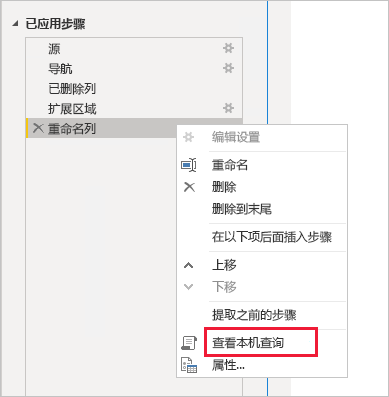
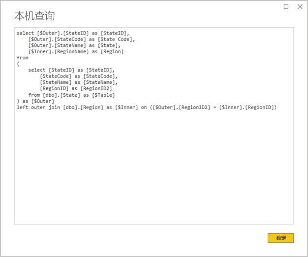
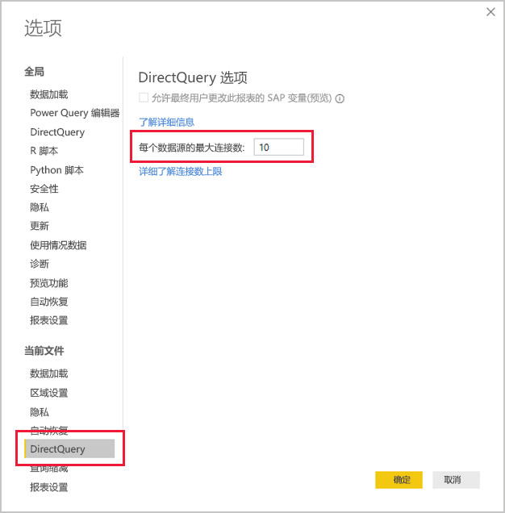
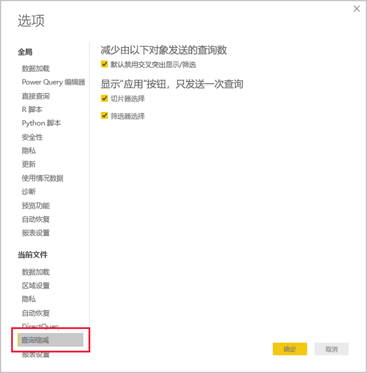
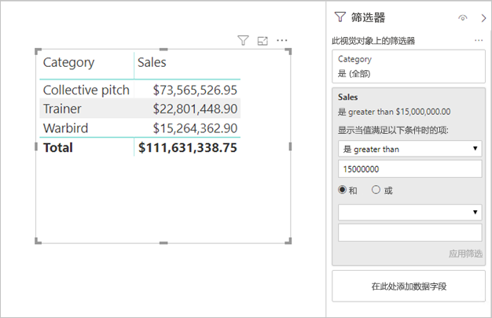

# <a name="directquery-model-guidance-in-power-bi-desktop"></a>Power BI Desktop 中的 DirectQuery 模型指导

本文面向使用 Power BI Desktop 或 Power BI 服务开发 Power BI DirectQuery 模型的数据建模者。 其中介绍了 DirectQuery 用例、限制和指导。 具体而言，本指南旨在帮助你确定 DirectQuery 是否是适用于你的模型的模式，以及基于 DirectQuery 模型提高报表性能。 本文适用于 Power BI 服务或 Power BI 报表服务器中承载的 DirectQuery 模型。

本文并不会提供有关 DirectQuery 模型设计的完全讨论。 有关简介，请参阅 [Power BI Desktop 中的 DirectQuery 模型](../desktop-directquery-about.md)一文。 有关更深入的讨论，请直接参阅 [DirectQuery in SQL Server 2016 Analysis Services](https://download.microsoft.com/download/F/6/F/F6FBC1FC-F956-49A1-80CD-2941C3B6E417/DirectQuery%20in%20Analysis%20Services%20-%20Whitepaper.pdf)（SQL Server 2016 Analysis Services 中的 DirectQuery）白皮书。 请记住，该白皮书介绍如何在 SQL Server Analysis Services 中使用 DirectQuery。 但大部分内容仍适用于 Power BI DirectQuery 模型。

本文不会直接涵盖复合模型。 复合模型至少包含一个 DirectQuery 源，并且可能有更多个。 本文中所述的指导仍与复合模型设计相关，至少部分相关。 但是，将导入表与 DirectQuery 表结合在一起所产生的影响并不在本文范围内。 有关详细信息，请参阅[在 Power BI Desktop 中使用复合模型](../desktop-composite-models.md)。

请务必了解，DirectQuery 模型在 Power BI 环境（Power BI 服务或 Power BI 报表服务器）和基础数据源上施加了不同的工作负载。 如果确定 DirectQuery 是适合的设计方法，我们建议你与项目相应的人员联系。 我们经常会发现，成功的 DirectQuery 模型部署总是离不开一组 IT 专业人员的密切合作。 团队通常包括模型开发者和源数据库管理员。 它还可以涉及数据架构师、数据仓库和 ETL 开发者。 通常，优化需要直接应用于数据源，以获得良好的性能结果。

## <a name="design-in-power-bi-desktop"></a>在 Power BI Desktop 中设计

可直接连接到 Azure SQL 数据仓库和 Azure HDInsight Spark 数据源，而无需使用 Power BI Desktop。 这是通过“获取数据”并选择“数据库”磁贴在 Power BI 服务中实现的。 有关详细信息，请参阅[具有 DirectQuery 的 Azure SQL 数据仓库](../service-azure-sql-data-warehouse-with-direct-connect.md)。

尽管直接连接很方便，但我们不建议使用此方法。 主要原因是，基础数据源架构发生更改时，无法刷新模型结构。

建议使用 Power BI Desktop 来创建和管理所有 DirectQuery 模型。 此方法提供对用于定义所需模型的完全控制，其中包括使用受支持的功能，如层次结构、计算列、度量值等。 借助该方法，还可以在基础数据源架构更改时修改模型设计。

## <a name="optimize-data-source-performance"></a>优化数据源性能

可通过多种方式优化关系数据库源，如以下项目符号列表所述。

> [!NOTE]
> 我们了解到，并非所有建模者都具有优化关系数据库的权限或技能。 虽然这是为 DirectQuery 模型准备数据的首选层，但也可以在不修改源数据库的情况下在模型设计中实现一些优化。 但是，最佳优化结果通常是通过将优化应用于源数据库来实现的。

- **确保数据完整性已完成：** 尤其重要的是，维度类型表包含映射到事实类型表的唯一值（维度键）的列。 事实类型维度列包含有效的维度键值，这也是非常重要的。 这样就可以配置更有效的模型关系，该模型关系对关系的双方都具有匹配的值。 源数据缺少完整性时，建议添加“未知”维度记录以有效地修复数据。 例如，可向“产品”表添加行，用于表示未知产品，然后为其分配超出范围的密钥，如 -1  。 如果销售表中的行包含缺少的产品密钥值，请将其替换为 -1  。 这将确保每个销售产品密钥值在“产品”表中都有相应的行   。
- **添加索引：** 针对表或视图定义适当的索引，以便为预期的报表视觉对象筛选和分组支持高效数据检索。 对于 SQL Server、Azure SQL 数据库或 Azure SQL 数据仓库，请参阅 [SQL Server 索引体系结构和设计指南](/sql/relational-databases/sql-server-index-design-guide?view=sql-server-2017)，了解索引设计指南的帮助信息。 对于 SQL Server 或 Azure SQL 数据库可变源，请参阅[开始使用列存储进行实时运营分析](/sql/relational-databases/indexes/get-started-with-columnstore-for-real-time-operational-analytics?view=sql-server-2017)。
- **设计分布式表：** 对于利用大规模并行处理 (MPP) 体系结构的 Azure SQL 数据仓库源，请考虑将大型事实类型表配置为哈希分布的维度类型表，从而在所有计算节点之间进行复制。 有关详细信息，请参阅[在 Azure SQL 数据仓库中设计分布式表的指南](/azure/sql-data-warehouse/sql-data-warehouse-tables-distribute#what-is-a-distributed-table)。
- **确保所需的数据转换已具体化：** 对于 SQL Server 关系数据库源（和其他关系数据库源），可将计算列添加到表中。 这些列基于表达式，如数量与单价相乘   。 计算列可以持久保存（具体化），也可以像常规列一样编入索引。 有关详细信息，请参阅[计算列索引](/sql/relational-databases/indexes/indexes-on-computed-columns?view=sql-server-2017)。

    还应考虑使用能够以更高的粒度预先聚合事实数据表数据的索引视图。 例如，如果销售表以订单行级别存储数据，则可以创建用于汇总此数据的视图  。 该视图可基于 SELECT 语句，该语句将销售表数据按日期（月级别）、客户、产品和汇总度量值（如销售额、数量等）进行分组  。然后，可将该视图编入索引。 有关 SQL Server 或 Azure SQL 数据库源，请参阅[创建索引视图](/sql/relational-databases/views/create-indexed-views?view=sql-server-2017)。
- **具体化日期表：** 常见的建模要求涉及到添加日期表，用于支持基于时间的筛选。 若要支持组织中基于时间的已知筛选器，请在源数据库中创建表，并确保其中加载的日期范围包含事实数据表日期。 还要确保包含有用时间段（如年、季度、月、周等）的列。

## <a name="optimize-model-design"></a>优化模型设计

可通过多种方式优化 DirectQuery 模型，如以下项目符号列表所述。

- **避免复杂的 Power Query 查询：** 可以通过不再需要使用 Power Query 查询应用任何转换，来实现有效的模型设计。 这意味着每个查询都映射到单个关系数据库源表或视图。 通过选择“查看本机查询”选项，可以预览实际 SQL 查询语句对于 Power Query 应用步骤的表示形式  。

    
    
    

- **检查计算列和数据类型更改的使用：** DirectQuery 模型支持添加计算和 Power Query 步骤来转换数据类型。 但是，更好的性能通常是通过在可能的情况下具体化关系数据库源中的转换结果来实现的。
- **请勿使用 Power Query 相对日期筛选：** 可在 Power Query 查询中定义相对日期筛选。 例如，检索去年（相对于当天的日期）创建的销售订单。 此类筛选器可转换为低效的本机查询，如下所示：

    ```SQL
    …
    from [dbo].[Sales] as [_]
    where [_].[OrderDate] >= convert(datetime2, '2018-01-01 00:00:00') and [_].[OrderDate] < convert(datetime2, '2019-01-01 00:00:00'))  
    ```
    
    更好的设计方法是在日期表中包含相对时间列。 这些列存储相对于当前日期的偏移值。 例如，在 RelativeYear 列中，零值表示当前年份，-1 表示上一年，等等  。最好在日期表中具体化 RelativeYear 列  。 虽然效率较低，但也可以根据使用 [TODAY](/dax/today-function-dax) 和 [DATE](/dax/date-function-dax) DAX 函数的表达式，将该列添加为模型计算列。

- **简化度量值：** 至少在开始时，建议将度量值限制为简单聚合。 聚合函数包括 SUM、COUNT、MIN、MAX 和 AVERAGE。 如果度量值足够敏感，则可以尝试更复杂的度量值，但要注意每个度量值的性能。 虽然 [CALCULATE](/dax/calculate-function-dax) DAX 函数可用于生成操作筛选器上下文的复杂度量值表达式，但它们会生成性能不高的昂贵本机查询。
- **避免定义计算列上的关系：** 模型关系只能将一个表中的单个列与另一个表中的单个列相关联。 但是，有时必须通过使用多个列来关联表。 例如，“销售”表和”地域”表均通过两列来关联   ：国家/地区和市/县   。 若要在表之间创建关系，需要使用单个列，并且在地域表中，该列必须包含唯一的值  。 将国家/地区和市/县通过连字符分隔符连接可实现此结果。

    可以使用 Power Query 自定义列创建组合列，或在模型中以计算列的形式创建。 但是，应避免这样操作，因为计算表达式将嵌入到源查询中。 这样操作不仅效率低下，而且通常会阻止使用索引。 相反，请在关系数据库源中添加具体化列，并考虑将其编入索引。 还可以考虑将代理键列添加到维度-类型表中，这是关系数据仓库设计中常见的做法。
    
    本指南中有一个例外，其中涉及到 [COMBINEVALUES](/dax/combinevalues-function-dax) DAX 函数的使用。 此函数的用途是支持多列模型关系。 该函数不生成关系所使用的表达式，而是生成多列 SQL 联接谓词。
- **避免定义“唯一标识符”列上的关系：** Power BI 不能以本机方式支持唯一标识符 (GUID) 数据类型。 定义此类型的列之间的关系时，Power BI 将使用涉及强制转换的联接生成源查询。 此查询-时间数据转换通常会导致性能不佳。 在进行优化之前，唯一的解决方法是在基础数据库中具体化替代数据类型的列。
- **隐藏关系的一方列：** 应隐藏关系的一方列。 （这通常是维度-类型表的主键列。）隐藏后，它在“字段”窗格中不可用，因此不能用于配置视觉对象  。 如果按列值对报表进行分组或筛选时，多方列有帮助，则可保持可见。 例如，假设有一个模型，该模型的销售表与产品表之间存在关系   。 关系列包含产品 SKU（库存单位）值。 如果必须将产品 SKU 添加到视觉对象中，则它应仅在销售表中可见  。 如果此列用于对视觉对象进行筛选或分组，Power BI 将生成不需要联接销售表和产品表的查询   。
- **设置关系来强制实施完整性：** DirectQuery 关系的“假设引用完整性”属性决定 Power BI 是否使用内部联接而不是外部联接来生成源查询  。 这通常可以提高查询性能，但具体取决于关系数据库源的详细情况。 有关详细信息，请参阅 [Power BI Desktop 中的假设引用完整性设置](../desktop-assume-referential-integrity.md)。
- **避免使用双向关系筛选：** 使用双向关系筛选可能导致查询语句应用效果不佳。 只有在必要时才使用此关系特征，这通常是在桥接表之间实现多对多关系的情况。 有关详细信息，请参阅 [Power BI Desktop 中具有多对多基数的关系](../desktop-many-to-many-relationships.md)。
- **限制并行查询：** 可以为每个基础数据源设置 DirectQuery 打开的最大连接数。 这样可控制以并发形式发送到数据源的查询数。

    
    
    此设置仅在模型中至少有一个 DirectQuery 源时启用。 该值适用于所有 DirectQuery 源，以及添加到模型中的任何新的 DirectQuery 源。

    增加“每个数据源的最大连接数”值确保更多查询（最多为指定的最大数）可以发送到基础数据源，这在单个页面上有许多视觉对象或多个用户同时访问报表时很有用  。 达到最大连接数后，超出的查询就会排队，直到连接可用。 增加此限制确实会导致基础数据源上的负载增加，因此该设置不保证提高总体性能。
    
    将模型发布到 Power BI 时，发送到基础数据源的并发查询的最大数目也取决于环境。 不同环境（如 Power BI、Power BI Premium 或 Power BI 报表服务器）中的每一个都可以施加不同的吞吐量约束。 有关 Power BI Premium 容量资源限制的详细信息，请参阅[部署和管理 Power BI Premium 容量](https://docs.microsoft.com/power-bi/whitepaper-powerbi-premium-deployment)。

## <a name="optimize-report-designs"></a>优化报表设计

可通过多种方式优化基于 DirectQuery 数据集的报表，如以下项目符号列表所述。

- **启用查询缩减方法：** Power BI Desktop 选项和设置包含“查询缩减”页  。 该页具有三个有用选项。 默认情况下，可以禁用交叉突出显示和交叉筛选，但这可以通过编辑交互进行重写。 还可以显示切片器和筛选器的“应用”按钮。 除非报表用户单击该按钮，否则不会应用切片器或筛选器选项。 如果启用这些选项，则建议你在首次创建报表时这样操作。

    
    
- **先应用筛选器：** 首次设计报表时，建议在将字段映射到可视字段之前，以报表、页面或视觉对象级别应用任何适用的筛选器。 例如，请先对“年份”字段应用筛选器，而不是拖入“国家/地区”和“销售额”度量值，然后按特定年份进行筛选    。 这是因为生成视觉对象的每个步骤都将发送查询，而在第一个查询完成之前可能会进行其他更改，这仍然会对基础数据源造成不必要的负担。 尽早应用筛选器通常会降低中间查询成本，并加快其速度。 此外，如果未能尽早应用筛选器，可能导致超过一百万行的限制，如上所述。
- **限制页面上的视觉对象的数目：** 应用页面筛选器，如果打开报表页，将刷新页面上的所有视觉对象。 不过，如前所述，Power BI 环境和“每个数据源的最大连接数”模型设置对可并行发送的查询数有所限制  。 因此，随着页面视觉对象数量的增加，很可能会以串行方式进行刷新。 这会增加刷新整个页面所需的时间，并且还会增加视觉对象显示不一致结果的可能性（对于可变数据源）。 出于以上原因，建议限制任何页面中的视觉对象数量，改为包含更多更简单的页面。 将多个卡片视觉对象替换为单个多行卡片视觉对象，即可实现类似的页面布局。
- **关闭视觉对象之间的交互：** 交叉突出显示和交叉筛选交互要求向基础源提交查询。 除非有必要进行这些交互，否则，建议在响应用户选择所用的时间太长的情况下将其关闭。 可以为整个报表（如上面的查询缩减选项所述）或者按具体情况关闭这些交互。 有关详细信息，请参阅[视觉对象如何在 Power BI 报表中彼此交叉筛选](../consumer/end-user-interactions.md)。

除了上述列表中的优化方法，以下每一种报表功能都会导致性能问题：

- **度量值筛选器：** 包含度量值（或列聚合）的视觉对象可以使筛选器应用于这些度量值。 例如，下面的视觉对象按类别显示销售额，但仅面向销售额超过 1500 万美元的类别   。

    
    
    
    这可能会导致两个查询被发送到基础数据源：
    
    - 第一个查询检索符合条件（销售额 > 1500 万美元）的类别
    - 第二个查询检索视觉对象所需的数据，同时添加满足 WHERE 子句的条件的类别
    
    如果有数百或数千个类别（如此示例所示），这通常可以正常执行。 但是如果类别数量太大，则可能会降低性能（事实上，如果符合条件的类别超过一百万，由于前面所述的一百万行限制，查询将失败）。
- **TopN 筛选器：** 可以将高级筛选器定义为仅筛选按度量值排名前（后）N 的值。 例如，仅显示上述视觉对象中的前五个类别。 与度量值筛选器一样，这也会导致将两个查询发送到基础数据源。 但是，第一个查询会从基础数据源返回所有类别，然后前 N 基于返回的结果确定。 根据涉及的列的基数，这可能会导致性能问题（或查询失败，由于一百万行限制）。
- **中值**：通常情况下，所有聚合（Sum、Count Distinct 等）都会被推送到基础数据源。 但这并不适用于中值，因为基础数据源不支持此聚合。 在这种情况下，会先从基础数据源中检索详细数据，然后 Power BI 从返回的结果中计算中值。 当中值在相对较少的结果中计算时，计算正常，但是如果基数很大，则会发生性能问题（或由于一百万行限制引起的查询失败）。 例如，国家/地区人口的中值可能是合理的，但销售价格的中值可能不合理。
- **多选切片器：** 允许切片器和筛选器采用多选形式会导致性能问题。 这是因为，当用户选择其他切片器项（例如，生成多达 10 种他们感兴趣的产品）时，每个新选择都会导致新的查询发送到基础源。 同时用户可以在查询完成之前选择下一项，这会导致基础源上的额外负载。 可通过显示“应用”按钮来避免这种情况，如上面的查询缩减方法中所述。
- **直观合计：** 表格和矩阵默认显示总计和小计。 在许多情况下，必须将其他查询发送到基础源以获取总计值。 这适用于使用 Count Distinct 或 Median 聚合的情况，并适用于在 SAP HANA 或 SAP 业务仓库上使用 DirectQuery 的所有情况。 如果不需要，应（使用“格式”窗格）关闭此类总计。

## <a name="convert-to-a-composite-model"></a>转换为复合模型

通过配置模型表的存储模式，可以将 Import 和 DirectQuery 模型的优点合并为单个模型。 表存储模式可以采用 Import 或 DirectQuery，也可以采用二者（称为 Dual）。 当模型包含具有不同存储模式的表时，就被称为复合模型。 有关详细信息，请参阅[在 Power BI Desktop 中使用复合模型](../desktop-composite-models.md)。

通过将 DirectQuery 模型转换为复合模型，可实现许多功能和性能提升。 复合模型可以集成多个 DirectQuery 源，还可以包含聚合。 可以将聚合表添加到 DirectQuery 表以导入表的汇总表示形式。 当视觉对象查询较高级别的聚合时，可以实现显著的性能提升。 有关详细信息，请参阅 [Power BI Desktop 中的聚合](../desktop-aggregations.md)。

## <a name="educate-users"></a>让用户了解更多内容

让用户了解如何高效使用基于 DirectQuery 数据集的报表，这一点非常重要。 报表创建者应了解[优化报表设计](#optimize-report-designs section)中描述的内容。

建议你让报表使用者了解基于 DirectQuery 数据集的报表。 这有助于他们理解一般的数据体系结构，包括本文中所述的任何相关限制。 让他们知道，刷新响应和交互式筛选有时可能会很慢。 当报表用户了解性能退化发生的原因时，他们不太可能对报表和数据失去信任。

在对可变数据源传递报表时，请确保让报表用户了解如何使用“刷新”按钮。 还要让他们知道，可能会看到不一致的结果，并且可通过刷新报表来解决报表页上的任何不一致问题。

## <a name="next-steps"></a>后续步骤

有关 DirectQuery 的详细信息，请查看以下资源：

- [Power BI Desktop 中的 DirectQuery 模型](../desktop-directquery-about.md)
- [在 Power BI Desktop 中使用 DirectQuery](../desktop-use-directquery.md)
- [Power BI Desktop 中的 DirectQuery 模型疑难解答](../desktop-directquery-troubleshoot.md)
- 是否有任何问题? [尝试咨询 Power BI 社区](https://community.powerbi.com/)
