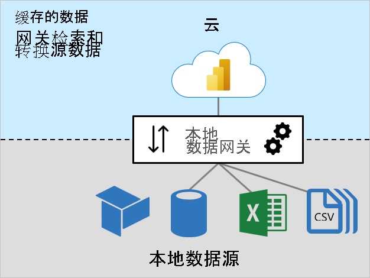
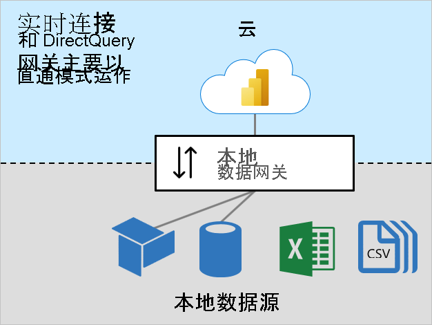

# 本地数据网关大小调整

本文面向需要安装和管理[本地数据网关](../connect-data/service-gateway-onprem.md)的 Power BI 管理员。

当 Power BI 必须访问无法直接通过 Internet 访问的数据时，就需要网关。 它可以安装在本地服务器上，也可以安装在 VM 托管的基础结构即服务 (IaaS) 上。

## 网关工作负载

本地数据网关支持两种工作负载。 首先务必要了解这些工作负载，然后再讨论网关大小调整和建议。

### 缓存的数据工作负载

“缓存数据”  工作负载检索和转换源数据以加载到 Power BI 数据集。 它通过三个步骤完成：

1. **连接**：网关连接到源数据
1. **数据检索和转换**：检索数据，并在必要时对其进行转换。 只要有可能，Power Query 混合引擎就会将转换步骤推送到数据源，这称为[查询折叠](power-query-folding.md)  。 如果无法进行转换，则必须由网关完成转换。 在这种情况下，网关会占用更多 CPU 和内存资源。
1. **传输**：将数据传输到 Power BI 服务（可靠且快速的 Internet 连接非常重要，尤其是对于大型数据卷而言）

### 实时连接和 DirectQuery 工作负载

“实时连接和 DirectQuery”  工作负载主要在传递模式下工作。 Power BI 服务发送查询，网关则响应查询结果。 通常，查询结果的大小很小。

- 有关实时连接的详细信息，请参阅 [Power BI 服务中的数据集（外部托管模型）](../connect-data/service-datasets-understand.md#external-hosted-models)。
- 有关 DirectQuery 的详细信息，请参阅 [Power BI 服务中的数据集模式（DirectQuery 模式）](../connect-data/service-dataset-modes-understand.md#directquery-mode)。

此工作负载需要 CPU 资源来路由查询和查询结果。 通常，CPU 需求要低于缓存数据工作负载所需的 CPU，特别是在需要转换数据以进行缓存时。

可靠、快速且一致的连接对于确保报表用户具有响应体验非常重要。

## 调整大小注意事项

确定针对网关计算机的正确大小调整取决于以下变量：

- 对于缓存数据工作负载：
  - 并发数据集刷新数
  - 数据源类型（关系数据库、分析数据库、数据馈送或文件）
  - 要从数据源检索的数据量
  - 需要由 Power Query 混合引擎完成的任何转换
  - 要传输到 Power BI 服务的数据量
- 对于实时连接和 DirectQuery 工作负载：
  - 并发报表用户数
  - 报表页上的视觉对象数（每个视觉对象发送至少一个查询）
  - Power BI 仪表板查询缓存更新的频率
  - 使用[自动页面刷新](../create-reports/desktop-automatic-page-refresh.md)功能的实时报表数
  - 数据集是否强制执行[行级安全性 (RLS)](../create-reports/desktop-rls.md)

通常，实时连接和 DirectQuery 工作负载需要足够的 CPU，而缓存数据工作负载需要更多的 CPU 和内存。 这两个工作负载都依赖于与 Power BI 服务和数据源之间的良好连接。

> [!NOTE]
> Power BI 容量对模型刷新并行度、实时连接和 DirectQuery 吞吐量施加限制。 除了 Power BI 服务支持的内容以外，没有必要对网关大小进行调整以提供更多内容。 高级 SKU（以及相同大小的 A SKU）的限制有所不同。 有关详细信息，请参阅[什么是 Power BI Premium？（容量节点）](../admin/service-premium-what-is.md#capacity-nodes)。

## 建议

网关大小建议取决于多个变量。 在本部分中，我们将提供可纳入考虑的一般建议。

### 初始大小调整

可能很难准确地估计合适的大小。 建议从至少具有 8 个 CPU 内核、8 GB RAM 和多个千兆位网络适配器的计算机开始。 然后，可以通过记录 CPU 和内存系统计数器来度量典型的网关工作负载。 有关详细信息，请参阅[监视和优化本地数据网关性能](/data-integration/gateway/service-gateway-performance)。

### 连接

尽可能规划 Power BI 服务和网关、网关和数据源之间的最佳连接。

- 尽量实现可靠、快速和一致的低延迟性
- 消除（或减少）网关和数据源之间的计算机跃点数
- 删除防火墙代理层施加的任何网络限制。 有关 Power BI 终结点的详细信息，请参阅[列入允许列表的 Power BI URL](../admin/power-bi-whitelist-urls.md)。
- 配置 [Azure ExpressRoute](/azure/expressroute/expressroute-introduction) 以建立到 Power BI 的专用托管连接
- 对于 Azure VM 中的数据源，请确保 VM [与 Power BI 服务并置](../admin/service-admin-where-is-my-tenant-located.md)
- 对于涉及动态 RLS 的 SQL Server Analysis Services (SSAS) 的实时连接工作负载，请确保网关计算机和本地 Active Directory 之间良好连接

### 聚类

对于大规模部署，你可以创建群集安装网关。 群集可避免单一故障点，并可跨网关实现流量负载均衡。 你可以：

- 在群集中安装一个或多个网关
- 将工作负载隔离到独立网关或网关服务器群集

有关详细信息，请参阅[管理本地数据网关的高可用性群集和负载均衡](/data-integration/gateway/service-gateway-high-availability-clusters)。

### 数据集设计和设置

数据集设计及其设置可能会影响网关工作负载。 为了减少网关工作负载，可以考虑执行以下操作。

对于导入数据集：

- 配置不太频繁的数据刷新
- 配置[增量刷新](../admin/service-premium-incremental-refresh.md)，以最大程度减少要传输的数据量
- 请尽可能确保执行[查询折叠](power-query-folding.md)
- 尤其是对于大型数据卷或需要低延迟的结果时，请将设计转换为 DirectQuery 或[复合](../connect-data/service-dataset-modes-understand.md#composite-mode)模型

对于 DirectQuery 数据集：

- 优化数据源、模型和报表设计；有关详细信息，请参阅 [Power BI Desktop 中的 DirectQuery 模型指南](directquery-model-guidance.md)
- 创建[聚合](../transform-model/desktop-aggregations.md)缓存更高级的结果以减少 DirectQuery 请求数目
- 限制报表设计和容量设置中的[自动页面刷新](../create-reports/desktop-automatic-page-refresh.md)间隔
- 尤其是在强制执行动态 RLS 时，限制仪表板缓存的更新频率
- 特别是对于较小的数据卷或非易失性数据，将设计转换为导入或[复合](../connect-data/service-dataset-modes-understand.md#composite-mode)模型

对于实时连接数据集：

- 尤其是在强制执行动态 RLS 时，限制仪表板缓存的更新频率

## 后续步骤

有关本文的详细信息，请参阅以下资源：

- [Power BI 数据网关部署指南](../connect-data/service-gateway-deployment-guidance.md)
- [为本地数据网关配置代理设置](/data-integration/gateway/service-gateway-proxy)
- [监视和优化本地数据网关性能](/data-integration/gateway/service-gateway-performance)
- [对网关进行排除故障 - Power BI](../connect-data/service-gateway-onprem-tshoot.md)
- [本地数据网关故障排除](/data-integration/gateway/service-gateway-tshoot)
- [查询折叠的重要性](power-query-folding.md)
- 是否有任何问题? [尝试咨询 Power BI 社区](https://community.powerbi.com/)
- 建议？ [提出改进 Power BI 的想法](https://ideas.powerbi.com)
