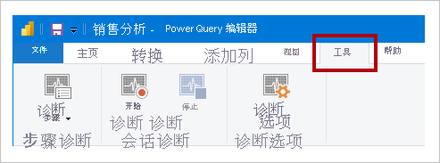

# <a name="monitor-report-performance-in-power-bi"></a>在 Power BI 中监视报表性能

在 Power BI Desktop 中使用 [Power BI Premium 指标应用](../admin/service-premium-metrics-app.md)监视报表性能，了解瓶颈所在，并了解如何提升报表性能。

在下列情况下会监视性能：

- 导入数据模型刷新速度缓慢。
- DirectQuery 或 Live Connection 报表速度缓慢。
- 模型计算速度缓慢。

应重点针对速度缓慢的查询或报表视觉对象进行持续优化。

## <a name="use-query-diagnostics"></a>使用查询诊断

在 Power BI Desktop 中使用[查询诊断](/power-query/QueryDiagnostics)确定在预览或应用查询时 Power Query 执行的操作。 此外，使用 _诊断步骤_ 功能记录每个查询步骤的详细评估信息。 结果在 Power Query 中提供，你可以应用转换进一步了解查询执行。

> [!NOTE]
> 查询诊断目前是一项预览功能，因此必须在“选项和设置”中启用它。 启用后，其命令将出现在“Power Query 编辑器”窗口中的“工具”功能区选项卡上。



## <a name="use-performance-analyzer"></a>使用性能分析器

在 Power BI Desktop 中使用[性能分析器](../create-reports/desktop-performance-analyzer.md)了解视觉对象和 DAX 公式等报表元素的性能。 它特别适用于确定产生性能问题的查询或视觉对象呈现。

## <a name="use-sql-server-profiler"></a>使用 SQL Server Profiler

还可以使用 [SQL Server Profiler](/sql/tools/sql-server-profiler/sql-server-profiler) 来确定速度缓慢的查询。

> [!NOTE]
> SQL Server Profiler 作为 [SQL Server Management Studio](/sql/ssms/download-sql-server-management-studio-ssms) 的一部分提供。

如果你的数据源属于以下任一类型，可以使用 SQL Server Profiler：

- SQL Server
- SQL Server Analysis Services
- Azure Analysis Services

> [!CAUTION]
> Power BI Desktop 支持连接到诊断端口。 诊断端口允许其他工具进行连接并执行跟踪以进行诊断。 不支持对 Power Desktop 数据模型进行任何更改。 更改数据模型可能会导致损坏和数据丢失。

若要创建 SQL Server Profiler 跟踪，请按照以下说明操作：

1. 打开 Power BI Desktop 报表（以便在下一步中轻松定位端口，关闭任何其他已打开的报表）。
1. 若要确定 Power BI Desktop 使用的端口，请在 PowerShell 中（使用管理员权限）或在命令提示符下输入以下命令：
    ```powershell
    netstat -b -n
    ```
    应该会输出应用程序及其开放端口的列表。 查找 msmdsrv.exe 使用的端口，并记录下来以备后用。 这是你的 Power BI Desktop 实例。
1. 若要将 SQL Server Profiler 连接到 Power BI Desktop 报表，请执行以下操作：
    1. 打开 SQL Server Profiler。
    1. 在 SQL Server Profiler 的“文件”菜单上，选择“新建跟踪”。
    1. 对于“服务器类型”，选择“Analysis Services”。
    1. 对于“服务器名称”，请输入 localhost:[之前记录的端口]。
    1. 单击“运行”，此时 SQL Server Profiler 跟踪处于活动状态，并且正在主动分析 Power BI Desktop 查询。
1. 执行 Power BI Desktop 查询时，你将看到它们各自的持续时间和 CPU 时间。 根据数据源类型，可能会看到指示查询执行方式的其他事件。 使用此信息可以确定哪些查询是瓶颈。

使用 SQL Server Profiler 的好处是可以保存 SQL Server（关系）数据库跟踪。 跟踪可能会成为[数据库引擎优化顾问](/sql/relational-databases/performance/start-and-use-the-database-engine-tuning-advisor)的输入。 这样便于你获得有关如何优化数据源的建议。

## <a name="monitor-premium-metrics"></a>监视 Premium 指标

对于 Power BI Premium 容量，可以使用 Power BI Premium 指标应用来监视 Power BI Premium 订阅的运行状况和容量。 有关详细信息，请参阅 [Power BI Premium 指标应用](../admin/service-premium-metrics-app.md)。

## <a name="next-steps"></a>后续步骤

有关本文的详细信息，请参阅以下资源：

- [查询诊断](/power-query/QueryDiagnostics)
- [性能分析器](../create-reports/desktop-performance-analyzer.md)
- [Power BI 中的报表性能疑难解答](report-performance-troubleshoot.md)
- [Power BI Premium 指标应用](../admin/service-premium-metrics-app.md)
- 是否有任何问题? [尝试咨询 Power BI 社区](https://community.powerbi.com/)
- 建议？ [提出改进 Power BI 的想法](https://ideas.powerbi.com/)
