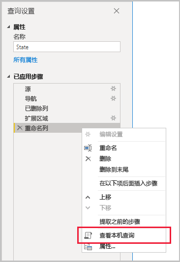
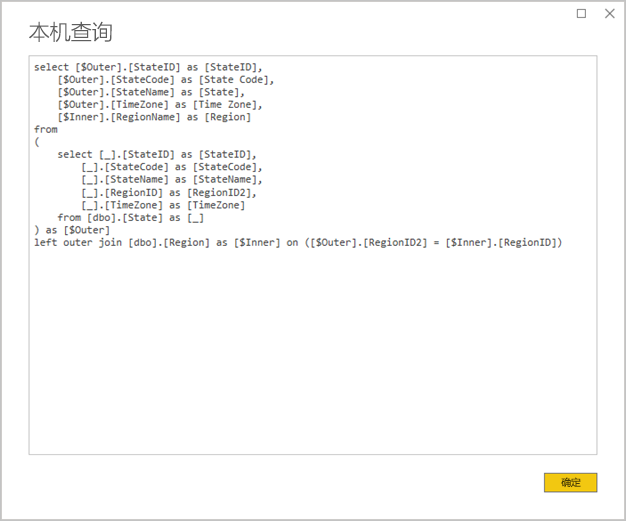
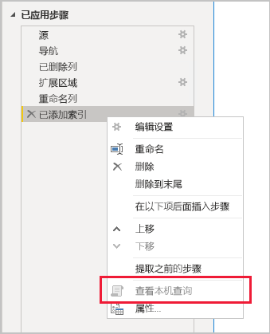

# <a name="the-importance-of-query-folding"></a>查询折叠的重要性

本文面向在 Power BI Desktop 中开发模型的数据建模人员。 它描述了什么是查询折叠，并且其为何重要。 它还介绍了可实现查询折叠的数据源和转换，以及如何确定可以折叠 Power Query 查询，无论全部还是部分折叠。 最后，它提供了关于何时以及如何实现查询折叠的最佳做法指南。

## <a name="background"></a>背景

查询折叠是 Power Query 查询提供的一种功能，用于生成一个单独查询语句以检索和转换源数据。 Power Query 糅合引擎尽力实现查询折叠，因为这会使最有效的路径将 Power BI 模型表连接到其基础数据源。

折叠查询是数据建模的重要主题，原因如下：

- **导入模型表：** 根据资源利用率和刷新持续时间，数据刷新将在“导入模型表”中有效进行
- **DirectQuery 和双存储模式表：** 每个 DirectQuery 和双存储模式表都必须基于可以折叠的 Power Query 查询
- **增量刷新：** 根据资源利用率和刷新持续时间，增量数据刷新会很有效。 事实上，“增量刷新配置”窗口确定无法实现对表的查询折叠时会发出警告。 如果无法实现，增量刷新的目标会失效。 然后糅合引擎会检索所有源行，再应用筛选器来确定增量更改。

对于整个 Power Query 查询或其步骤的子集，可能会进行查询折叠。 无法实现查询折叠时，不管是部分还是全部，Power BI 中的 Power Query 糅合引擎必须通过处理数据自身转换来进行补偿。 这可能涉及到检索源查询结果，这对于大型数据集来说可能会消耗大量资源，并且速度缓慢。

建议数据建模者尽力在其导入模型设计中提高效率，方法是确保尽可能进行查询折叠。

## <a name="sources-that-support-query-folding"></a>支持查询折叠的源

具有查询语言概念的大多数数据源都支持查询折叠。 其中包括关系数据库、OData 数据源（包括 SharePoint 列表）、Exchange 和 Active Directory 域服务。 但是，平面文件、blob 和 Web 等数据源通常不支持查询折叠。

## <a name="transformations-that-can-achieve-query-folding"></a>可以实现查询折叠的转换

可折叠查询的关系数据源转换可以编写为单个 SELECT 语句。 可以使用适当的 WHERE、GROUP BY 和 JOIN 子句构造 SELECT 语句。 它还可以包含使用 SQL 数据集支持的通用内置函数的列表达式（计算）。

通常，下面的项目符号列表描述了可折叠查询的转换。

- 删除列
- 重命名列（SELECT 列别名）
- 筛选行，包含静态值或 Power Query 参数（WHERE 子句谓词）
- 分组和汇总（GROUP BY 子句）
- 展开记录列（源外键列）以实现两个源表的联接（JOIN 子句）
- 基于相同源进行折叠查询的非模糊合并（JOIN 子句）
- 基于相同源追加折叠查询（UNION ALL 运算符）
- 添加具有“简单逻辑”的自定义列（SELECT 列表达式）  。 简单逻辑是指简单的操作，可能包括在 SQL 数据源（如数学，或文本操作函数）中使用具有等效函数的 M 函数。 例如，以下表达式将返回 OrderDate 列值的年份部分（返回数值）  。

    ```powerquery-m
    Date.Year([OrderDate])
    ```

- 透视和逆透视（PIVOT 和 UNPIVOT 运算符）

## <a name="transformations-that-prevent-query-folding"></a>阻止查询折叠的转换

通常，下面的项目符号列表描述了阻止折叠查询的转换。 这并不是一个详尽的列表。

- 基于不同源合并查询
- 基于不同源追加（合并）查询
- 添加具有“复杂逻辑”的自定义列  。 复杂逻辑是指在数据源中使用没有等效函数的 M 函数。 例如，以下表达式会格式化 OrderDate 列值（返回文本值）  。

    ```powerquery-m
    Date.ToText([OrderDate], "yyyy")
    ```

- 添加索引列
- 更改列数据类型

请注意，Power Query 查询包含多个数据源时，数据源隐私级别的不兼容性会阻止查询折叠发生。 有关详细信息，请阅读 [Power BI Desktop 隐私级别](../desktop-privacy-levels.md)一文。

## <a name="determine-when-a-query-can-be-folded"></a>确定何时可以折叠查询

在“Power Query 编辑器”窗口中，可确定何时可以折叠 Power Query 查询。 在“查询设置”窗格中，右键单击最后应用的步骤时，如果已启用“查看本机查询”选项（不显示为灰色），则可以折叠查询   。



若要查看折叠查询，请继续选择“查看本机查询”选项  。 然后，你就会看见 Power Query 将用于源数据的本机查询。



如果未启用“查看本机查询”选项（显示为灰色），则表明所有查询步骤都无法折叠  。 但是，这可能意味着步骤的子集仍然可以折叠。 从最后一步开始倒退，可以检查每个步骤以查看是否启用了“查看本机查询”选项  。 如果是这种情况，那么你已经了解到，按照步骤顺序，无法再实现查询折叠。



## <a name="best-practice-guidance"></a>最佳实践指南

简而言之，对于 DirectQuery 或双存储模式表，Power Query 查询必须实现查询折叠。 对于基于关系源的导入表，并且可以构造单个 SELECT 语句时，通过确保查询折叠发生，可以实现“最佳数据刷新性能”  。 如果仍需要糅合引擎来处理转换，则应努力减少所需的工作，尤其是对于大型数据集。

下面的项目符号列表提供了最佳实践指南。

- **尽可能多地委托处理数据源：** 如果无法折叠 Power Query 查询的所有步骤，请查找可防止查询折叠的步骤。 在可能的情况下，请按顺序将后续步骤提前，以便可以将它们纳入查询折叠中。 请注意，Power Query 糅合引擎可能足够聪明，可以在生成源查询时对查询步骤进行重新排序。

对于关系数据源，如果可以在单个 SELECT 语句中或在存储过程的过程逻辑中实现防止查询折叠的步骤，请考虑使用本机查询语句，如下所述。

- **使用本机 SQL 查询：** 如果 Power Query 查询从关系源中检索数据，可以使用本机 SQL 查询。 该查询实际上可以是任何有效的语句，包括存储过程的执行。 如果该语句产生多个结果集，则仅返回第一个。 可以在语句中声明参数，建议使用 [ Value.NativeQuery](/powerquery-m/value-nativequery) M 函数安全方便地传递参数值。 重要的是要理解 Power Query 糅合引擎无法折叠后续的查询步骤，因此在本机查询语句中包括所有（或尽可能多的）转换逻辑非常重要。

    使用本机 SQL 查询时，需要牢记两个重要注意事项：

    - 对于 DirectQuery 模型表，查询必须是 SELECT 语句，并且不能使用公用表表达式 (CTEs) 或存储过程
    - 增量刷新无法利用本机 SQL 查询，因此它将强制 Power Query 糅合引擎检索所有源行，然后应用筛选器来确定增量更改

    > [!IMPORTANT]
    > 本机查询可执行的操作远不止检索数据。 任何有效的语句都可以执行（可能多次执行），包括修改或删除数据的语句。 重要的是应用最小特权原则，以确保用于访问数据库的帐户仅具有对所需数据的读取权限。

- **在源中准备和转换数据：** 如果确定某些 Power Query 查询步骤无法折叠，则有可能在数据源中应用转换。 这可通过在 Power BI 查询之前编写一个逻辑上转换源数据的数据库视图，或通过物理准备和实例化数据来实现。 关系数据仓库是准备好的数据的一个极佳例子，通常由预先集成的组织数据源组成。

## <a name="next-steps"></a>后续步骤

有关查询折叠和相关主题的详细信息，请查看以下资源：

- [在 Power BI Desktop 中使用复合模型](../desktop-composite-models.md)
- [Power BI Premium 中的增量刷新](../service-premium-incremental-refresh.md)
- [使用表视图实现查询折叠](/power-query/handlingqueryfolding)
- 是否有任何问题? [尝试咨询 Power BI 社区](https://community.powerbi.com/)
