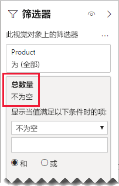

# <a name="bi-directional-relationship-guidance"></a>双向关系指南

本文面向使用 Power BI Desktop 的数据建模者。 它指导你何时创建双向模型关系。 双向关系是一种双向  筛选的关系。

[!INCLUDE [relationships-prerequisite-reading](includes/relationships-prerequisite-reading.md)]

通常，建议尽量减少使用双向关系。 此类关系可能会对模型查询性能产生负面影响，并可能会为报表用户带来令其困惑的体验。

双向筛选可以满足特定要求的场景有以下三种：

- [特殊模型关系](#special-model-relationships)
- [“使用数据”的切片器项](#slicer-items-with-data)
- [维度到维度分析](#dimension-to-dimension-analysis)

## <a name="special-model-relationships"></a>特殊模型关系

在创建以下两种特殊模型关系类型时，双向关系起着重要作用：

- **一对一关系**：所有一对一关系都必须是双向的，否则无法进行配置。 通常，建议不要创建这种类型的关系。 有关完整讨论和替换设计，请参阅[一对一关系指南](relationships-one-to-one.md)。
- **多对多关系**：关联两个维度类型表时，必须有桥接表。 为了确保筛选器跨桥接表传播，必须使用双向筛选器。 有关详细信息，请参阅[多对多关系指南（关联多对多维度）](relationships-many-to-many.md#relate-many-to-many-dimensions)。

## <a name="slicer-items-with-data"></a>“使用数据”的切片器项

双向关系可以将切片器限制为，显示与数据所在位置相关的项。 （如果你熟悉 Excel 数据透视表和切片器，就会发现这是从 Power BI 数据集或 Analysis Services 模型获取源数据时的默认行为。）为了帮助解释它的含义，先来看看下面的模型图。


第一个表名为 Customer  ，它包含以下三列：Country-Region  、Customer  和 CustomerCode  。 第二个表名为 Product  ，它包含以下三列：Color  、Product  和 SKU  。 第三个表名为 Sales  ，它包含以下四列：CustomerCode  、OrderDate  、Quantity  和 SKU  。 Customer  和 Product  表是维度类型表，它们与 Sales  表之间都有一对多关系。 每个关系都是单向筛选。

为了帮助介绍双向筛选的工作原理，模型图已修改为显示表行。 本文中的所有示例都以此数据为依据。

> [!NOTE]
> 本来是不可以在 Power BI Desktop 模型关系图中显示表行的。 本文显示出来为的是通过提供清晰的示例来支持讨论。


下面的项目符号列表介绍了三个表的行详细信息：

- “Customer”  表有两行：
  - CustomerCode  CUST-01、Customer  Customer-1、Country-Region  United States
  - CustomerCode  CUST-02、Customer  Customer-2、Country-Region  Australia
- Product  表包含以下三行：
  - SKU  CL-01、Product  T-shirt、Color  Green
  - SKU  CL-02、Product  Jeans、Color  Blue
  - SKU  AC-01、Product  Hat、Color  Blue
- Sales  表包含以下三行：
  - OrderDate  January 1 2019、CustomerCode  CUST-01、SKU  CL-01、Quantity  10
  - OrderDate  February 2 2019、CustomerCode  CUST-01、SKU  CL-02、Quantity  20
  - OrderDate  March 3 2019、CustomerCode  CUST-02、SKU  CL-01、Quantity  30

现在来看看下面的报表页。


报表页包含两个切片器和一个卡视觉对象。 第一个切片器是“国家/地区”  ，它包含以下两项：“澳大利亚”和“美国”。 此切片器当前按“澳大利亚”切片。 第二个切片器是“产品”  ，它包含以下三项：“帽子”、“牛仔裤”和“T 恤”。 未选中任何项（即未按任何产品  筛选）。 卡视觉对象显示数量 30。

当报表用户按“澳大利亚”切片时，不妨将“产品”  切片器限制为，显示数据与澳大利亚销售相关  的项。 这就是显示“使用数据”的切片器项的含义。 为了实现此行为，可以将 Product  与 Sales  表之间的关系配置为双向筛选。


“产品”  切片器现在列出一个项，即“T 恤”。 此项表示唯一销售给澳大利亚客户的产品。


首先，建议仔细考虑这种设计是否适用于报表用户。 一些报表用户觉得这种体验令人困惑。 他们不理解为什么在自己与其他切片器交互时，切片器项会动态显示或消失。

如果你确实决定显示“使用数据”的切片器项，建议不要配置双向关系。 双向关系需要更多处理，因此可能会对查询性能产生负面影响，尤其是在模型中的双向关系数量增加时。

有一种更好的方法可以达到同样的效果：可以将视觉对象级别筛选器应用于“产品”  切片器本身，而不是使用双向筛选器。

现在来看看，Product  与 Sales  表之间的关系不再是双向筛选。 此外，以下度量值定义已添加到 Sales  表中。

```dax
Total Quantity = SUM(Sales[Quantity])
```

若要显示“使用数据”的“产品”  切片器项，只需按使用“非空白”条件的“总数量”  度量值筛选即可。



## <a name="dimension-to-dimension-analysis"></a>维度到维度分析

另一种涉及双向关系的场景是，将事实类型表视为桥接表。 通过这种方式，支持在不同维度类型表的筛选器上下文中分析维度类型表数据。

使用本文中的示例模型，考虑如何回答下列问题：

- 有多少种颜色销售给澳大利亚客户？
- 有多少个国家/地区购买了牛仔裤？

这两个问题都可以回答，无需  汇总桥接事实类型表中的数据。 不过，确实需要筛选器从一个维度类型表传播到另一个。 在筛选器通过事实类型表传播后，就可以使用 [DISTINCTCOUNT](/dax/distinctcount-function-dax) DAX 函数（可能还有 [MIN](/dax/min-function-dax) 和 [MAX](/dax/max-function-dax) DAX 函数）汇总维度类型表列。

由于事实类型表的行为类似于桥接表，因此可以按照多对多关系指南操作，关联两个维度类型表。 需要配置至少一个双向筛选关系。 有关详细信息，请参阅[多对多关系指南（关联多对多维度）](relationships-many-to-many.md#relate-many-to-many-dimensions)。

不过，正如本文中所述，这种设计可能会对性能产生负面影响，并对用户体验产生与[“使用数据”的切片器项](#slicer-items-with-data)相关的影响。 因此，建议改用 [CROSSFILTER](/dax/crossfilter-function) DAX 函数在度量值定义中  激活双向筛选。 CROSSFILTER 函数可用于在表达式求值期间修改筛选器方向，甚至还可用于禁用关系。

现在来看看添加到 Sales  表中的以下度量值定义。 在此示例中，Customer  与 Sales  表之间的模型关系已配置为单向  筛选。

```dax
Different Countries Sold =
CALCULATE(
    DISTINCTCOUNT(Customer[Country-Region]),
    CROSSFILTER(
        Customer[CustomerCode],
        Sales[CustomerCode],
        BOTH
    )
)
```

在“不同国家/地区销售数量”  度量值表达式求值期间，Customer  与 Sales  表之间的关系为双向筛选。

下面的表视觉对象显示了每种售出产品的统计信息。 “数量”  列只计算数量值的总和。 “不同国家/地区销售数量”  列显示所有已购买产品的客户的国家/地区值的非重复计数。


## <a name="next-steps"></a>后续步骤

有关本文的详细信息，请参阅以下资源：

- [Power BI Desktop 中的模型关系](../transform-model/desktop-relationships-understand.md)
- [了解星型架构及其对 Power BI 的重要性](star-schema.md)
- [一对一关系指南](relationships-one-to-one.md)
- [多对多关系指南](relationships-many-to-many.md)
- [关系故障排除指南](relationships-troubleshoot.md)
- 是否有任何问题? [尝试咨询 Power BI 社区](https://community.powerbi.com/)
- 建议？ [提出改进 Power BI 的想法](https://ideas.powerbi.com/)

