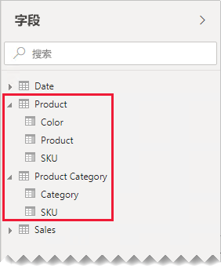
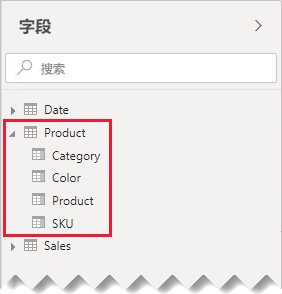
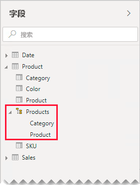
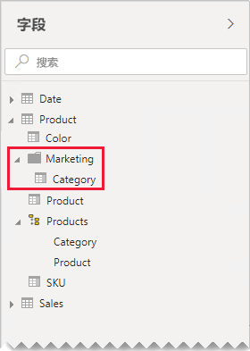

# 一对一关系指南

本文面向使用 Power BI Desktop 的数据建模者。 它指导你如何处理一对一模型关系。 如果两个表都包含一列唯一公用值，可以创建一对一关系。

[!INCLUDE [relationships-prerequisite-reading](includes/relationships-prerequisite-reading.md)]

涉及一对一关系的场景有以下两种：

- [退化维度](#degenerate-dimensions)：可以从事实类型表派生[退化维度](star-schema.md#degenerate-dimensions)。
- [跨表的行数据](#row-data-spans-across-tables)：一个业务实体或主体加载为两个（或更多）模型表，这可能是因为它们的数据源自不同的数据存储。 这种场景对维度类型表很常见。 例如，主产品详细信息存储在运营销售系统中，而附属产品详细信息则存储在其他源中。

    不过，通过一对一关系关联两个事实类型表并不常见。 这是因为，两个事实类型表都需要有相同的维度和粒度。 此外，每个事实类型表都必须有唯一列，才能创建模型关系。

## 退化维度

如果事实类型表中的列用于筛选或分组，可以考虑将这些列放在单独的表中。 这样一来，就可以将用于筛选或分组的列与用于汇总事实行的列分隔开来。 这种分隔可以：

- 节约存储空间
- 简化模型计算
- 有助于提升查询性能
- 向报表作者提供更直观的“字段”  窗格体验

假设源销售表在两列中存储销售订单详细信息。

OrderNumber  列存储订单号，OrderLineNumber  列存储订单中的一系列订单项。

在下面的模型图中，请注意，订单号列和订单项号列尚未加载到 Sales  表中。 相反，它们的值用于创建[代理键](star-schema.md#surrogate-keys)列 SalesOrderLineID  。 （键值的计算方法为，将订单号乘以 1000，然后再加上订单项号。）

Sales Order  表通过以下三列为报表作者提供丰富体验：Sales Order  、Sales Order Line  和 Line Number  。 它还包含一个层次结构。 这些表资源支持需要对订单和订单项进行筛选、分组或向下钻取的报表设计。

由于 Sales Order  表派生自销售数据，因此两个表中的行数应完全相同。 此外，两个 SalesOrderLineID  列还应该有匹配值。

## 跨表的行数据

例如，假设有两个一对一相关的维度类型表：Product  和 Product Category  。 每个表都显示导入的数据，并有包含唯一值的 SKU  （库存单位）列。

下面展示了这两个表的部分模型图。

第一个表名为 Product  ，它包含以下三列：Color  、Product  和 SKU  。 第二个表名为 Product Category  ，它包含以下两列：Category  和 SKU  。 一对一关系将两个 SKU  列关联起来。 关系为双向筛选，对于一对一关系，总是如此。

为了帮助说明关系筛选器的传播方式，已修改模型关系图以显示表行。 本文中的所有示例都以此数据为依据。

> [!NOTE]
> 本来是不可以在 Power BI Desktop 模型关系图中显示表行的。 本文显示出来为的是通过提供清晰的示例来支持讨论。

下面的项目符号列表描述了两个表的行的详细信息：

- Product  表包含以下三行：
  - SKU  CL-01、Product  T-shirt、Color  Green
  - SKU  CL-02、Product  Jeans、Color  Blue
  - SKU  AC-01、Product  Hat、Color  Blue
- Product Category  表包含以下两行：
  - SKU  CL-01、Category  Clothing
  - SKU  AC-01、Category  Accessories

请注意，Product Category  表没有产品 SKU CL-02 对应的行。 本文稍后将讨论缺少此行的结果。

在“字段”  窗格中，报表作者会找到以下两个表中与产品相关的字段：Product  和 Product Category  。

现在来看看添加有两个表中字段的表视觉对象是什么样的。 在此示例中，“SKU”  列源自 Product  表。

请注意，产品 SKU CL-02 的“类别”  值为 BLANK。 这是因为，此产品在 Product Category  表中没有任何行。

### 建议

若为跨模型表的行数据，建议尽可能避免创建一对一模型关系。 这是因为这种设计可能会：

- 导致“字段”  窗格混乱，列出不必要的表
- 导致报表作者很难找到相关字段，因为它们分布在多个表中
- 限制创建层次结构的功能，因为它们的级别必须以相同表  中的列为依据
- 在表之间的行不完全匹配时导致意外结果出现

具体建议因一对一关系是岛内  还是岛间  而异。 若要详细了解关系计算，请参阅 [Power BI Desktop 中的模型关系（关系计算）](../transform-model/desktop-relationships-understand.md#relationship-evaluation)。

### 岛内一对一关系

如果表之间有岛内  一对一关系，建议将数据合并到一个模型表中。 这是通过合并 Power Query 查询来完成的。

下面的步骤提供了一种方法来合并和建模一对一关联数据：

1. **合并查询**：[合并两个查询](../connect-data/desktop-shape-and-combine-data.md#combine-queries)时，考虑每个查询中数据的完整性。 如果一个查询包含一组完整的行（如主列表），请将另一个查询与它合并。 将合并转换配置为使用左外部联接  （即默认联接类型）。 这种联接类型可确保你保留第一个查询的所有行，并使用第二个查询的任何匹配行进行补充。 将第二个查询的所有必需列扩展到第一个查询中。
2. **禁用查询负载**：请务必对第二个查询[禁用负载](import-modeling-data-reduction.md#disable-power-query-query-load)。 这样，它就不会将其结果加载为模型表。 此配置减少了数据模型存储大小，并有助于让“字段”  窗格保持整洁。

    在此示例中，报表作者现在“字段”  窗格中找到一个 Product  表。 它包含所有与产品相关的字段。

    
3. **替换缺少的值**：如果第二个查询包含不匹配的行，那么从它引入的列中显示 NULL。 视情况考虑使用标记值替换 NULL。 当报表作者按列值筛选或分组时，替换缺少的值尤为重要，因为报表视觉对象中可能会显示 BLANK。

    请注意，在下面的表视觉对象中，产品 SKU CL-02 的类别现在显示为“[未定义]”  。 在查询中，null 类别已替换为此标记文本值。

    

4. **创建层次结构**：如果当前合并的表的列之间  存在关系，不妨创建层次结构。 这样，报表作者会快速发现报表视觉对象钻取机会。

    在此示例中，报表作者现在可以使用一个层次结构，其中包含以下两个级别：Category  和 Product  。

    

如果你更倾向于单独的表有助于整理字段，仍建议合并到单个表中。 仍可以整理字段，但要改用显示文件夹  。

在此示例中，报表作者可以在“Marketing”  显示文件夹内找到“Category”  字段。

如果你仍决定在模型中定义一对一岛内关系，请尽可能确保关联表中有匹配行。 由于一对一岛内关系被计算为[强关系](../transform-model/desktop-relationships-understand.md#strong-relationships)，因此数据完整性问题可能会在报表视觉对象中作为 BLANK 出现。 （例如，本文中显示的第一个表视觉对象中就有 BLANK 分组。）

### 岛间一对一关系

如果表之间有岛间  一对一关系，除非预先合并数据源中的数据，否则没有替换模型设计。 Power BI 会将一对一模型关系计算为[弱关系](../transform-model/desktop-relationships-understand.md#weak-relationships)。 因此，请注意确保关联表中有匹配行，因为不匹配的行会从查询结果中删除。

现在来看看添加有这两个表（之间有弱关系）中字段的表视觉对象是什么样的。

表只显示两行。 缺少产品 SKU CL-02，因为 Product Category  表中没有匹配行。

## 后续步骤

有关本文的详细信息，请参阅以下资源：

- [Power BI Desktop 中的模型关系](../transform-model/desktop-relationships-understand.md)
- [了解星型架构及其对 Power BI 的重要性](star-schema.md)
- [关系故障排除指南](relationships-troubleshoot.md)
- 是否有任何问题? [尝试咨询 Power BI 社区](https://community.powerbi.com/)
- 建议？ [提出改进 Power BI 的想法](https://ideas.powerbi.com/)
