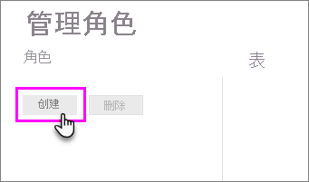
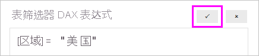

## <a name="define-roles-and-rules-in-power-bi-desktop"></a>在 Power BI Desktop 中定义角色和规则
你可以在 Power BI Desktop 中定义角色和规则。 发布到 Power BI 时，它还会发布角色定义。

若要定义安全角色，请执行以下步骤。

1. 将数据导入 Power BI Desktop 报表，或配置 DirectQuery 连接。
   
   > [!NOTE]
   > 不能在 Power BI Desktop 中为 Analysis Services 实时连接定义角色。 需要在 Analysis Services 模型中执行此操作。
   > 
   > 
2. 从“建模”选项卡中，选择“管理角色”   。
   
   
3. 从“管理角色”窗口中，选择“创建”   。
   
   
4. 在“角色”下，提供角色的名称  。 
5. 在“表”下，选择要对其应用 DAX 规则的表  。
6. 在“表筛选器 DAX 表达式”框中，输入 DAX 表达式  。 此表达式返回值 true 或 false。 例如：```[Entity ID] = “Value”```。
      
   

   > [!NOTE]
   > 可以在此表达式内使用 *username()* 。 请注意，username() 在 Power BI Desktop 中采用“域\用户名”格式   。 在 Power BI 服务和 Power BI 报表服务器中，采用用户的用户主体名称 (UPN) 格式。 或者，可以使用 userprincipalname()，它始终返回采用其用户主体名称格式 username\@contoso.com 的用户。
   > 
   > 

7. 创建 DAX 表达式后，选择“表达式”框上方的“复选标记”以验证该表达式。
      
   
   
   > [!NOTE]
   > 在此表达式框中，即使使用的区域设置通常使用分号分隔符（例如，法语或德语），也要使用逗号分隔 DAX 函数参数。 
   >
   >
   
8. 选择“保存”  。

无法在 Power BI Desktop 中将用户分配到角色。 在 Power BI 服务中分配用户。 通过使用 username()  或 userprincipalname()  DAX 函数并配置好正确的关系，则可以启用 Power BI Desktop 中的动态安全。 

