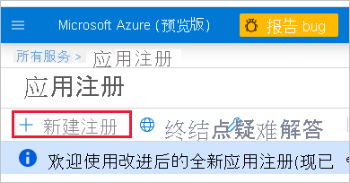

1. 登录 [Microsoft Azure](https://ms.portal.azure.com/#allservices)。

2. 搜索“应用程序注册”，然后单击“应用程序注册”链接。

    

3. 单击“新建注册”。

    

4. 填写所需信息：
    * **名称** - 输入应用程序名称
    * **受支持的帐户类型** - 选择受支持的帐户类型
    * （可选） **重定向 URI** - 视需要输入 URI

5. 单击“注册”。

6. 注册后，可以从“概览”选项卡中获取“应用程序 ID”。复制并保存“应用程序 ID”，以供日后使用。

    