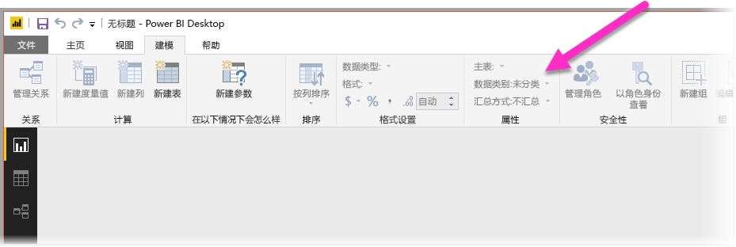
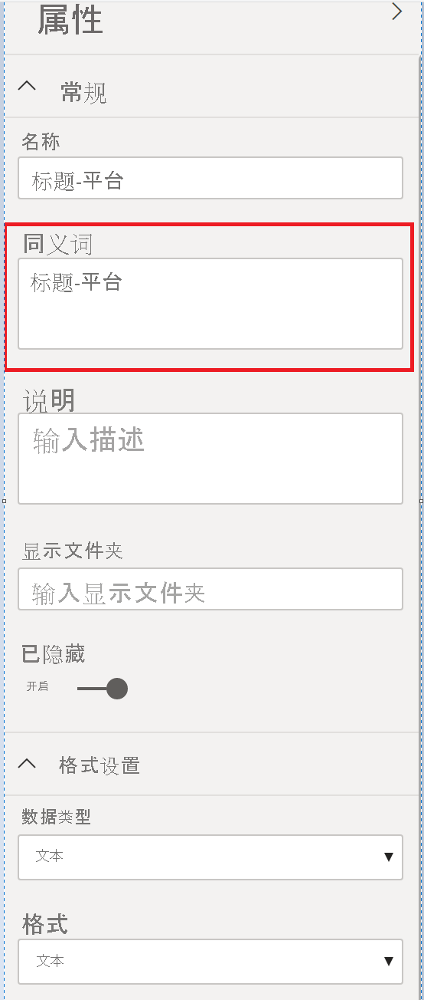

# 优化 Power BI“问答”功能的最佳做法
使用常用短语和自然语言来查询数据是一个非常有用的功能。 在用数据回答问题时，该项功能更为强大，而这就是 Power BI“问答”功能的作用。

为了能够让“问答”功能成功地解释其能够进行回答的大型问题集合，“问答”功能就必须对有关模型进行假设。 如果你的模型结构不能满足一个或多个这些假设，则需要对该模型进行调整。 针对“问答”功能的这些调整，对于 Power BI 中的任何模型来说都是同样的最佳做法优化，无论你是否使用“问答”。

在以下部分中，我们将介绍如何调整模型，以使其能够很好地适用于 Power BI 中的“问答”功能。

## “问答”作出的自动调整

### 度量值表

在以前版本的“问答”中，由于基础表已断开连接，所以“问答”无法正常处理有关度量值表的问题。 “问答”现在可以正常处理有关度量值表的问题。

### 表名与列名冲突

在以前版本的“问答”中，如果表和列的名称相同，则该表具有优先权。 此问题已得到解决，你不会再在模型中遇到此问题。

## 手动改进“问答”的步骤

### 使用新的“问答”工具来解决问题

使用“问答”工具，可将核心业务术语传授给“问答”，并修复最终用户提出的问题。 有时，由于数据调整不正确或数据丢失，某些问题仍无法解决。 在这种情况下，请阅读以下其他部分，获取优化帮助。 阅读有关[“问答”工具](q-and-a-tooling-intro.md)的详细信息。

## 添加缺少的关系

如果模型缺少表之间的关系，则 Power BI 报表和“问答”功能都将无法解释如何联接这些表。 关系是一个优秀模型的基石。 例如，如果“订单”表和“客户”表之间缺少关系，则无法提问类似“西雅图客户的销售总额”的问题   。 下图显示了一个需要进行调整的模型，以及一个可用于“问答”的模型。 

**需要调整**

在第一张图像中，客户表、销售额表和产品表之间没有关系。

**可用于“问答”**

第一张图像定义了表之间的关系。

## 重命名表和列

表和列的选择对“问答”非常重要。 例如，假设你有一个名为“客户汇总”的表，其中包含你的客户列表  。 你需要提问类似“列出芝加哥的客户汇总”的问题，而不是提问“列出芝加哥的客户”。 

尽管“问答”功能可以执行一些基本的断词和复数检测，但其假定你的表和列名能够准确地反映自身包含的内容。

请看另一个示例。 假设你有一个名为“员工总数”的表，其中包含员工的姓氏、名字和编号。  你还有另外一个名为“员工”的表，其中包含员工编号、作业编号和开始日期  。 熟悉此模型的人可能会理解此结构。 其他人提问“员工计数”时，将获得“员工”表中的行的总数。 此结果可能不是他们想要的结果，因为它是每个员工曾经拥有的每一项作业的总数。 因此，最好重命名这些表，以真正反映它们所包含的信息。

**需要调整**

需要调整表名称，如“StoreInfo”和“产品列表”   。

**可用于“问答”**

名为“商店”和“产品”的表性能更高   。

## 修复不正确的数据类型

导入的数据可能包含错误的数据类型。 具体而言，以“字符串”  导入的“日期”  和“编号”  列将不会被“问答”功能解释为日期和编号。 请确保在 Power BI 模型中选择正确的数据类型。

## 将“年份”和“标识符”列标记为“不汇总”

在默认情况下，Power BI 将主动聚合数值列，因此，“年销售总额”等提问的结果有时可能会是多年度总计的总销售额。 如果有特定列不希望让 Power BI 进行汇总，则可以将列的“默认汇总”属性设置为“不汇总”   。 请注意“年”  、“月”  、“日”  和 ID  列，因为这些列最容易出现问题。 对不适合汇总的其他列（如年龄），将“默认汇总”设置为“不汇总”或“平均值”，也可以从中受益     。 可以在“建模”  选项卡中找到此设置。

## 为每个日期和地理列选择数据类别

 “数据类别”可提供有关列数据类型以外的列内容的语义知识。 例如，可将整数列标记为邮政编码，将字符串列标记为城市、国家/地区/区域等。 “问答”功能将该信息用于两个重要方面：用于可视化效果选择和用于语言偏好设置。

首先，“问答”使用数据类别  信息帮助选择要使用什么类型的视觉显示。 例如，它可以识别出具有日期或时间数据类别  的列，这对于使用水平轴的折线图或播放轴的气泡图来说都是一个不错的选择。 并且，它还假设包含具有地理数据类别  的列的结果在地图上显示效果良好。

其次，“问答”功能将对用户可能讨论的日期和地理列进行一些推理，以帮助其理解某些类型的问题。 例如“何时雇用的 John Smith？”中的“何时” 几乎能够肯定映射到日期列，而“Brown 的客户计数”中的“Brown”更有可能是一个城市，而不是头发的颜色。

## 为相关列选择“按列排序”

使用“按列排序”属性，可以对一个列进行排序，从而自动对其他列进行排序  。 例如，当提问“按衬衫尺寸对客户排序”时，你可能希望你的“衬衫尺寸”列按基础尺寸编号（XS、S、M、L、XL）排序，而不是按字母顺序（L、M、S、XL、XS）排序。

## 规范化你的模型

请放心，我们并不是建议你需要重新构建整个模型。 但是，一些结构难度很大，“问答”功能无法很好地对其进行处理。 如果对模型的结构执行一些基本的规范化操作，则 Power BI 报表的可用性会得到显著提升，“问答”结果也会更为准确。

请遵循此一般规则：用户讨论的每个唯一“事项”都应由相应的一个模型对象（表或列）来表示。 因此，如果你的用户讨论客户，则应有一个 customer 对象  。 如果你的用户讨论销售额，则应有一个 sales 对象  。 听起来很简单，对吗？ 取决于你开始使用的数据形状，它可以很简单。  如果需要，查询编辑器中提供了丰富的数据构形功能，而使用 Power BI 模型中的计算能够更为直接的进行转换。

以下部分包含可能需要执行的一些常见转换。

### 为多列实体创建新表

如果有多个列充当较大表内的单个不同单元，则应将这些列拆分为其自己的表。 例如，假设你的“公司”表中包含“联系人姓名”、“联系人职务”和“联系人电话”列。  则最好设计一个单独的“联系人”   表，以包含姓名、职务和电话，以及一个指回公司表的链接。 与在公司表中提问谁是联系人相比，单独就联系人表进行提问要简单很多，且提高了显示的灵活性。

**需要调整**

**可用于“问答”**

### 消除属性包的透视

如果在模型中存在属性包，则应对其重新构建以使每个属性都具有单个列  。 尽管属性包便于管理大量的属性，但依然存在许多固有限制，Power BI 报表和问答功能都没有解决此问题的方法。

例如，考虑采用一个 CustomerDemographics 表，用以包含客户 ID、属性和值列，其中每行表示客户的一个不同属性（例如，年龄、婚姻状况、城市等）  。 通过基于属性列的内容重载值列的含义，“问答”功能无法解释引用它的大部分查询。 简单的问题（如“显示每个客户的年龄”）可能碰巧起作用，因为它可能被解释为“显示属性为年龄的客户和客户人口统计数据”。 但是，模型结构将无法支持稍微复杂一点的问题，如“芝加哥客户的平均年龄”。 尽管直接创作 Power BI 报表的用户有时可找到更聪明的方法来获取他们正在寻找的数据，但只有当每列仅有一个含义时，问答才起作用。

**需要调整**

**可用于“问答”**

### 消除分区的联合

如果已跨多个表对数据进行了分区，或拥有跨多个列的透视值，则你的用户很难或无法实现许多常用的操作。 请首先考虑典型表分区：一个“销售额 2000-2010”  表和一个“销售额 2011-2020”  表。 如果你的所有重要报表都被限制为特定的十年，则可以为 Power BI 报表保留这种方式。 但是，“问答”的灵活性会让你的用户期望得到“按年销售总额”等问题的答案。 若要执行此查询，需要将数据联合到单个 Power BI 模型表中。

同样的，请考虑采用典型的透视值列：一个包含作者、书籍、城市 1、城市 2 和城市 3 列的 BookTour  表。 对于此类结构，即使一个简单的问题（如“按城市计数书籍”）都无法正确解释。 若要执行此查询，请创建一个单独的 BookTourCities  表，将城市值联合到单个列。

**需要调整**

**可用于“问答”**

### 拆分格式化列

如果导入数据的源包含格式化的列，则 Power BI 报表（和“问答”）无法访问列内部以分析其内容。 因此，例如，如果有一个包含地址、城市和国家/地区的“完整地址”  列，还应将其拆分为地址、城市和国家/地区列，以便你的用户能够单独对各列进行查询。

**需要调整**

**可用于“问答”**

同样的，如果你有某人的任何完整姓名列，则添加名字和姓氏列，以防可能有人会使用姓名的一部分进行提问   。 

### 为多值列创建新表

情况类似，如果导入数据的源包含多值列，则 Power BI 报表（和“问答”）无法访问列内部以分析其内容。 因此，例如，如果有一个“作曲者”列，包含有一首歌曲的多个作曲者姓名，则应在单独的“作曲者”表中将其拆分为多个行  。

**需要调整**

**可用于“问答”**

### 规范化以消除非活动关系

“规范化更好”规则的一个例外是当存在从一个表到另一个表的多个路径时。 例如，如果有一个“航班”  表，包含出发城市 ID 和目标城市 ID 列，其中每列都与“城市”  表相关。 必须将其中的一个关系标记为非活动关系。 因为“问答”只能使用活动关系，所以无法提问有关出发城市或目标城市的问题，具体要取决于所选的关系是什么。 如果改为使城市名称列非规范化为“航班”  表，则可以提问类似“列出明天包含西雅图出发城市和旧金山目标城市的航班”等的问题。

**需要调整**

**可用于“问答”**

### 将同义词添加到表和列

此步骤专门应用于“问答”（一般情况下不应用于 Power BI 报表）。 用户通常会使用各种不同的术语来表示同一个意思，例如，销售总额、销售净额、净销售总额。 可将这些同义词添加到 Power BI 模型中的表和列。 

此步骤非常重要。 即使使用直观的表和列名称，“问答”功能的用户仍会使用他们首先想到的词汇进行提问。 而不是从列的预定义列表中选择词汇。 能够添加的有意义的同义词越多，用户使用报表的体验就越好。 若要添加同义词，请在 Power BI Desktop 中转到“模型”视图，选择“建模”选项卡，然后选择字段或表。 “属性”窗格显示“同义词”框，可在其中添加同义词  。

 添加同义词时请谨慎。 将同一同义词添加到多个列或表中会导致产生歧义。 “问答”尽可能使用上下文在不确定的同义词之间进行选择，但并不是所有问题都具有充分的上下文。 例如，当用户提问“计数客户”时，如果在你的模型中对“客户”有三个同义词，则客户可能无法获得他们想要寻找的问题的答案。 在这些情况下，请确保主要同义词的唯一性，因为它将用于再次声明中。 它可以提醒用户出现歧义（例如，再次声明“显示已存档的客户记录数”），提示用户以不同的方式来提问。

## 后续步骤

[Power BI 问答简介](q-and-a-intro.md)
