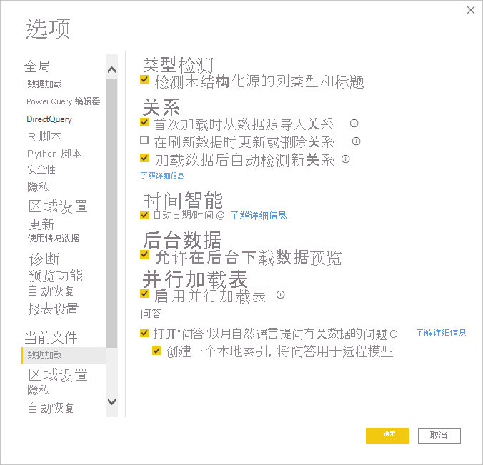

# 在导入、实时连接和直接查询中使用自然的语言

通过 Power BI 中的 Q&A 功能，你可以使用自然语言询问有关该数据的问题，从而快速从数据中获取答案。 本文介绍如何使用索引和缓存来提高每个受支持配置的性能。

## Q&A 支持哪些数据源？

以下配置支持 Q&A：

- 导入模式
- 实时连接模式 – 使用本地 SQL Server Analysis Services、Azure Analysis Services 或 Power BI 数据集
- 直接查询 – Azure Synapse、Azure SQL 和 SQL Server 2019。 尽管可能有其他源也可以在直接查询模式下工作，但我们并不正式支持这些源。

默认情况下，如果使用 Q&A 视觉对象，会在报表内启用 Q&A。 如果正在使用直接查询或实时连接，将出现一条提示。 可以通过进入选项来显式打开/关闭报表的自然语言功能。

有关详细信息，请参阅 [Power BI Q&A 限制](q-and-a-limitations.md)。

## 索引如何与 Q&A 协同工作？

当启用 Q&A 时，将生成一个索引以快速向用户提供实时反馈，并帮助解释用户的问题。 此索引可能需要一些时间才能生成，并将具有以下元素和限制。

- 所有列名称和表都将插入到索引中，除非已在 Q&A 工具中将其显式关闭。
- 将为不超过 100 个字符的全部文本值编制索引。 不会为超过 100 个字符的文本值编制索引。 
- Q&A 将在其索引中存储最多 500 万个唯一值。 如果超过此阈值，则索引将不会保存所有可能的值，这可能会降低从 Q&A 收到的结果的准确性。
- 如果在编制索引过程中出现错误，则索引将保持不完整状态，并在下一次刷新时重新创建，如下一节中所述。

## 索引刷新和缓存的频率是多少？

在 Power BI Desktop 中，索引是在使用 Q&A 时创建的。 将出现一个小图标，让你知道正在建立索引。 在这段时间内，包括建议在内的 Q&A 视觉对象可能需要一些时间来加载。

在 Power BI 服务中，索引是在发布/重新发布和刷新时重新创建的。 Q&A 索引并非总是自动创建的，有时会根据需要来优化数据集刷新。 对于直接查询，我们每天最多为数据编制一次索引，以减少对直接查询源的影响。

## 后续步骤

可以通过多种方式将自然语言集成到报表中。 有关详细信息，请参阅以下文章：

* [问答视觉对象](../visuals/power-bi-visualization-q-and-a.md)
* [问答最佳做法](q-and-a-best-practices.md)
