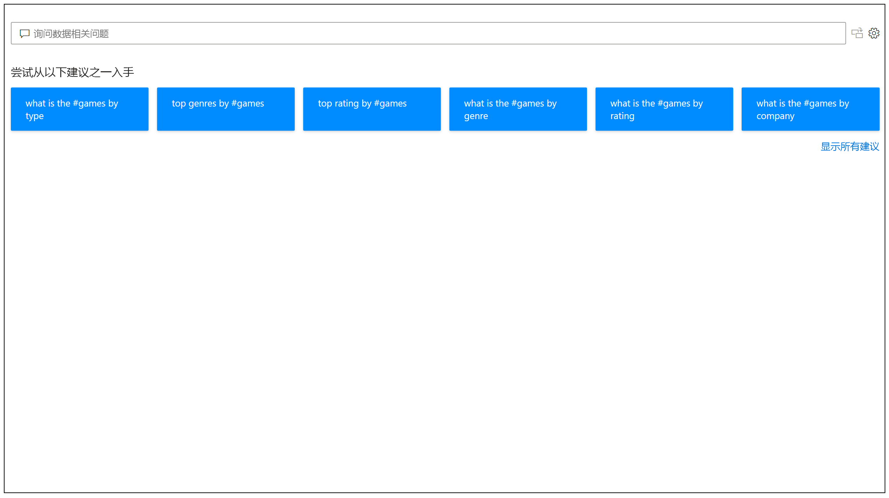
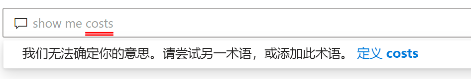
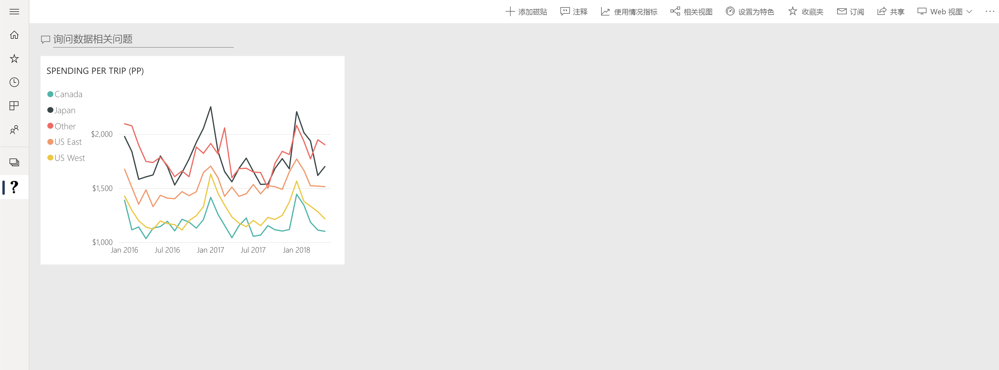

# Power BI 问答简介

有时从数据中获得答案的最快方法是使用自然语言对数据执行搜索。 通过 Power BI 中的问答功能，可以使用自然语言以自己的语言浏览数据。 问答是互动式的，甚至很好玩。 通常情况下，随着可视化效果揭示有趣的追问路径，一个问题会引出其他问题。 提问仅仅是个开始。 浏览数据、优化或扩展问题、发现新信息、专注细节以及缩小以获得更宽广的视野。 通过内存中存储实现的快速交互体验。 

Power BI 问答免费供所有用户使用。 在 Power BI Desktop 中，报表设计者可以使用问答来浏览数据并创建可视化效果。 在 Power BI 服务中，每个人都可以使用问答来浏览其数据。 我们的移动应用也支持问答功能，在 iOS 中为问答虚拟助手，在 Android 设备上为问答视觉对象。 如果你有权编辑仪表板或报表，还可以固定问答结果。

## 如何使用问答

在开始键入前，“问答”会显示新的屏幕，上面有帮助你提问的一些建议。 从建议的问题开始，或键入你自己的问题。 问答支持各种问题，包括但不限于：

- **询问自然问题** 哪些销售人员收入最高？
- **使用相对日期筛选** 显示去年的销售额
- **仅返回前 N 个** 销售额排名前 10 的产品
- **提供筛选器** 显示美国的销售额
- **提供复杂条件** 显示产品类别为类别 1 或类别 2 的销售额
- **返回特定的视觉对象** 显示产品销售额饼图
- **使用复杂聚合** 显示各产品销售额中值
- **对结果进行排序** 显示销售额排名前 10 的国家/地区，按国家/地区代码排序
- **比较数据** 按总销售额和总成本显示数据
- **查看趋势** 显示随时间推移的销售额

### 自动完成

在你键入问题时，Power BI 问答会显示符合语境的相关建议，以帮助你使用自然语言迅速提高工作效率。 键入时，会立即获得反馈和结果。 体验类似于在搜索引擎中键入内容。

### 红色/蓝色/橙色下划线

问答会为字词添加下划线，帮助你了解系统理解或无法识别的字词。 蓝色实心下划线指示系统已成功将该词匹配到数据模型中的字段或值。 下面的示例表明，问答识别了“欧盟销售额”一词。

 橙色下划线指示单词，归类为“低置信度”。 如果你键入模糊或不明确的单词，则字段将带橙色下划线。 例如“销售额”一词。 可能有多个字段包含“销售额”一词，因此系统使用橙色下划线来提示你选择所指的字段。 低置信度的另一个示例是，你键入“区域”一词，但它匹配的列是“地区”。 得益于与必应和 Office 的集成，Power BI 问答可识别含义相同的单词，以及将报告中的重命名解释为潜在建议。 问答会为该词添加橙色下划线，告诉你显示的不是直接匹配项。

红色下划线表示问答根本无法识别这个单词。 使用数据中未提到的特定于域的字词，或者数据字段的名称不正确，可能会遇到此问题。 例如，你使用了“Costs”一词，而该词并不存在于数据中。 这个词在英语词典中，但问答将用红色下划线标记此术语，以指示它没有找到与数据有关的术语。

> [!NOTE]
> 可以在问答“视觉对象格式设置”窗格中自定义蓝色/红色/橙色下划线颜色。 另外，[问答工具](q-and-a-tooling-teach-q-and-a.md)一文介绍了“教导 Q&A”，可用它定义问答未能识别的术语。

### 可视化效果结果

当你键入问题时，问答将尝试即时解释并以可视化形式显示答案。 作为最新更新的一部分，问答现在尝试解释问题，并自动将字段绘制到正确的轴上。 例如，如果你键入“按年份排序的销售额”，则问答检测到年份是日期字段，并始终优先将此字段放置在 X 轴上。 如果要更改可视化效果类型，请在问题后面键入“图表类型”。 问答目前支持以下类型的可视化效果：

- 折线图
- 条形图
- Matrix
- 表
- 卡片
- 分区图
- 饼图
- 散点图/气泡图
 

## 将问答添加到报表

可以通过以下两种方式在 Power BI Desktop 或 Power BI 服务中将报表添加到问答中：

- 添加问答视觉对象。
- 添加问答按钮。

若要将问答视觉对象添加到报表，请在“可视化效果”窗格中选择新问答图标，选择新的问答视觉对象。 或者，双击报表画布上的任意位置以插入问答视觉对象。

若要添加按钮，请在“主页”功能区上选择“按钮” > “问答”。可以完全自定义问答按钮图像  。

> [!NOTE]
> 从按钮启动问答时，仍使用旧版问答。 后续 Power BI 版本将会更改此行为。

## 将问答用于仪表板

默认情况下，问答位于仪表板顶部。 若要使用问答，请在“提出有关数据的问题”框中键入内容。

## 后续步骤

可以通过多种方式将自然语言集成到报表中。 有关详细信息，请参阅以下文章：

* [问答视觉对象](../visuals/power-bi-visualization-q-and-a.md)
* [问答最佳做法](q-and-a-best-practices.md)
