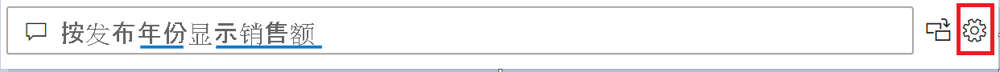
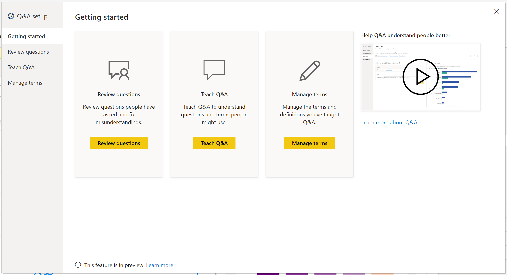
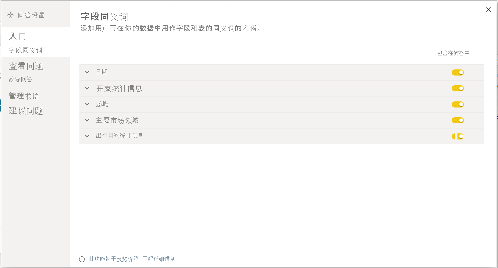
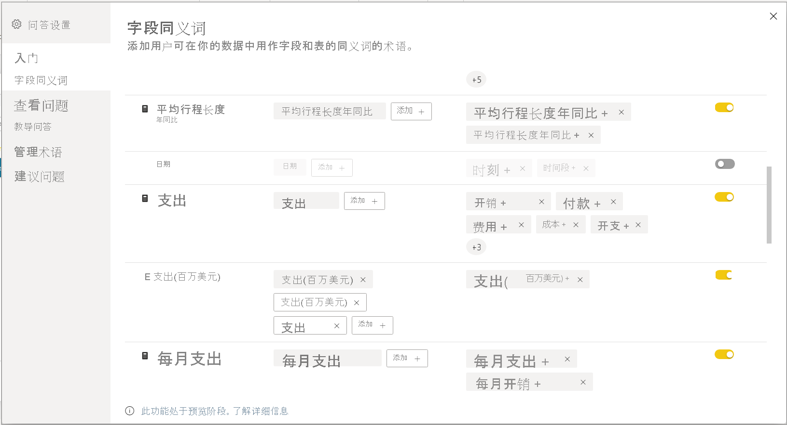

# 培训 Power BI 问答的问答工具简介（预览版）

使用 Power BI 问答工具，可以为用户改进自然语言体验  。 作为设计者或管理员，你可以与自然语言引擎进行交互，并在以下三个方面进行改进： 

- 查看用户提出的问题。
- 教导 Q&A 以了解问题。
- 管理已教导 Q&A 的术语。

除了这些专用工具功能外，Power BI Desktop 中的“建模”  选项卡还提供了更多选项：  

- 同义词
- 行标签
- 在“问答”中隐藏
- 语言架构的配置（高级）

## 开始使用问答工具

问答工具仅在 Power BI Desktop 中提供，且当前仅支持导入模式。

1. 打开 Power BI Desktop 并使用“问答”来创建视觉对象。 
2. 在视觉对象的角落，选择齿轮图标。 

    

    此时将打开“入门”页。  

    

### 字段同义词

选择“字段同义词”以查看属于模型的所有表和列。 通过此视图，你可以添加替代名称来匹配列，以帮助用户。 你还可以选择是否应在问答中隐藏列或表。

单击其中一个表以将其展开，你会看到类似于下面的对话框。

该对话框将显示所有列和表及其各自的术语/同义词，可供用户在针对数据集提问时使用。 可以在一个位置快速查看所有术语，还可以为多个列添加或删除术语。 

- 添加术语 - 如果你有一个名为“销售额”的字段，则可能需要添加一个称为“收入”的术语，以便用户可以使用这个词，而无需使用“销售额”一词。 单击“添加”符号以快速添加新术语

- 包括在问答中 - 此选项允许在问答中省略列或表，这意味着不会显示此列或表，也不会显示此列的结果。 处理日期时可能不会包含列。 如果存在很多日期字段或外键，可能需要删除除一个日期字段外的所有日期字段，以便当用户询问日期相关问题时选择正确的日期列。

- 建议的术语 - 问答还将推荐从建议引擎中检索的建议术语，以帮助你快速添加术语/同义词。 如果未添加建议，它们仍然有效，但会向用户显示一条橙色虚线，表示问答认为它有不确定的答案。 如果建议的同义词正确，请单击 + 图标，以便它可以用作同义词。 如果建议不正确，请单击 x，以删除该术语并确保该术语不会用作术语/同义词，并且在问答中无效。 这些建议由 Office 字典提供支持，也来自报表中找到的重命名

### 查看问题

选择“查看问题”，查看 Power BI 服务中为租户使用的数据集列表****。 “查看问题”页还会显示数据集所有者、工作区和上次刷新日期****。 在这里，你可以选择一个数据集，并查看用户提出了哪些问题。 数据还会显示无法识别的单词。 此处显示的所有数据都是最近 28 天的数据。

### 教导“问答”

在“教导 Q&A”部分，你可以培训问答来识别单词****。 首先，键入一个问题，其中包含一个或多个问答无法识别的单词。 问答提示你输入该术语的定义。 输入与该单词所代表的内容相对应的筛选器或字段名称。 问答随后将重新解释原问题。 如果对结果满意，可保存输入。 要了解详细信息，请参阅[教导 Q&A](q-and-a-tooling-teach-q-and-a.md)

### 管理术语

在教导 Q&A 部分保存的任何内容都显示在此处，因此你可以查看或删除已定义的术语。 目前，你无法编辑现有定义。因此，若要重新定义一个术语，则必须删除并重新创建该术语。

### 建议问题

如果没有执行任何设置，问答视觉对象将开始建议几个问题。 这些问题是根据你的数据模型自动生成的。 在“建议问题”中，你可以使用自己的问题覆盖自动生成的问题。

若要开始，请在文本框中键入要添加的问题。 可在“预览”部分查看结果在问答视觉对象中的显示效果。 

:::image type="content" source="media/q-and-a-tooling-intro/power-bi-qna-suggest-questions.png" alt-text="建议问答问题":::
 
选择“添加”按钮，将此问题添加到“建议的问题”中 。 每个附加问题都将添加到此列表的末尾。 这些问题将以与在此列表中显示的相同顺序显示在问答视觉对象中。 

:::image type="content" source="media/q-and-a-tooling-intro/power-bi-qna-save-suggest-questions.png" alt-text="保存建议的问题":::
 
请确保选择“保存”，以在问答视觉对象中显示建议的问题列表。 

> [!NOTE]
> 建议的问题将显示在问答视觉对象的所有实例中。 无法为每个问答视觉对象创建一组单独的建议。
> 
> 

## 其他问答设置

### 设置行标签

使用行标签可以定义哪一列（或字段**）最能标识表中的单个行。 例如，对于一个名为“客户”的表，行标签通常是“显示名称”。 当用户键入“按客户显示销售额”时，提供此额外的元数据，使问答能绘制出更有帮助的视觉对象。 它可以使用“显示名称”并显示一个显示每个客户销售额的条形图，而不是将“客户”视为一个表。 你只能设置行标签建模视图。 

1. 在 Power BI Desktop 中，选择“建模”视图。

2. 选择一个表，以显示“属性”窗格****。

3. 在“行标签”**** 框中，选择一个字段。

## 配置语言架构（高级）

在 Power BI 中，你可以在问答中完全训练和增强自然语言引擎，包括更改基础自然语言结果的评分和权重。 要了解如何进行操作，请参阅[编辑问答的语言架构并添加短语](q-and-a-tooling-advanced.md)。

## 后续步骤

用于改进自然语言引擎的最佳做法还有很多。 有关详细信息，请参阅[问答最佳做法](q-and-a-best-practices.md)。
