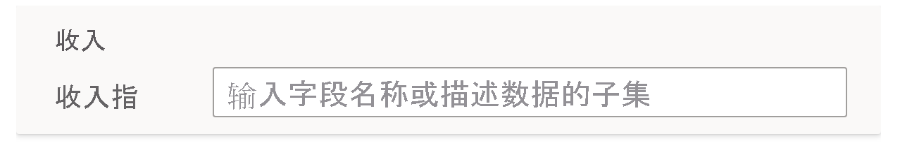

# 在 Power BI 问答中教导 Q&A 以使其理解问题和术语

在问答设置的“教导 Q&A”部分，训练问答以使其理解自然语言问题和未识别的术语  。 首先，提交包含问答不可识别的一个或多个单词的问题。 问答稍后会提示你定义该术语。 输入与该单词所代表的内容相对应的筛选器或字段名称。 问答随后将重新解释原问题。 如果对结果满意，请将其保存。

> [!NOTE]
> 教导功能仅支持导入模式。 也不支持连接到本地或 Azure Analysis Services 数据源。 Power BI 的后续版本中将删除此限制。

## 开始教导 Q&A

1. 在 Power BI Desktop 的“建模”功能区，依次选择“问答设置” > “教导 Q&A”    。

    

2. 输入一句包含问答不能识别术语的句子，选择“提交”  。

3. 选择带红色下划线的单词。 

    问答会提供建议，并提示你提供该术语的正确定义。 
    
3. 在“定义问答不理解的术语”下，提供定义  。

    

4. 选择“保存”以预览更新后的视觉对象  。

5. 输入下一个问题，或选择“X”关闭  。

在你将报表发布回服务前，报表使用者不会看到此更改。

## 定义名词和形容词

可以教导问答理解两种类型的术语：

- 名词
- 形容词

### 定义名词同义词

在处理数据时，通常可能会有可使用其他名称指代的字段名称。 例如“销售额”。 很多词语都可以指代销售额，例如“收入”。 如果一个列被命名为“销售额”，而报表使用者键入“收入”，则问答可能无法选择正确的列来正确回答问题。 在这种情况下，你要告诉问答，“销售额”和“收入”是一回事。

问答使用 Microsoft Office 提供的知识自动检测未识别的单词是否是名词。 如果问答检测到名词，它会提示你执行以下操作：

- <your term> 是指  

在框中填写数据中的术语。

如果提供数据模型中的字段以外的内容，可能会得到不理想的结果。

### 定义形容词筛选条件

有时可能需要定义充当基础数据筛选条件的术语。 例如“优秀发布者”。 “优秀发布者”这一条件可用于选出发布了 X 个产品的发布者。 问答会尝试检测形容词，并显示不同的提示：

- <field name> 是形容   

在框中填写条件。

可定义的条件的示例有：

- “国家/地区”是美国
- “国家/地区”不是美国
- 产品数 > 100
- 产品数大于 100
- 产品数 = 100
- 产品数为 100
- 产品数 < 100
- 产品数小于 100。

在这些示例中，“产品数”可以是列名称或度量值。 

还可在问答表达式本身中指定聚合。 例如，如果“热销产品”是至少售出了 100 个单位的产品，则可以将“已售出的单位总数 > 100”的产品定义为热销产品。  

:::image type="content" source="media/q-and-a-tooling-teach-q-and-a/power-bi-qna-popular-products.png" alt-text="定义“热销产品”":::

只能在工具中定义单个条件。 要定义更复杂的条件，请使用 DAX 创建计算列或度量值，然后使用“工具”部分为该列或度量值创建单个条件。

## 管理术语

提供定义后，可以返回以查看你的所有修改，并编辑或删除它们。 

1. 在“问答设置”中，转到“管理术语”部分   。

2. 删除不再需要的任何术语。 当前无法编辑术语。 若要重新定义某个术语，请删除该术语并重新定义一个。

    

## 后续步骤

用于改进自然语言引擎的最佳做法还有很多。 有关详细信息，请参阅[问答最佳做法](q-and-a-best-practices.md)。
