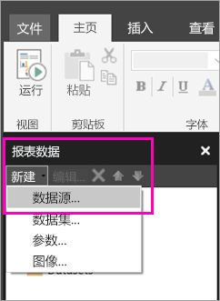

# 在 Power BI 服务中为分页报表创建嵌入数据源（预览）

本文介绍如何在 Power BI 服务中为分页报表创建和修改嵌入数据源。 可以在单个报表中定义嵌入数据源，并且仅在该报表中使用它。 目前，发布到 Power BI 服务的分页报表需要嵌入的数据集和嵌入的数据源，并且可以连接到这些数据源：

- Azure SQL 数据库和数据仓库
- SQL Server
- SQL Server Analysis Services 

分页报表通过网关连接到本地数据源。 将报表发布到 Power BI 服务后，可以设置网关。 了解有关 [Power BI 网关](service-gateway-getting-started.md)的详细信息。 

## 创建嵌入的数据源
  
1. 打开报表生成器。

1. 在“报表数据”窗格中的工具栏上，选择“新建” > “数据源”。 随即将打开“数据源属性”对话框。

    
  
2.  在“名称”文本框中，键入数据源的名称或接受默认名称。  
  
3.  选择“使用我的报表中嵌入的连接”。  
  
1.  从“选择连接类型”列表中，选择数据源类型。 

1.  使用下列方法之一指定连接字符串：  
  
    -   在“连接字符串”文本框中直接键入连接字符串。 
  
    -   选择表达式 (fx) 按钮，创建一个计算结果为连接字符串的表达式。 在“表达式”对话框的“表达式”窗格中键入表达式。 选择**确定**。 
  
    -   选择“构建”以打开在步骤 2 中选择的数据源的“连接属性”对话框。  
  
        根据数据源类型，填写“连接属性”对话框中的字段。 连接属性包括数据源类型、数据源名称和要使用的凭据。 在此对话框中指定值后，选择“测试连接”以验证数据源是否可用，以及指定的凭据是否正确。  
  
4.  选择“凭据”。  
  
     指定要用于此数据源的凭据。 数据源的所有者将选择支持的凭据类型。 有关详细信息，请参阅[指定报表数据源的凭据和连接信息](https://docs.microsoft.com/sql/reporting-services/report-data/specify-credential-and-connection-information-for-report-data-sources)。
  
5.  选择**确定**。  
  
     “报表数据”窗格中将显示数据源。  

## 后续步骤

- [在 Power BI 服务中为分页报表创建嵌入数据集](paginated-reports-create-embedded-dataset.md)
- [Power BI Premium 中的分页报表是什么？（预览）](paginated-reports-report-builder-power-bi.md)