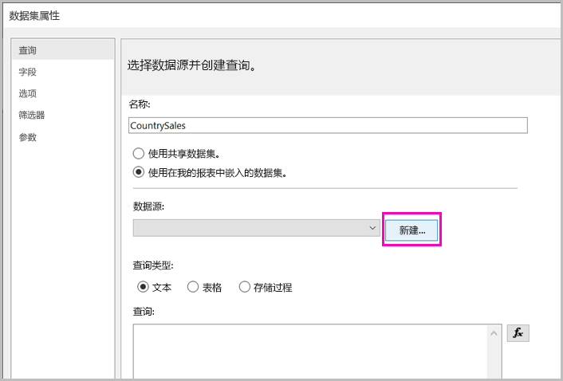
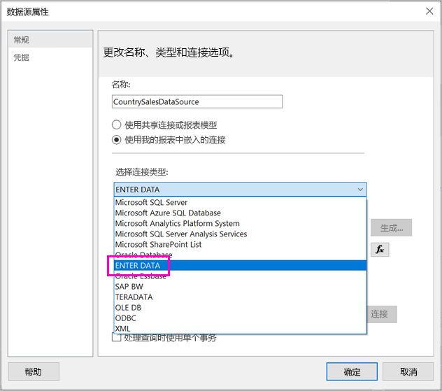
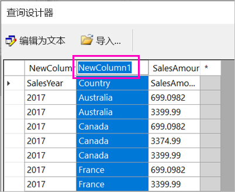
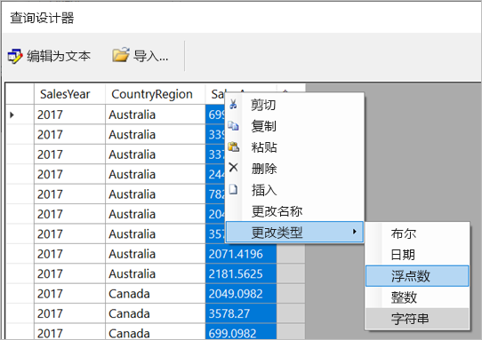
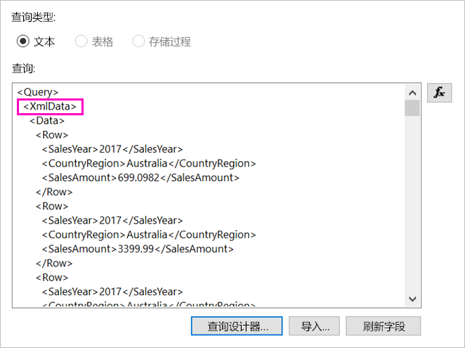
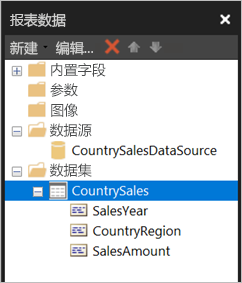

# <a name="enter-data-directly-in-a-paginated-report-in-report-builder-preview---power-bi"></a>直接在报表生成器 - Power BI 的分页报表中输入数据（预览）

本文介绍新版 SQL Server 2016 报表生成器中的一项功能，使用该功能可将数据作为嵌入数据集直接输入 RDL 报表。  此功能类似于 Power BI Desktop。 可以直接在报表的数据集中键入数据，也可从其他程序（如 Microsoft Excel）中粘贴数据。 通过输入数据创建数据集后，可像使用任何其他已创建的嵌入数据集一样使用它。 此外，可以添加多个表，并使用一个表作为另一个表的筛选器。 此功能对可能要用于报表的小型静态数据集（如报表参数）特别有用。
 
## <a name="prerequisites"></a>先决条件

- 若要直接在分页报表中输入数据，请[从 Microsoft 下载中心](https://www.microsoft.com/download/details.aspx?id=53613)安装新版本的报表生成器。 
- 若要将分页报表保存到 Power BI 服务，则需 [Power BI Pro 帐户](service-self-service-signup-for-power-bi.md)，以及对 [Power BI 高级容量](service-premium.md)中的工作区的写入权限。
- 若要将分页报表保存到报表服务器，则需[编辑 RsReportServer.config 文件](#upload-the-paginated-report-to-a-report-server)的权限。

## <a name="get-started"></a>开始使用

下载并安装报表生成器后，按照向报表添加嵌入数据源和数据集的相同工作流程操作。 在以下过程中，“数据源”下会出现一个新选项：“输入数据”。  只需在报表中设置一次此数据源。 之后，可创建多个输入数据表作为单独的数据集，数据集全部使用该单个数据源。

1. 在“报表数据”窗格中，选择“新建” > “数据集”。

    

1. 在“数据集属性”对话框中，选择“使用我的报告中嵌入的数据集”。

1. 在“数据源”旁边，选择“新建”。

    

1. 在“数据源属性”对话框中，选择“使用我的报告中嵌入的连接”。
2. 在“选择连接类型”框中，选择“输入数据” > “确定”。

    

1. 返回“数据集属性”对话框，选择“查询设计器”。
2. 在“查询设计器”窗格中，右键单击并在表中粘贴数据。

    

1. 若要设置列名称，请双击每个“NewColumn”并键入列名称。

    

1. 如果第一行包含原始数据的列标题，请右键单击并将其删除。
    
9. 默认情况下，每列的数据类型为字符串。 若要更改数据类型，请右键单击列标题 >“更改类型”，然后将其设为其他数据类型，例如日期或浮点数。

    

1. 表格创建完成后，选择“确定”。  

    生成的查询与使用 XML 数据源时的查询相同。 实际上，我们使用 XML 来提供数据。  我们已重新对其进行了调整，以启用此方案。

    

12. 在“数据集属性”对话框中，选择“确定”。

13. 可在“报表数据”窗格中看到数据源和数据集。

    

可使用数据集作为报表中数据可视化效果的基础。 此外，还可添加其他数据集并为其使用相同数据源。

## <a name="upload-the-paginated-report-to-the-power-bi-service"></a>将分页报表上传到 Power BI 服务

现在预览版 Power BI 服务支持分页报表，可将分页报表上传到高级容量。 有关详细信息，请参阅[上传分页报表](paginated-reports-save-to-power-bi-service.md#upload-a-paginated-report)。

## <a name="upload-the-paginated-report-to-a-report-server"></a>将分页报表上传到报表服务器

还可将分页报表上传到 Power BI 报表服务器或 SQL Server Reporting Services 2016 或 2017 报表服务器。 在此之前，需将以下项添加到 RsReportServer.config 作为附加数据扩展。 如果遇到任何问题，请在进行更改前备份 RsReportServer.config 文件。

```
<Extension Name=”ENTERDATA” Type=”Microsoft.ReportingServices.DataExtensions.XmlDPConnection,Microsoft.ReportingServices.DataExtensions”>
<Configuration>
<ConfigName>ENTERDATA</ConfigName>
</Configuration>
</Extension>
```

编辑完后，配置文件中的数据提供程序列表应如下所示：


就这么简单！现在即可将使用此新功能的报表发布到报表服务器。

## <a name="next-steps"></a>后续步骤

- [Power BI Premium 中的分页报表是什么？（预览）](paginated-reports-report-builder-power-bi.md)
- [什么是 Power BI 报表服务器？](report-server/get-started.md)
