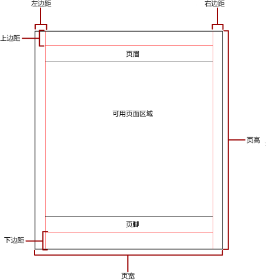
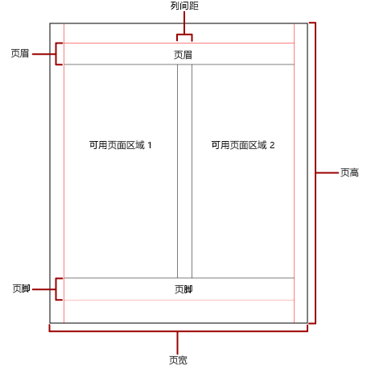

# Power BI 分页报表中的分页

 分页指报表中的页数以及报表项在这些页上的排列方式。 Power BI 分页报表中的分页因用于查看和交付报表的呈现扩展插件而异。 在报表服务器上运行报表时，报表会使用 HTML 呈现器。 HTML 遵循一组特定的分页规则。 例如，如果将同一个报表导出为 PDF，则使用 PDF 呈现器并应用另一组规则；因此，报表分页有所不同。 若要为用户成功设计针对计划用于交付报表的呈现器而优化的易于阅读的报表，需要了解用于在 Power BI 分页报表中控制分页的规则。  
  
 本主题讨论物理页大小和报表布局对强制分页符呈现器如何呈现报表的影响。 可以使用“报表属性”  窗格、“属性”  窗格或“页面设置”  对话框设置属性以修改物理页大小和边距，以及将报表划分为各列。 可以通过单击表体外部的蓝色区域来访问“报表属性”  窗格。 通过单击“主页”选项卡上的“运行”  ，然后单击“运行”选项卡上的“页面设置”  ，可访问“页面设置”  对话框。  
  
> [!NOTE]  
>  如果将报表设计为一页宽度，但是它跨多页呈现，请检查表体的宽度（包括边距）是否不大于物理页大小宽度。 若要防止向报表添加空页，可以通过向左拖动容器角来减小容器大小。  

## 表体  
 表体是在设计图面上显示为空白的矩形容器。 它可以增大或收缩以容纳其中包含的报表项。 表体不反映物理页大小，实际上，表体可以增大到超过物理页大小边界以跨越多个报表页。 某些呈现器（如 Microsoft Excel、Word、HTML 和 MHTML）可呈现根据页的内容增大或收缩的报表。 以这些格式呈现的报表针对基于屏幕的查看（如在 Web 浏览器中）进行了优化。 如果需要，这些呈现器会添加垂直分页符。  
  
 可以使用边框颜色、边框样式和边框宽度设置表体格式。 还可以添加背景色和背景图像。  
  
## 物理页  
 物理页大小是纸张大小。 为报表指定的纸张大小控制报表的呈现方式。 以强制分页符格式呈现的报表会基于物理页大小来水平和垂直插入分页符，以便在以强制分页符文件格式打印或查看时提供优化的阅读体验。 以软分页符格式呈现的报表会基于物理大小来水平插入分页符，以便在 Web 浏览器中查看时提供优化的阅读体验。  
  
 默认情况下，页大小为 8.5 x 11 英寸，但是可以“报表属性”  窗格或“页面设置”  对话框中更改此大小，也可以通过在“属性”  窗格中更改 PageHeight 和 PageWidth 属性来进行更改。 页大小不会增大或收缩以容纳表体的内容。 如果希望报表出现在单个页上，则表体中的所有内容都必须可容纳在该物理页中。 如果无法容纳并且使用的是强制分页符格式，则报表需要更多页。 如果表体增大到超出物理页右边缘，则会水平插入分页符。 如果表体增大到超出物理页下边缘，则会垂直插入分页符。  
  
 如果要替代报表中定义的物理页大小，可以使用用于导出报表的特定呈现器“设备信息”设置来指定物理页大小。 有关完整列表，请参阅 SQL Server Reporting Services 文档中的[呈现扩展插件的设备信息设置](https://docs.microsoft.com/sql/reporting-services/device-information-settings-for-rendering-extensions-reporting-services?view=sql-server-2017)。  
  
### 边距

 边距从物理页尺寸的边缘向内绘制到指定边距设置。 如果报表项扩展到边距区域中，则会进行剪裁，以便不呈现重叠区域。 如果指定的边距大小导致页的水平或垂直宽度等于零，则边距设置默认为零。 边距在“报表属性”  窗格或“页面设置”  对话框中指定，或是通过在“属性”  窗格中更改 TopMargin、BottomMargin、LeftMargin 和 RightMargin 属性进行指定。 如果要替代报表中定义的边距大小，可以使用用于导出报表的特定呈现器“设备信息”设置来指定边距大小。  
  
 为边距、列间距以及页眉和页脚分配空间之后保留的物理页区域称为可用页区域  。 仅当以强制分页符呈现器格式呈现和打印报表时，才会应用边距。 下图指出了物理页的边距和可用页区域。  
  
 
  
### 新闻稿样式列  

 报表可以划分为各列（如报纸中的列）。 列被视为在相同物理  页上呈现的逻辑  页。 它们按从左到右、从上到下的顺序排列，各列之间以空格分隔。 如果报表划分为多个列，则每个物理页会垂直划分为各列，每列被视为一个逻辑页。 例如，假定在一个物理页上有两个列。 报表的内容会填充第一列，然后填充第二列。 如果前两列无法完全容纳报表，则报表随后会填充下一页上的第一列和第二列。 会继续从左到右、从上到下填充列，直到呈现了所有报表项。 如果指定的列大小导致水平宽度或垂直宽度等于零，则列间距默认为零。  
  
 可在“报表属性”  窗格或“页面设置”  对话框中指定列，或是通过在“属性”  窗格中更改 TopMargin、BottomMargin、LeftMargin 和 RightMargin 属性进行指定。 如果要使用未定义的边距大小，可以使用要将报表导出到的特定呈现器“设备信息”设置来指定边距大小。 仅当以 PDF 或图像格式呈现和打印报表时，才会应用列。 下图指出了包含列的页的可用页区域。  
  

  
## 分页符和页名称

 报表具有页名称时，可能更具可读性并且其数据更易于审核和导出。 Reporting Services 为报表提供属性；表、矩阵和列表数据区域；组；以及报表中的矩形，以控制分页、重置页码以及在分页符上提供新报表页名称。 这些功能可以增强报表（与报表呈现格式无关），但是在将报表导出到 Excel 工作簿时特别有用。

> [!NOTE]
> 表、矩阵和列表数据区域在后台都是完全相同的数据区域类型：tablix  。 因此可能会遇到该名称。 

 InitialPageName 属性提供报表的初始页名称。 如果报表不包含分页符的页名称，则初始页名称会用于由分页符创建的所有新页。 无需使用初始页名称。  
  
 呈现的报表可以为分页符形成的新页提供新的页名称。 若要提供页名称，可设置表、矩阵、列表、组或矩形的 PageName 属性。 不必在分页符上指定页名称。 如果不这样做，则会改为使用 InitialPageName 的值。 如果 InitialPageName 也为空白，则新页没有名称。  
  
 表、矩阵和列表数据区域、组与矩形支持分页符。  
  
 分页符包括以下属性：  
  
- BreakLocation  为启用了分页符的报表元素提供分页符的位置：在开头、结尾或是开头和结尾。 对于组，BreakLocation 可以位于组之间。  
  
- Disabled  指示是否将分页符应用于报表元素。 如果此属性的计算结果为 True，则忽略分页符。 此属性用于在报表运行时基于表达式动态地禁用分页符。  
  
- ResetPageNumber  指示在出现分页符时是否应将页码重置为 1。 如果此属性的计算结果为 True，则重置页码。  
  
 可以在“Tablix 属性”  、“矩形属性”  或“组属性”  对话框中设置 BreakLocation 属性，但是必须在“报表生成器属性”窗格中设置 Disabled、ResetPageNumber 和 PageName 属性。 如果“属性”窗格中的属性按类别进行组织，则可在“PageBreak”  类别中找到这些属性。 对于组，“PageBreak”  类别位于“组”  类别中。  
  
 可以使用常量和简单或复杂表达式来设置 Disabled 和 ResetPageNumber 属性的值。 但是，不能将表达式与 BreakLocation 属性一起使用。 有关编写和使用表达式的详细信息，请参阅 [Power BI 报表生成器中的表达式](report-builder-expressions.md)。  
  
 在报表中，可以使用 Globals  集合来编写引用当前页名称或页码的表达式。 有关详细信息，请参阅报表生成器和 Reporting Services 文档中的[内置 Globals 和 Users 引用](https://docs.microsoft.com/sql/reporting-services/report-design/built-in-collections-built-in-globals-and-users-references-report-builder?view=sql-server-2017)。
  
### 命名 Excel 工作表选项卡

 将报表导出到 Excel 工作簿时，这些属性很有用。 使用 InitialPage 属性可指定导出报表时工作表选项卡名称的默认名称，使用分页符和 PageName 属性可为每个工作表提供不同的名称。 每个由分页符定义的新报表页会导出到由 PageName 属性值命名的不同工作表。 如果 PageName 为空，但是报表具有初始页名称，则 Excel 工作簿中的所有工作表都会使用相同名称，即初始页名称。  
  
 有关将报表导出到 Excel 时这些属性的工作方式的详细信息，请参阅报表生成器和 Reporting Services 文档中的[导出到 Microsoft Excel](https://docs.microsoft.com/sql/reporting-services/report-builder/exporting-to-microsoft-excel-report-builder-and-ssrs?view=sql-server-2017)。  
  
## 后续步骤

[在 Power BI 服务中查看分页报表](paginated-reports-view-power-bi-service.md)

更多问题？ [尝试参与 Power BI 社区](http://community.powerbi.com/)
