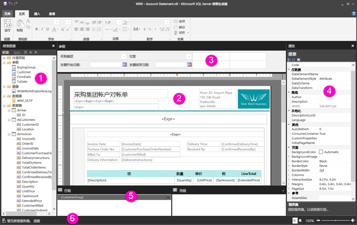

# 介绍分页报表的报表设计视图

Power BI 报表生成器中的报表设计视图是用于创建可以发布到 Power BI 服务的分页报表的设计空间。 设计图面位于报表生成器中间，其周围是功能区和窗格。 可在设计图面中添加和组织报表项。 本文介绍了用于添加、选择和组织报表资源以及更改报表项属性的窗格。  

1. [“报表数据”窗格](#1-report-data-pane) 
2. [报表设计图面](#2-report-design-surface)  
3. [“参数”窗格](#3-parameters-pane) 
4. [“属性”窗格](#4-properties-pane) 
5. [“分组”窗格](#5-grouping-pane) 
6. [当前报表状态栏](#6-current-report-status-bar)  
  
## 1 “报表数据”窗格  
 在设计报表布局之前，可以从“报表数据”窗格定义报表所需的报表数据和报表资源。 例如，可以将数据源、数据集、计算字段、报表参数和图像添加到“报表数据”窗格。  
  
 在将上述各项添加到“报表数据”窗格后，将字段拖动到设计图面上的报表项，以控制数据在报表中的显示位置。  
  
> [!TIP]  
>  如果将“报表数据”窗格中的某个字段直接拖动到报表设计图面，而不是将其置于表格或图表等数据区域，那么在运行报表时，用户将只会在该字段中看到数据的第一个值。  
  
 还可以将“报表数据”窗格的内置字段拖动到报表设计图面。 呈现时，这些字段提供有关报表的信息，例如报标名称、报表中的总页数以及当前页码。  
  
 在向报表设计图面添加内容时，某些内容会自动添加到“报表数据”窗格中。 例如，如果在报表中嵌入图像，则会将其添加到“报表数据”窗格中的“图像”文件夹中。  
  
> [!NOTE]  
>  可以使用“新建”  按钮将新项目添加到“报告数据”窗格。 可以将同一数据源或其他数据源中的多个数据集添加到报表中。 要从同一数据源添加新数据集，请右键单击某个数据源 >“添加数据集”  。  
  
## 2 报表设计图面  
 报表生成器报表设计图面是设计报表的主要工作区域。 若要在报表中放置报表项（如数据区域、子报表、文本框、图像、矩形和线条），可以将这些项从功能区或报表部件库添加到设计图面。 可以在设计图面中为报表项添加组、表达式、参数、筛选器、操作、可见性和格式设置。  
  
 还可以更改以下内容：  
  
-   报表正文属性（如边框和填充颜色），方法如下：在任何报表项外部，右键单击设计图面的白色区域，然后选择“正文属性”  。  
  
-   页眉和页脚属性（如边框和填充颜色），方法如下：在任何报表项外部，右键单击页眉或页脚区域中设计图面的白色区域，然后选择“页眉属性”  或“页脚属性”  。  
  
-   报表本身的属性（如页面设置），方法如下：右键单击设计图面周围的灰色区域并选择“报表属性”  。  
  
-   报表项的属性，方法如下：右键单击报表项并选择“属性”  。  
  
### 设计图面大小和打印区域  
设计图面大小可能与指定用于打印报表的页面大小打印区域不同。 更改设计图面的大小将不会更改报表的打印区域。 无论为报表的打印区域设置的大小如何，完整的设计区域大小均不会改变。 有关更多信息，请参阅“呈现行为”。 
  
- 若要显示标尺，请在“视图”  选项卡上，选中“标尺”  复选框。  
  
## 3 “参数”窗格  
 使用报表参数，可以控制报表数据，将相关报表连接在一起以及更改报表显示。 “参数”窗格为报表参数提供灵活的布局。  
  
 了解有关报表参数的详细信息   
  
## 4 “属性”窗格
 报表中的每个项目（包括数据区域、图像、文本框和报表正文本身）都具有与之关联的属性。 例如，文本框的 BorderColor 属性显示文本框边框的颜色值，报表的 PageSize 属性显示报表的页面大小。  
  
 这些属性在“属性”窗格中显示。 窗格中的属性会根据所选择的报表项而更改。  
  
- 若要查看“属性”窗格，请在“显示/隐藏”  组 >“属性”  中的“视图”  选项卡上进行查看。  
  
### 更改属性值  
 在报表生成器中，可以通过以下几种方式更改报表项的属性：  
  
-   选择功能区上的按钮和列表。  
  
-   更改对话框中的设置。  
  
-   更改“属性”窗格中的属性值。  
  
 对话框和功能区中提供了最常用的属性。  
  
 根据属性，可以从下拉列表中设置属性值，键入值，或选择 `<Expression>` 以创建表达式。  
  
### 更改“属性”窗格视图  
 默认情况下，会将“属性”窗格中显示的属性组织成大类，例如“操作”、“边框”、“填充”、“字体”和“常规”。 每个类别都有一组与之关联的属性。 例如，在“字体”类别中列出以下属性：Color、FontFamily、FontSize、FontStyle、FontWeight、LineHeight 和 TextDecoration。 如果愿意，可以按字母顺序排列窗格中列出的所有属性。 这将删除类别并按字母顺序列出所有属性，而不考虑类别。  
  
 “属性”窗格在窗格顶部有三个按钮：“类别”  、“按字母顺序排列”  和“属性页”  。 选择“类别”和“按字母顺序”按钮可在“属性”窗格视图之间切换。 选择“属性页”  按钮以打开所选报表项的属性对话框。  
  
  
## 5 “分组”窗格

 组用于将报表数据组织到可视对象层次结构中并计算总计。 可以在设计图面上以及“分组”窗格中查看数据区域中的行组和列组。 “分组”窗格有两个窗格：“行组”和“列组”。 选择数据区域时，“分组”窗格将该数据区域中的所有组显示为分层列表：子组在其父组下缩进显示。  
  
 可以通过从“报表数据”窗格中拖动字段并将其拖放到设计图面上或“分组”窗格中来创建组。 在“分组”窗格中，可以添加父组、相邻组和子组，更改组属性以及删除组。  
  
 默认情况下会显示“分组”窗格，但可以通过在“视图”选项卡上清除“分组窗格”复选框将其关闭。“分组”窗格不适用于“图表”或“仪表”数据区域。  
  
 有关更多信息，请参阅“分组窗格”和“了解组”。  
  
## 6 当前报表状态栏

当前报表状态栏显示报表所连接的服务器的名称，或者显示“无当前报表服务器”。 可以选择“连接”  以连接到服务器。

## 后续步骤

[Power BI Premium 中的分页报表是什么？](paginated-reports-report-builder-power-bi.md) 

  
  
