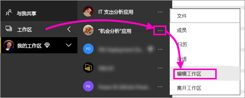
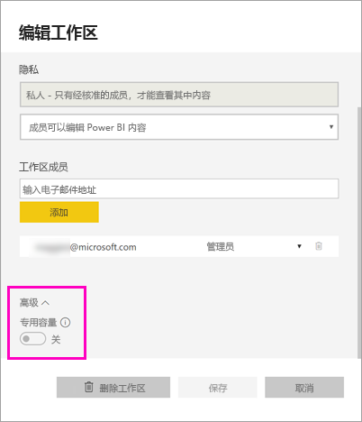
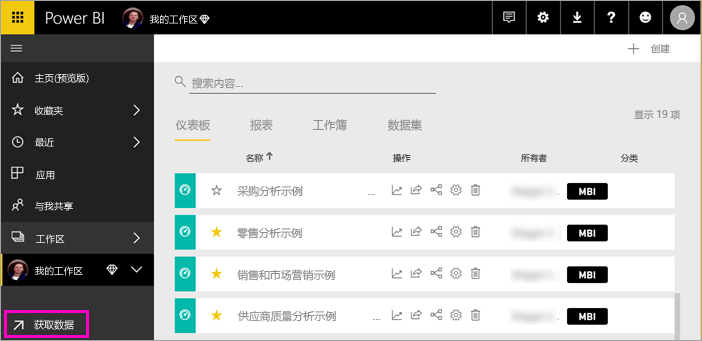
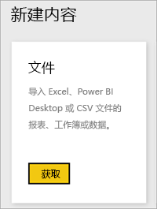
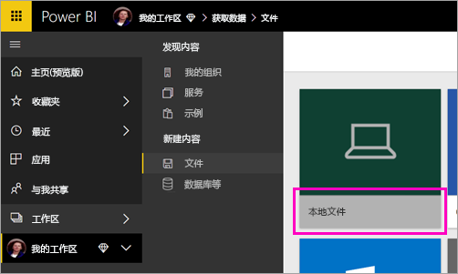
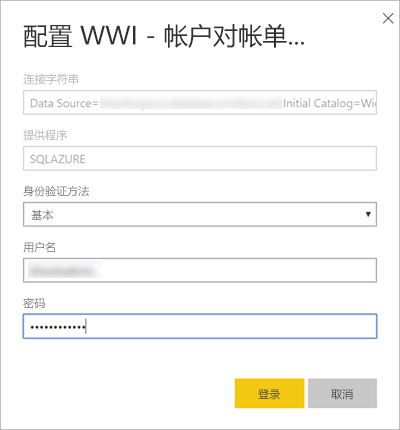
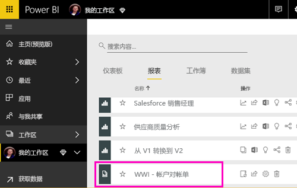
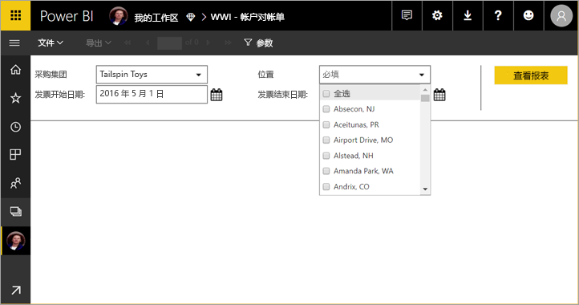

# 将分页报表发布到 Power BI 服务

本文介绍如何通过从本地计算机上传分页报表将其发布到 Power BI 服务。 只要工作区位于高级容量中，就可以将分页报表上传到“我的工作区”或任何其他工作区。 请查找工作区名称旁边的钻石型图标  。 

如果你的报表数据源位于本地环境中，需要在上传报表后[创建网关](#create-a-gateway)。

## 将工作区添加到高级容量

如果工作区名称旁边中没有钻石形图标  ，需要将工作区添加到高级容量。 

1. 选择“工作区”  ，然后选择工作区名称旁边的省略号 (...  )，再选择“编辑工作区”  。

    

1. 在“编辑工作区”  对话框中，展开“高级”  ，然后将“专用容量”  的滑块滑动到“开”  。

    

   你可能无法更改它。 如果是这样，请联系你的 Power BI 高级容量管理员，为你提供将工作区添加到高级容量的分配权限。

## 上传分页报表

1. 在报表生成器中创建分页报表，并将其保存到本地计算机。

1. 在浏览器中打开 Power BI 服务，然后浏览到要在其中发布报表的“高级”工作区。 请注意名称旁边的钻石形图标  。 

1. 选择“获取数据”  。

    

1. 在**文件**框中，选择**获取**。

    

1. 选择“本地文件”  ，浏览到分页报表，然后选择“打开”  。

    

1. 选择“继续”   > “编辑凭据”  。

    

1. 配置凭据，然后单击“登录”  。

    

   可以在报表列表中看到你的报表。

    

1. 选择此报表，并在 Power BI 服务中打开它。 如果此报表包含参数，需要选择这些参数才能查看报表。
 
    

## 创建网关

同任何其他 Power BI 报表一样，如果报表数据源位于本地环境中，则需要创建或连接到网关才能访问数据。

1. 在报表名称旁边，选择“管理”  。

   

1. 请参阅 Power BI 服务文章[安装网关](service-gateway-install.md)，了解详细信息和后续步骤。

### 网关限制

当前网关不支持多值参数。

## 后续步骤

- [在 Power BI 服务中查看分页报表](paginated-reports-view-power-bi-service.md)
- [Power BI Premium 中的分页报表是什么？](paginated-reports-report-builder-power-bi.md)

