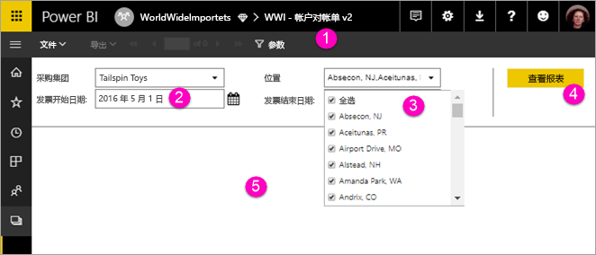

# 查看 Power BI 服务中分页报表的参数（预览）

本文介绍了如何与 Power BI 服务中分页报表的参数进行交互。  报表参数提供了一种筛选报表数据的方法。 参数提供可用值的列表，你可以选择一个或多个值。 有时参数具有默认值，有时你必须先选择一个值才能看到报表。  

查看包含参数的报表时，报表查看器工具栏会显示每个参数，以便以交互方式指定值。 下图显示了包含“购买组”  、“位置”  、“起始日期”、  和“结束日期”  参数的报表的参数区域。  

## Power BI 服务中的“参数”窗格

  
1.  “参数”窗格  报表查看器工具栏显示诸如“必需”的提示或每个参数的默认值。    
  
2.  “发票开始/结束日期”参数  两个数据参数具有默认值。 若要更改日期，请在文本框中键入日期或在日历中选择一个日期。  
  
3.  “位置”参数  将“位置”参数设置为允许用户选择一个、多个或所有值。 
  
4.  查看报表  输入或更改参数值后，单击“查看报表”  以运行报表。 

5. 默认值  如果所有参数都具有默认值，则报表将在第一个视图上自动运行。 此报表中的某些参数没有默认值，因此，用户在选择值之前看不到报表。  

## 后续步骤

[在 Power BI 服务中为分页报表创建参数](paginated-reports-parameters.md)
