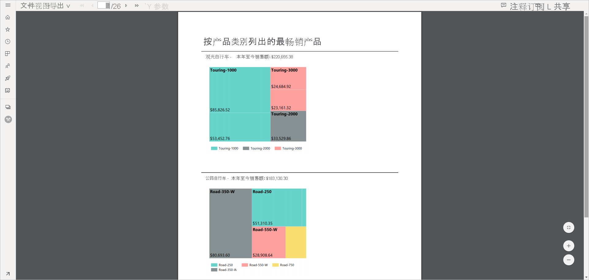
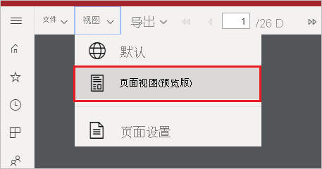
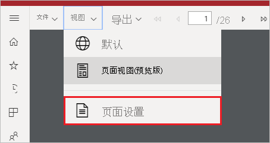
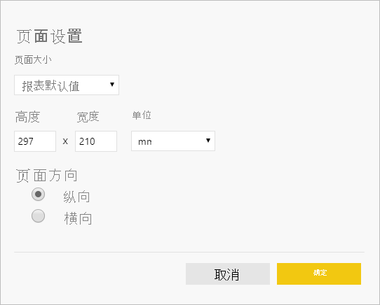

# 为 Power BI 服务中的分页报表设置报表视图

在 Power BI 服务中呈现分页报表时，默认视图是基于 HTML 的交互式视图。 另一个报表视图是新的“页面视图”选项，用于 PDF 等固定页面格式。

**默认交互式视图**

**页面视图**

在页面视图中，所呈现的报表与默认视图相比看起来有所不同。 分页报表中的某些属性和概念仅适用于固定页面。 该视图类似于打印或导出报表时的视图。 你仍可更改某些元素（如参数值），但它不具有其他交互式功能，如列排序和切换。

页面视图支持浏览器的 PDF 查看器支持的所有功能，例如“放大”、“缩小”和“调整到页面大小”。

## 切换到页面视图

打开分页报表时，默认情况下，它会呈现在交互式视图中。 如果报表具有参数，请选择“参数”，然后查看报表。

1. 在工具栏选择“视图”>“页面视图” 。

    

2. 可以通过在工具栏上的“视图”菜单中选择“页面设置”来更改页面视图的设置 。 

    
    
    “页面设置”对话框具有用于设置页面视图的“页面大小”和“方向”的选项  。 应用页面设置后，将在稍后打印页面时应用相同的选项。
   
    

3. 要切换回交互式视图，请在“视图”下拉框中选择“默认” 。

## 浏览器支持

Google Chrome 和 Microsoft Edge 浏览器支持页面视图。 确保已启用“在浏览器中查看 PDF”。 这是这些浏览器的默认设置。

Internet Explorer 和 Safari 不支持页面视图，因此该选项处于禁用状态。 移动设备上的浏览器或本机 Power BI 移动应用也不支持页面视图。  

## 后续步骤

- [在 Power BI 服务中查看分页报表](../consumer/paginated-reports-view-power-bi-service.md)
- [Power BI Premium 中的分页报表是什么？](paginated-reports-report-builder-power-bi.md)
