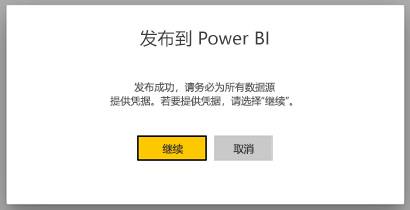
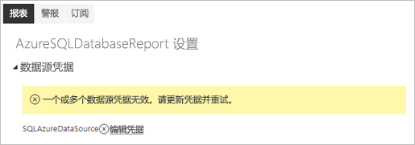
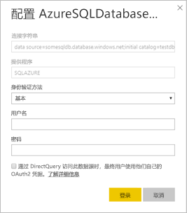

# Power BI 分页报表支持的数据源

本文将详细介绍 Power BI 服务中分页报表支持的数据源，以及如何连接到 Azure SQL 数据库数据源。 部分 PBI 数据源受本机支持。 可通过数据网关与其他人连接。

## 本机支持的数据源

分页报表本机支持下表中的数据源：

| 数据源 | 身份验证 | 备注 |
| --- | --- | --- |
| Azure SQL 数据库  Azure SQL 数据仓库 | 基本、单一登录 (SSO)、OAuth2 | 你可以使用包含 Azure SQL DB 的企业网关。 但在这些情况下，不能使用 SSO 或 oAuth2 进行身份验证。   |
| Azure SQL 托管实例 | 基本 | 通过公共或专用终结点（专用终结点需要通过企业网关进行路由）  |
| Azure Analysis Services | SSO、OAuth2 | AAS 防火墙要么必须禁用，要么必须配置为允许所有 IP 范围。|
| Power BI 数据集 | SSO | 高级和非高级 Power BI 数据集。 需要读取权限 |
| 高级 Power BI 数据集 (XMLA) | SSO |   |
| 输入数据 | 不适用 | 数据嵌入在报表中。 |

将报表上传到 Power BI 服务之后，可使用除 Azure SQL 数据库之外的所有数据源。 如果适用的话，数据源默认使用单一登录 (SSO)。 对于 Azure Analysis Services，可将身份验证类型更改为 OAuth2。 但是，一旦将给定数据源的身份验证类型更改为 OAuth2，就无法还原回使用 SSO 了。  另外，此更改适用于跨给定租户的所有工作区使用相应数据源的全部报表。  分页报表中的行级别安全性不起作用，除非用户选择 SSO 作为身份验证类型。

对于 Azure SQL 数据库数据源，需提供更多信息，如 [Azure SQL 数据库身份验证](#azure-sql-database-authentication)一节所述。

## 其他数据源

除上述本机支持的数据源以外，还可通过 [Power BI 数据网关](../service-gateway-onprem.md)访问以下数据源：

- SQL Server
- SQL Server Analysis Services
- Oracle
- Teradata

对于分页报表，目前无法通过 Power BI 数据网关访问 Azure SQL 数据库和 Azure Analysis Services。

## Azure SQL 数据库身份验证

对于 Azure SQL 数据库数据源，需先设置身份验证类型，再运行报表。 这仅适用于在工作区中首次使用数据源时。 首次使用时会显示以下信息：

如果未提供任何凭据，则运行报表时将发生错误。 选择“继续”，转到刚上传的报表的“数据源凭据”页   ：

选择给定数据源的“编辑凭据”链接以打开“配置”对话框   ：

对于 Azure SQL 数据库数据源，以下是支持的身份验证类型：

- 基本（用户名和密码）
- SSO（单一登录）
- OAuth2（存储的 AAD 令牌）

为让 SSO 和 OAuth2 正常工作，数据源所连接的 Azure SQL 数据库服务器需[启用 AAD 身份验证支持](https://docs.microsoft.com/azure/sql-database/sql-database-aad-authentication-configure)。 对于 OAuth2 身份验证方法，AAD 会生成令牌并存储，以供将来访问数据源。 若使用 [SSO 身份验证方法](https://docs.microsoft.com/power-bi/service-azure-sql-database-with-direct-connect#single-sign-on)，则选择其正下方的 SSO 选项，即“最终用户通过 DirectQuery 访问此数据源时使用自己的 OAuth2 凭据”  。
  
## 后续步骤

[在 Power BI 服务中查看分页报表](../consumer/paginated-reports-view-power-bi-service.md)

更多问题？ [尝试参与 Power BI 社区](https://community.powerbi.com/)
