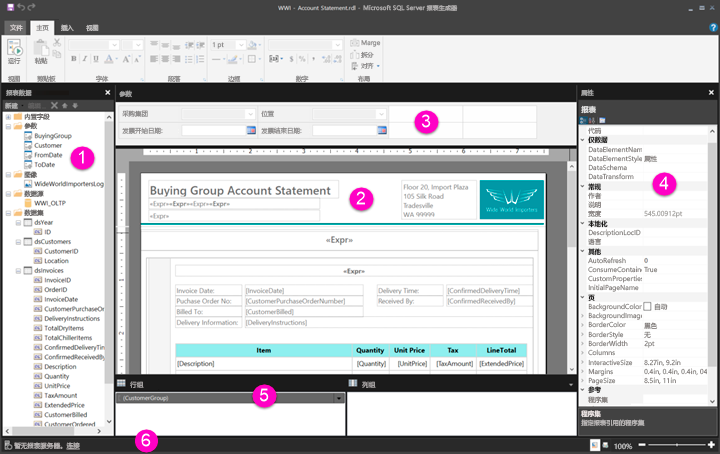

# 介绍分页报表的报表设计视图

[!INCLUDE [applies-to](../includes/applies-to.md)] [!INCLUDE [yes-service](../includes/yes-service.md)] [!INCLUDE [yes-paginated](../includes/yes-paginated.md)] [!INCLUDE [yes-premium](../includes/yes-premium.md)] [!INCLUDE [no-desktop](../includes/no-desktop.md)] 

Power BI 报表生成器中的报表设计视图是用于创建可以发布到 Power BI 服务的分页报表的设计空间。 设计图面位于报表生成器中间，其周围是功能区和窗格。 设计图面用于添加和组织报表项。 本文说明用于添加、选择和组织报表资源，以及更改报表项属性的窗格。  

1. [“报表数据”窗格](#1-report-data-pane) 
2. [报表设计图面](#2-report-design-surface)  
3. [“参数”窗格](#3-parameters-pane) 
4. [属性窗格](#4-properties-pane) 
5. [分组窗格](#5-grouping-pane) 
6. [当前报表状态栏](#6-current-report-status-bar)  
  
## 1 “报表数据”窗格  
 在“报表数据”窗格中，在设计报表布局前可以定义报表所需的报表数据和报表资源。 例如，您可以向“报表数据”窗格中添加数据源、数据集、计算字段、报表参数和图像。  
  
 在将项添加到“报表数据”窗格中后，将字段拖到报表设计图面上的报表项，就可以控制数据在报表中的显示位置。  
  
> [!TIP]  
>  如果将某个字段从“报表数据”窗格直接拖到报表设计图面，而不是将其放在数据区域（如表或图表）中，则在运行报表时只能看到该字段中数据的第一个值。  
  
 还可以将内置字段从“报表数据”窗格中拖到报表设计图面中。 呈现时，这些字段提供有关报表的信息，例如报表名称、报表中的总页数以及当前页码。  
  
 在您向报表设计图面中添加某些项时，这些项也会自动添加到“报表数据”窗格中。 例如，如果在报表中嵌入图像，则会将其添加到“报表数据”窗格中的“图像”文件夹中。  
  
> [!NOTE]  
>  您可以使用 **“新建”** 按钮向“报表数据”窗格添加新项。 您可以从同一数据源或其他数据源向报表添加多个数据集。 要从同一数据源添加新数据集，请右键单击某个数据源 >“添加数据集”。  
  
## 2 报表设计图面  
 报表生成器的报表设计图面是用于设计报表的主工作区。 若要将报表项（如数据区域、子报表、文本框、图像、矩形和线条）放入报表中，请从功能区或报表部件库将它们添加到设计图面。 在设计图面中，您可以向报表项添加组、表达式、参数、筛选器、操作、可见性和格式设置。  
  
 还可以更改以下项：  
  
-   报表正文属性（如边框和填充颜色），方法如下：在任何报表项外部，右键单击设计图面的白色区域，然后选择“正文属性”。  
  
-   页眉和页脚属性（如边框和填充颜色），方法如下：在任何报表项外部，右键单击页眉或页脚区域中设计图面的白色区域，然后选择“页眉属性”或“页脚属性”。  
  
-   报表本身的属性（如页面设置），方法如下：右键单击设计图面周围的灰色区域并选择“报表属性”。  
  
-   报表项的属性，方法如下：右键单击报表项并选择“属性”。  
  
### 设计图面大小和打印区域  
设计图面大小可能与您指定用来打印报表的打印区域的页面大小不同。 更改设计图面的大小将不会更改报表的打印区域。 不论您为报表的打印区域设置何种大小，整个设计区域的大小都不会改变。 有关更多信息，请参阅“呈现行为”。 
  
-  若要显示标尺，请在 **“视图”** 选项卡上，选中 **“标尺”** 复选框。  
  
## 3 “参数”窗格  
 通过报表参数，可以控制报表数据、将相关报表连接在一起以及更改报表显示。 “参数”窗格中为报表参数提供灵活的布局。  
  
 了解有关报表参数的详细信息   
  
## 4 “属性”窗格
 报表中的每一项（包括数据区域、图像、文本框和表体本身）都有相关联的属性。 例如，文本框的 BorderColor 属性指示文本框的边框颜色值，报表的 PageSize 属性指示报表的页大小。  
  
 这些属性显示在“属性”窗格中。 该窗格中的属性会根据所选择的报表项发生变化。  
  
- 若要查看“属性”窗格，请在“显示/隐藏”组 >“属性”中的“视图”选项卡上进行查看。  
  
### 更改属性值  
 在报表生成器中，可通过多种方式来更改报表项的属性：  
  
-   选择功能区上的按钮和列表。  
  
-   在对话框内更改设置。  
  
-   在“属性”窗格内更改属性值。  
  
 可以在对话框和功能区上找到最常用的属性。  
  
 根据属性，可以从下拉列表中设置属性值，键入值，或选择 `<Expression>` 以创建表达式。  
  
### 更改“属性”窗格视图  
 默认情况下，“属性”窗格中显示的属性是按大的类别（例如操作、边框、填充、字体和常规）分类的。 每个类别都有一组与其相关联的属性。 例如，“字体”类别内会列出以下属性：Color、FontFamily、FontSize、FontStyle、FontWeight、LineHeight 和 TextDecoration。 如果愿意，可以按字母顺序排列该窗格内列出的所有属性。 这会删除类别并按字母顺序列出所有属性，而不考虑类别。  
  
 “属性”窗格在窗格顶部有三个按钮：“类别”、“按字母顺序”和“属性页”。 选择“类别”和“按字母顺序”按钮可在“属性”窗格视图之间切换。 选择“属性页”按钮以打开所选报表项的属性对话框。  
  
  
## 5 “分组”窗格

 使用组可以将报表数据组织成可视层次结构，也可以计算总计。 可以在设计图面上或“分组”窗格中查看数据区域内的行组和列组。 “分组”窗格有两个窗格：“行组”和“列组”。 选定数据区域后，“分组”窗格会将该数据区域内的所有组显示为一个层次结构列表；子组以缩进的方式显示在其父组下方。  
  
 可通过将字段从“报表数据”窗格中拖放到设计图面上或“分组”窗格中来创建组。 在“分组”窗格中，可以添加父组、相邻组和子组，更改组属性以及删除组。  
  
 默认情况下会显示“分组”窗格，但可以通过在“视图”选项卡上清除“分组窗格”复选框将其关闭。“分组”窗格不适用于“图表”或“仪表”数据区域。  
  
 有关更多信息，请参阅“分组窗格”和“了解组”。  
  
## 6 当前报表状态栏

当前报表状态栏显示报表所连接的服务器的名称，或者显示“无当前报表服务器”。 可以选择“连接”以连接到服务器。

## 后续步骤

[Power BI Premium 中的分页报表是什么？](paginated-reports-report-builder-power-bi.md) 

  
  
