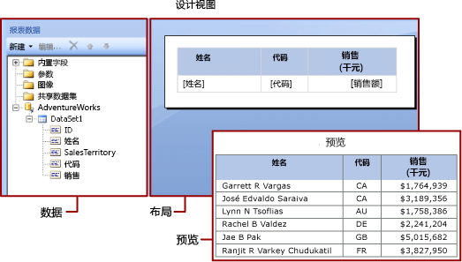

# Power BI 报表生成器中的表达式

[!INCLUDE [applies-to](../includes/applies-to.md)] [!INCLUDE [yes-service](../includes/yes-service.md)] [!INCLUDE [yes-paginated](../includes/yes-paginated.md)] [!INCLUDE [yes-premium](../includes/yes-premium.md)] [!INCLUDE [no-desktop](../includes/no-desktop.md)] 

表达式在 Power BI Report Builder 分页报表中被广泛用于检索、计算、显示、分组、排序、筛选、参数化和格式化数据。 
  
许多报表项属性都可以设置为表达式。 表达式可帮助您控制报表的内容、设计和交互。 表达式用 Microsoft Visual Basic 编写，保存在报表定义中，并在运行报表时由报表处理器进行计算。  
  
 与直接在工作表中处理数据的 Microsoft Office Excel 等应用程序不同，在报表中可以将表达式用作数据占位符。 若要查看来自已计算表达式的实际数据，您必须预览报表。 在运行报表时，报表处理器在合并报表数据和报表布局元素（例如表和图表）时对每个表达式进行计算。  
  
 在您设计报表时，系统将为您设置针对报表项的许多表达式。 例如，将一个字段从数据窗格拖到报表设计图面上的表单元时，文本框值将设置为针对该字段的简单表达式。 在下图中，“报表数据”窗格显示数据集字段 ID、Name、SalesTerritory、Code 和 Sales。 三个字段已添加到该表中：[Name]、[Code] 和 [Sales]。 设计图面上的标志 [Name] 表示基础表达式 `=Fields!Name.Value`。  
  

  
 在您预览报表时，报表处理器将表数据区域和来自数据连接的实际数据相结合，并且为结果集中的每一行在表中显示一行。  
  
 若要手动输入表达式，请在设计图面上选择某个项，然后使用快捷菜单和对话框设置该项的属性。 在下拉列表中看到 (fx) 按钮或值 `<Expression>` 时，可以将属性设置为表达式。 
  
##   了解简单和复杂表达式  
 表达式以等号 (=) 开头且用 Microsoft Visual Basic 编写。 表达式可包含以下项的组合：常量、运算符、对内置值（字段、集合和函数）的引用以及对外部或自定义代码的引用。  
  
 您可以使用表达式来指定许多报表项属性的值。 最常见的属性是文本框和占位符文本的值。 通常，如果某一文本框只包含一个表达式，则该表达式是文本框属性的值。 如果某一文本框包含多个表达式，则每个表达式都是该文本框中占位符文本的值。  
  
 默认情况下，表达式在报表设计图面上显示为简单或复杂表达式。  
  
-   **简单** ：包含对内置集合中单个项（例如，数据集字段、参数或内置字段）的引用的简单表达式。 在设计图面上，简单表达式将出现在括号中。 例如， `[FieldName]` 将对应于基础表达式 `=Fields!FieldName.Value`。 当您创建报表布局并且将项从“报表数据”窗格拖到设计图面时，系统将自动为您创建简单表达式。 有关表示不同内置集合的符号的详细信息，请参阅 [了解简单表达式中的前缀符号](#DisplayText)。  
  
-   **复杂** ：复杂表达式包含对多个内置引用、运算符和函数调用的引用。 当表达式值包括多个简单引用时，复杂表达式将以 <\<Expr>> 形式出现。 若要查看表达式，请将鼠标指针悬停在表达式上并使用工具提示。 若要编辑表达式，请在 **“表达式”** 对话框中打开它。  
  
 下图显示针对文本框和占位符文本的典型的简单和复杂表达式。  
  
 
  
 若要显示简单值而非表达式文本，请将格式设置应用于文本框或占位符文本。 下图显示了切换为显示简单值的报表设计图面：  
  
  

##  了解简单表达式中的前缀符号  

简单表达式使用符号来指示引用是指向字段、参数、内置集合还是指向 ReportItems 集合。 下表显示了显示文本和表达式文本的示例：  
  
|Item|显示文本示例|表达式文本示例|  
|----------|--------------------------|-----------------------------|  
|数据集字段|`[Sales]`   `[SUM(Sales)]`   `[FIRST(Store)]`|`=Fields!Sales.Value`   `=Sum(Fields!Sales.Value)`   `=First(Fields!Store.Value)`|  
|报表参数|`[@Param]`   `[@Param.Label]`|`=Parameters!Param.Value`   `=Parameters!Param.Label`|  
|内置字段|`[&ReportName]`|`=Globals!ReportName.Value`|  
|用于显示文本的文字字符|`\[Sales\]`|`[Sales]`|  
  
##   编写复杂表达式  
 表达式可包括对函数、运算符、常量、字段、参数、内置集合中的项以及对嵌入的自定义代码或自定义程序集的引用。  
  
 下表列出了可以包含在表达式中的引用类型：  
  
|参考|描述|示例|  
|----------------|-----------------|-------------|  
|常量|介绍能以交互方式访问需要常量值的属性（例如字体颜色）的常量。|`="Blue"`|  
|运算符|描述可用于合并表达式中的引用的运算符。 例如， **&** 运算符用于串联字符串。|`="The report ran at: " & Globals!ExecutionTime & "."`|  
|内置集合|介绍可在表达式中包含的内置集合，例如 `Fields`、 `Parameters`和 `Variables`。|`=Fields!Sales.Value`   `=Parameters!Store.Value`   `=Variables!MyCalculation.Value`|  
|内置报表函数和聚合函数|介绍可从表达式中访问的内置函数，例如 `Sum` 或 `Previous`。|`=Previous(Sum(Fields!Sales.Value))`|  
|报表生成器的表达式中的自定义代码和程序集引用 |描述如何访问内置 CLR 类 `xref:System.Math` 和 `xref:System.Convert`、其他 CLR 类、Visual Basic 运行时库函数或外部程序集中的方法。   介绍如何访问嵌入在报表中的自定义代码或已编译成自定义程序集并安装在报表客户端和报表服务器上的自定义代码。|`=Sum(Fields!Sales.Value)`   `=CDate(Fields!SalesDate.Value)`   `=DateAdd("d",3,Fields!BirthDate.Value)`   `=Code.ToUSD(Fields!StandardCost.Value)`|  
   
##   验证表达式  
 创建用于特定报表项属性的表达式时，可包含在表达式中的引用取决于该报表项属性可接受的值以及对属性进行求值的作用域。 例如：  
  
-   默认情况下，在对表达式进行求值时表达式 [Sum] 计算处于作用域中的数据的和。 对于表单元，该作用域依赖于行和列组成员资格。 
  
-   对于 Font 属性的值，该值的计算结果必须为字体名称。  
  
-   在设计时验证表达式语法。 在您发布报表时进行表达式作用域验证。 对于依赖于实际数据的验证，只能在运行时检测到错误。 其中的某些表达式将生成 #Error 作为呈现的报表中的错误消息。 

## 后续步骤

- [Power BI Premium 中的分页报表是什么？](paginated-reports-report-builder-power-bi.md)
