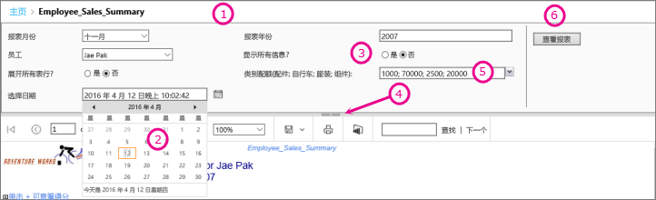
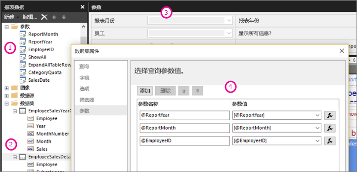

# Power BI 报表生成器中的报表参数

[!INCLUDE [applies-to](../includes/applies-to.md)] [!INCLUDE [yes-service](../includes/yes-service.md)] [!INCLUDE [yes-paginated](../includes/yes-paginated.md)] [!INCLUDE [yes-premium](../includes/yes-premium.md)] [!INCLUDE [no-desktop](../includes/no-desktop.md)] 

本主题介绍了 Power BI Report Builder 报表参数的常见用法、可以设置的属性等内容。 通过报表参数，您可以控制报表数据、将相关报表连接在一起以及更改报表显示。 可以在报表生成器中创建的分页报表中使用报表参数。

## 参数的常见用法

 下面是一些最常用的使用参数的方法。  
  
**控制分页报表数据**
  
- 通过编写包含变量的数据集查询，在数据源筛选分页报表数据。  
  
- 允许用户指定值以对分页报表中的数据进行自定义。 例如，为销售数据的开始日期和结束日期提供两个参数。  
  
**更改报表显示**
  
- 允许用户指定值以帮助自定义报表的外观。 例如，提供一个布尔参数以指示是否展开或折叠表中所有的嵌套行组。  
  
- 通过在表达式中包含参数来使用户能自定义报表数据和外观。  
  
## 查看包含参数的报表

查看具有参数的报表时，报表查看器工具栏将显示每个参数，以便你可以通过交互方式指定值。 下图显示了具有参数 @ReportMonth、@ReportYear、@EmployeeID、@ShowAll、@ExpandTableRows、@CategoryQuota 和 @SalesDate 的报表的参数区域。  

  
1. **“参数”窗格** 报表查看器工具栏显示各个参数的提示和默认值。 可以在参数窗格中自定义参数布局。  
  
2. **@SalesDate 参数** 参数 @SalesDate 是 DateTime 数据类型。 文本框旁边会显示“选择日期”提示。 若要修改日期，请在文本框中键入新日期或使用日历控件。  
  
3. **@ShowAll 参数** 参数 @ShowAll 是布尔数据类型。 使用单选按钮指定 **True** 或 **False** 。  
  
4. **“显示或隐藏参数区域”控点** 在报表查看器工具栏上，单击此箭头可显示或隐藏参数窗格。  
  
5. **@CategoryQuota 参数** 参数 @CategoryQuota 是 Float 数据类型，因此它采用数字值。  @CategoryQuota 设置为允许多个值。  
  
6. **查看报表** 输入参数值之后，单击“查看报表”可运行报表。 如果所有参数都具有默认值，则报表会在第一次查看时自动运行。  
  
## 创建参数

可以通过几种不同方式创建报表参数。
  
> [!NOTE]
>  并非所有的数据源都支持参数。
  
**具有参数的数据集查询或存储过程**
  
 添加一个包含变量的数据集查询或包含输入参数的数据集存储过程。 为每个变量或输入参数创建一个数据集参数，并为每个数据集参数创建一个报表参数。  
  

  
 来自报表生成器的此图像显示：  
  
1.  “报表数据”窗格中的报表参数。  
  
2.  具有参数的数据集。  
  
3.  “参数”窗格。  
  
4.  在“数据集属性”对话框中列出的参数。  
  
**手动创建参数**
  
从“报表数据”窗格中手动创建参数。 您可以配置报表参数，以便用户可以通过交互方式输入值以帮助自定义报表的内容或外观。 也可以对报表参数进行配置，以便用户无法更改预配置值。  
  
> [!NOTE]  
>  因为参数在服务器上是单独管理的，重新发布含有新参数设置的主报表不会覆盖报表上现有的数据设置。  

### 参数值

 以下是用于在报表中选择参数值的选项。  
  
- 从下拉列表中选择一个单一参数值。  
  
- 从下拉列表中选择多个参数值。  
  
- 从下拉列表中为参数选择一个值，该值决定可在下拉列表中为其他参数选择的值。 这些是级联参数。 级联参数使你能够持续筛选数以千计的值，最终将值的数量限定在易于管理的范围内。 有关详细信息，请参阅[在分页报表中使用级联参数](../guidance/paginated-report-cascading-parameter.md)。
  
- 无需先选择参数值即可运行报表，因为已经为该参数设置了默认值。  
  
## 报表参数属性

 可用使用“报表属性”对话框来更改报表属性参数。 下表总结了可以为各个参数设置的属性：  
  
|属性|说明|  
|--------------|-----------------|  
|名称|键入区分大小写的参数名称。 名称必须以字母开头，可以包含字母、数字、下划线 (_)。 名称中不能包含空格。 对于自动生成的参数，其名称会与数据集查询中的参数相匹配。 默认情况下，手动创建的参数与 ReportParameter1 相类似。|  
|Prompt|在报表查看器工具栏上的参数旁边显示的文本。|  
|数据类型|报表参数必须为以下数据类型之一：   **Boolean** 。 用户通过单选按钮选择 True 或 False。   **DateTime** 。 用户从日历控件中选择日期。   **Integer** 。 用户在文本框中键入值。   **Float** 。 用户在文本框中键入值。   **Text** 。 用户在文本框中键入值。   为参数定义可用值时，用户可从下拉列表中选择值，即使数据类型为 **DateTime** 也是如此。|  
|允许空值|如果参数的值可为空字符串或为空白，请选择此选项。   如果为参数指定有效值，并希望将空白值作为有效值之一，则必须在指定的值中包含空白值。 选择此选项不会自动将空白包含为可用值。|  
|允许 Null 值|如果参数的值可为 Null，请选择此选项。   如果为参数指定有效值，并希望将 Null 作为有效值之一，则必须在指定的值中包含 Null。 选择此选项不会自动将 null 包含为可用值。|  
|允许多个值|提供可用值以创建下拉列表，供用户从中选择。 这是确保只在数据集查询中提交有效值的好方法。   如果参数值可为下拉列表中显示的多个值，请选择此选项。 不允许为 Null 值。 选择此选项后，将向参数下拉列表中的可用值列表添加复选框。 列表的顶部包括 **“全选”** 复选框。 用户可以选中所需的值。   如果用于提供值的数据快速更改，则用户看到的列表可能不是最新列表。|  
|可见|选择此选项可在报表运行时在报表顶部显示报表参数。 此选项允许用户在运行时选择参数值。|  
|Hidden|选择此选项可隐藏已发布报表中的报表参数。 报表参数值仍可在报表 URL、订阅定义或报表服务器中进行设置。|  
|内部|选择此选项可以隐藏报表参数。 在已发布报表中，只能在报表定义中查看报表参数。|  
|可用值|如果已为参数指定可用值，则有效值将始终作为下拉列表显示。 例如，如果为 **DateTime** 参数提供了可用值，则在参数窗格中将显示日期下拉列表而不是显示日历控件。   为了确保值列表在报表与子报表中是一致的，可以在数据源中设置一个选项，使用单个事务处理与数据源关联的数据集中的所有查询。   **安全说明** 在任何包含 Text 数据类型参数的报表中，请务必使用可用值列表（也称为有效值列表），并确保任何运行报表的用户仅拥有必要的报表数据查看权限。|  
|默认值|设置来自查询或静态列表的默认值。   如果每个参数均具有默认值，则报表将在第一次查看时自动运行。|  
|高级|设置报表定义属性 **UsedInQuery** ，该值指示此参数是直接还是间接影响报表中的数据。   **自动确定何时刷新**  当您希望报表处理器来确定该值的设置时选择此选项。 如果报表处理器发现数据集查询具有对此参数的直接或间接引用，或者报表具有子报表，则该值为 **True** 。   **始终刷新**  当报表参数直接或间接用于数据集查询或参数表达式时，请选择此选项。 此选项将 **UsedInQuery** 设置为 True。   **从不刷新**  当报表参数未直接或间接用于数据集查询或参数表达式时，请选择此选项。 此选项将 **UsedInQuery** 设置为 False。   **注意** 应慎重使用“从不刷新”。 在报表服务器上， **UsedInQuery** 用于帮助控制报表数据和所呈现报表的高速缓存选项，以及控制快照报表的参数选项。 如果您未正确设置 **“从不刷新”** ，可能导致对不正确的报表数据或报表进行高速缓存，或者导致快照报表具有不一致的数据。 |  
  
##  数据集查询  
 若要筛选数据集查询中的数据，可以通过指定结果集中要包含或排除的值，来包含一个限制检索到的数据的限制子句。  
  
 使用数据源的查询设计器来帮助生成参数化查询。  
  
-   对于 Transact-SQL 查询，不同的数据源支持不同的参数语法。 支持范围包括在查询中按位置或名称标识的参数。 在关系查询设计器中，必须为筛选器选择参数选项，才能创建参数化查询。   
  
-   对于基于 Microsoft SQL Server Analysis Services 等多维数据源的查询，可以指定是否基于查询设计器中指定的筛选器来构建参数。 
  
##  已发布的报表的参数管理  
 当您设计报表时，报表参数保存在报表定义中。 当您发布报表时，报表参数与报表定义分开保存和管理。  
  
 对于已发布报表，可以使用：  
  
-   **报表参数属性。** 直接在报表服务器上独立于报表定义更改报表参数值。  
  
-   **报表订阅。** 可以指定参数值以筛选数据并通过订阅传递报表。 
  
 如果重新发布报表定义，则会保留已发布报表的参数属性。 如果报表定义重新发布为同一报表，并且参数名和数据类型不变，则属性设置将保留不变。 如果添加或删除了报表定义中的参数，或是更改了现有参数的数据类型或名称，则您最好更改已发布报表中的参数属性。  
  
 并非在所有情况下都可以修改所有参数。 如果报表参数从查询中获取默认值，则无法为已发布报表修改该值，并且无法在报表服务器上修改该值。 运行时使用的值将在运行查询时确定，如果是基于表达式的参数，则在对表达式求值时确定。  
  
 报表执行选项可以影响参数的处理方式。 作为快照运行的报表不能使用来自查询的参数，除非该查询包含这些参数的默认值。  
  
##  订阅的参数  
 您可以定义按需订阅或快照订阅，可以指定在订阅处理过程中所用的参数值。  
  
-   按需运行报表。  对于按需报表，你可以指定不同于每个参数（该报表所列的参数）的已发布值的参数值。 例如，假设有一个 Call Service 报表使用 *Time Period* 参数返回当前日、周或月的客户服务请求。 如果报表的默认参数值设置为“今天”，则订阅可以使用不同的参数值（例如，“周”或“月”）以生成包含每周或每月数字的报表。  
  
## 后续步骤

- [Power BI Premium 中的分页报表是什么？](paginated-reports-report-builder-power-bi.md)  
- [在分页报表中使用级联参数](../guidance/paginated-report-cascading-parameter.md)
