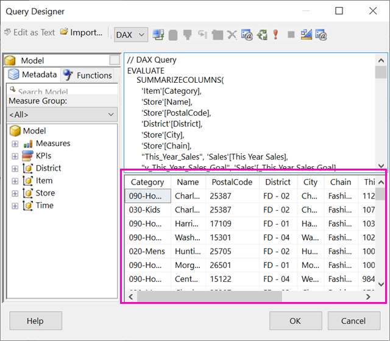

# 基于 Power BI 共享数据集创建分页报表

可以将在 Power BI Desktop 中创建的数据集用作 Power BI 报表生成器分页报表的数据源。 假设有这样一个场景：你已经在 Power BI Desktop 中创建了一个 Power BI 报表。 你花了很多时间来设计数据模型，然后创建了一个包含各种出色视觉对象的精美 Power BI 报表。 此报表中有一个包含多个行的矩阵，需要滚动页面才能查看全部内容。 报表阅览者希望打印该报表，以便显示矩阵中的所有行。 Power BI 分页报表可以实现此目的：打印分为多页的一张表或一个矩阵，并包含页眉页脚以及设计的完美页面布局。 它可进一步完善 Power BI Desktop 报表。 要想报表基于完全相同的数据且没有任何差异，需要使用同一数据集。

此数据集无需位于高级容量的工作区中，你也无需是该工作区的成员。 你只需要具备此数据集的[生成权限](../connect-data/service-datasets-build-permissions.md)。 要发布分页报表，则需要 Power BI Pro 许可证。 此外，还至少需要高级容量中工作区的参与者角色。

## 所需内容

以下是在 Power BI 报表生成器中使用共享数据集所需和不需要的事项。

- Power BI 报表生成器。 [下载并安装 Power BI 报表生成器](https://go.microsoft.com/fwlink/?linkid=2086513)。
- 要访问 Power BI 数据集，需要具有该数据集的生成权限。 请参阅[生成权限](../connect-data/service-datasets-build-permissions.md)。
- 在报表生成器中创建分页报表无需 Power BI Pro 许可证。 
- 要发布分页报表，则需要 Power BI Pro 许可证。 此外，还至少需要高级容量中工作区的参与者角色。 
- 可选：如果需要按照本文内容进行操作，请下载 Power BI Desktop [零售分析示例 .pbix](https://download.microsoft.com/download/9/6/D/96DDC2FF-2568-491D-AAFA-AFDD6F763AE3/Retail%20Analysis%20Sample%20PBIX.pbix) 文件，在 Power BI Desktop 中将其打开并添加一个包含多列的表。 在“格式”窗格中，关闭“总计”   。 然后将其发布到 Power BI 服务中的工作区。

    

## 连接到 Power BI 数据集

1. 打开 Power BI 报表生成器。
1. 选择报表生成器右上角的“登录”，登录 Power BI 帐户  。
1. 在“报表数据”窗格中，选择“新建” > “Power BI 数据集连接”   。

    

    > [!NOTE]
    > 无法通过报表生成器的表、矩阵、或图表向导为 Power BI 数据集创建数据源或数据集。 创建数据源或数据集后，可以使用这些向导基于它们来创建表、矩阵或图表。

1. 搜索或浏览到它所在的数据集或工作区，然后单击“选择”  。
    报表生成器会填充数据集名称。

    
    
1. 该数据集位于“报表数据”窗格中的“数据源”之下。

    

    请记住，可在同一个分页报表中连接到多个 Power BI 数据集和其他数据源。

## 获取数据集的 DAX 查询

如果希望 Power BI 报表和报表生成器报表中的数据相同，仅连接到数据集是不够的。 还需要基于该数据集生成的查询。

### 视频：获取 DAX 查询

在下面的视频中，Chris Finlan 演示如何获取分页报表所需的 DAX。

<iframe width="400" height="450" src="https://www.youtube.com/embed/NfoOK4QRkhI" frameborder="0" allowfullscreen></iframe>

### 获取 DAX 查询的步骤

下面是获取查询的步骤。

1. 在 Power BI Desktop 中打开 Power BI 报表 (.pbix)。
1. 请确保报表中具有一张包含分页报表中所有数据的表。 表需要满足以下两个要求：
    - 它必须是一个平面表，而不是矩阵或其他视觉对象。 如果它不是表，请立即将其转换为表，完成下面的性能分析器步骤，然后将其转换回所需的视觉对象。
    - 对于数字字段，需要使用预定义的度量值  。 它们旁边有一个计算器符号。 阅读有关[创建度量值](../transform-model/desktop-measures.md)的信息。 

        

1. 在“视图”功能区中，选择“性能分析器”   。

    

1. 在“性能分析器”窗格中，选择“开始录制”，然后选择“刷新视觉对象”    。

    

1. 展开表名称旁边的加号 (+) 并选择“复制查询”   。 此查询是 Power BI 报表生成器中数据集所需的 DAX 公式。

    

## 使用查询创建数据集

1. 返回到 Power BI 报表生成器。
1. 右键单击“数据源”下方的数据集，然后选择“添加数据集”   。

    

1. 在“数据集属性”中，为数据集命名，并选择“查询设计器”  。

4. 确保选择“DAX”，并取消选择“设计模式”图标   。

    

1. 在上方的框中，粘贴从 Power BI Desktop 中复制的查询。

1. 选择“执行查询”（红色感叹号 !），确保查询正常运行  。 

    

    查询结果如下方的框中所示。

    

1. 选择“确定”。 

    在“数据集属性”对话框的“查询”窗口中可以查看查询   。

    

1. 选择“确定”。 

    在“报表数据”窗格中，现在可以看到新数据集及其字段列表。

    

## 在报表中创建一张表

一种快速创建表的方法是使用表向导。

1. 在“插入”功能区中选择“表格” > “表向导”    。

    

1. 选择先前使用 DAX 查询创建的数据集，然后选择“下一步”  。

    

1. 若要创建平面表，请在“可用字段”中选择所需的字段  。 可以一次性选择多个字段，方法是先选择第一个所需字段，按住 Shift 键并选择最后一个所需字段。

    

1. 将字段拖动到“值”框，然后选择“下一步”   。

    

1. 选择需要的布局选项，然后选择“下一步”  。

1. 选择**完成**。
    在“设计视图”中查看表。

    

1. 选择“单击以添加标题”添加一个标题  。

1. 选择“运行”以预览报表  。

    

1. 选择“打印布局”，查看报表的打印效果  。 

    此报表布局需要一些调整。 由于列和边距使得该表宽度为两页，该报表包含 54 页。

    

## 设置报表格式

可以通过多个格式选项将该表的宽度调为一页。 

1. 可以在“属性”窗格中缩小页边距。 如果“属性”窗格未显示，请在“视图”功能区中选中“属性”复选框   。

1. 选择报表（而非表或标题）。
1. 在“报表属性”窗格的“页面”下，展开“边距”，将每个 1 更改为 0.75 英寸     。

    

1. 还可缩小列宽。 选择列边框并将其右侧向左拖动。

    

1. 另一种方法是确保为数字设置适当的格式。 选择一个包含数值的单元格。 
    > [!TIP]
    > 可以按住 Shift 键并选择其他单元格，一次性设置多个单元格的格式。

    

1. 在“开始”功能区的“数字”区域中，将“默认”格式更改为“货币”等数值格式     。

    

1. 将“占位符”样式更改为“示例值”，以便能在单元格中看到格式设置   。 

    

1. 如果合适，请在“数字”区域中减小小数位数，以便节省更多空间  。

### 删除空白页

即便边距和表列宽已经缩小，可能每隔一页仍存在一张空白页。 为什么？ 原因在于算术问题。 

将设置的页边距以及报表正文宽度相加后，值必须小于报表格式的宽度  。

例如，假设报表格式为 8.5" X 11" 且所设单侧边距为 0.75。 由于两侧边距之和为 1.5"，因此正文宽度必须小于 7"。

1. 选择并拖动报表设计图面右边缘，使其读数小于标尺上的所需数字。 

    > [!TIP]
    > 在“正文”属性中可以进行更为精确的设置  。 在“大小”下，设置“宽度”属性   。

    

1. 选择“运行”预览报表并确保已删除空白页  。 与先前的 54 页相比，该报表现在仅有 26 页。 成功!

    

## 限制和注意事项 

- 对于采用 Analysis Services 实时连接的数据集，可以使用基础 Analysis Services 连接而不是共享数据集直接进行连接。
- 虽然可用数据集列表中显示了具有提升或认证认可的数据集，但其并未被标记为可用数据集。 
- 无法在“应用拥有数据”方案中嵌入基于 Power BI 共享数据集的分页报表。

## 后续步骤

- [Power BI Premium 中的分页报表是什么？](paginated-reports-report-builder-power-bi.md)
