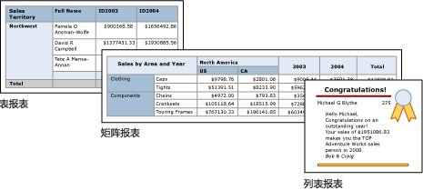

# Power BI 报表生成器中的表、矩阵和列表

[!INCLUDE [applies-to](../includes/applies-to.md)] [!INCLUDE [yes-service](../includes/yes-service.md)] [!INCLUDE [yes-paginated](../includes/yes-paginated.md)] [!INCLUDE [yes-premium](../includes/yes-premium.md)] [!INCLUDE [no-desktop](../includes/no-desktop.md)] 

在报表生成器中，表、矩阵和列表都是数据区域，它们在按行和列整理的单元格中显示分页报表数据。。 单元通常包含文本数据（如文本、日期和数字），但它们还可以包含仪表、图表或报表项（例如图像）。 表、矩阵和列表通常称为 tablix 数据区域。。  
  
 表、矩阵和列表模板是在 Tablix 数据区域的基础上建立的，Tablix 数据区域是可以在单元中显示数据的灵活的网格。 在表和矩阵模板中，单元将组织成行和列的形式。 因为模板是一般性的基础 tablix 数据区域的变体，所以，你可以结合模板格式显示数据，并且在你开发报表时更改表、矩阵或列表以便包括其他数据区域的功能。 例如，如果您添加一个表并发现它没有满足您的需要，则可以添加列组以使该表成为矩阵。  
  
 通过含入嵌套表、矩阵、列表、图表和仪表，表格和矩阵数据区域可以显示复杂的数据关系。 表和矩阵都有表格布局，其数据来自单个数据集，并且在单个数据源的基础上构建。 表和矩阵之间的主要区别在于，表只能包含行组，而矩阵可以包含行组和列组。  
  
 列表则稍有不同。 它们支持自由布局，并且可以包括多个对等表或矩阵，每个对等表或矩阵使用来自不同数据集的数据。 列表也可以用于发票之类的表单。  
  
 下图显示具有表、矩阵或列表的简单报表。  

  
##   表  
 使用表显示详细信息数据、组织行组中的数据，或者同时用于两种目的。 表模板包含三个列和一个表头行和一个数据详细信息行。 下图显示了在设计图面上选择的初始表模板：  

  
 可以按单个字段、多个字段或通过编写自己的表达式来对数据进行分组。 可以创建嵌套的组或独立的相邻组和显示分组数据的聚合值，或将合计添加到组。 例如，如果表有名为“类别”的行组，则可以为每个组添加小计以及报表的总计。 为了改进表的外观和突出显示要强调的数据，可以合并单元并将格式应用于数据和表标题。  
  
 可以在开始时隐藏详细信息数据或分组数据，并包括明细切换以使用户能够交互选择要显示的数据量。  
  
##   矩阵  
 使用矩阵显示按行和列进行分组的聚合数据汇总，类似于数据透视表或交叉表。 组的行数和列数由每个行组和列组中的唯一值的个数确定。 下图显示了在设计图面上选择的初始矩阵模板：  

 
 您可以按行组和列组中的多个字段或表达式对数据进行分组。 在运行时，当组合报表数据和数据区域时，随着为列组添加列和为行组添加行，矩阵将在页面上水平和垂直增长。 矩阵单元显示仅限于单元所属行组和列组的交集的聚合值。 例如，如果您的矩阵具有一个行组（类别）和两个显示销售额之和的列组（区域和年份），则报表中将显示两个单元，其中对于“类别”组中的每个值都显示销售额之和。 单元格的作用域是两个交集：“Category”和“Territory”的交集，以及“Category”和“Year”的交集。 矩阵可以包含嵌套组和相邻组。 嵌套组具有父-子关系，相邻组具有对等关系。 您可以添加矩阵内嵌套行组和列组的任何级别和所有级别的小计。  
  
 为使矩阵数据的外观更具可读性和突出显示要强调的数据，可以合并单元或者水平和垂直拆分，并将格式应用于数据和组标题。  
  
 您也可以包括最初隐藏详细信息数据的明细切换，然后用户便可单击该切换以根据需要显示更多或更少的详细信息。  
  
##   列表  
 使用列表创建自由格式布局。 您不受网格布局的限制，而可以在列表内自由放置字段。 可以使用列表设计用于显示多个数据集字段的表单，也可以将其用作容器以便并排显示分组数据的多个数据区域。 例如，您可以为列表定义组；添加表、图表和图像；并显示每组值的表和图形表单中的各个值，正如对雇员或病人记录所执行的操作一样。  

  
##   准备数据  
 表、矩阵和列表数据区域显示来自数据集的数据。 您可以在检索数据集数据的查询中准备数据，也可以通过设置表、矩阵或列表中的属性来准备数据。  
  
 用于检索报表数据集数据的查询语言（如 Transact-SQL）可用于准备数据，方法是使用筛选器以仅包含数据的子集，用使报表更具可读性的常量替换 NULL 值或空值，并对数据进行排序和分组。  
  
 如果您选择在报表的表、矩阵或列表数据区域中准备数据，则可以对数据区域或数据区域内的单元设置属性。 如果要筛选数据或对数据进行排序，则对数据区域设置属性。 例如，若要对数据进行排序，则可以指定要依据其进行排序的列以及排序方向。 如果要为某一字段提供可选值，您可以设置显示该字段的单元文本的值。 例如，若要在某一字段为空或 Null 时显示空白，您可以使用筛选器来设置值。  
  
##   构建和配置表、矩阵或列表  
 向报表添加表或矩阵时，可以使用表和矩阵向导手动构建，也可以从报表生成器提供的模板中手动构建。 而列表是根据列表模板手动生成的。  
  
 该向导将指导您一步步地快速生成并配置表或矩阵。 在您完成该向导或从头开始生成 Tablix 数据区域后，可以进一步配置和优化它们。 在数据区域的右键单击菜单上提供的对话框可便于您为分页符、页眉和页脚的可重复性和可见性、显示选项、筛选器和排序设置最常用的属性。 但是，Tablix 数据区域提供大量的附加属性，这些属性只能在报表生成器的“属性”窗格中设置。 例如，如果想要在表、矩阵或列表的数据集为空时显示一条消息，则在“属性”窗格的 NoRowsMessage Tablix 属性中指定消息文本。  
  
##   更改 Tablix 模板  
 您不受初始 Tablix 模板选择的限制。 添加组、总计和标签时，您可能希望修改 Tablix 设计。 例如，您可能会从表开始，然后删除详细信息行和添加列组。  
  
 通过添加任何 Tablix 功能，可以继续开发表、矩阵或列表。 Tablix 功能包括显示行和列中的分组数据的详细信息数据或聚合。 可以创建嵌套组、独立的相邻组或递归组。 可以对分组数据进行筛选和排序，并通过在组定义中包括多个组表达式来方便地组合组。  
  
 您还可以为组添加总计，或者为数据区域添加总计。 可以隐藏行或列以简化报表，并使用户能够切换显示隐藏数据，这与明细报表中相同。 

## 后续步骤

- [Power BI Premium 中的分页报表是什么？](paginated-reports-report-builder-power-bi.md)
