# 在 Power BI 中自定义视觉对象

创建或编辑 Power BI 报表时，可以使用多种不同类型的视觉对象。 这些视觉对象显示在“可视化效果”窗格中。 下载 [Power BI Desktop](https://powerbi.microsoft.com/desktop/) 或打开 [Power BI 服务](https://app.powerbi.com)时，这组视觉对象都已“预打包”。

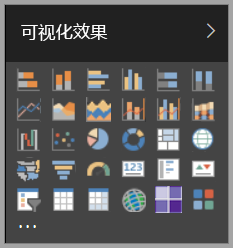

不过，并不是只能使用这组视觉对象，选择省略号可以打开其他报表视觉对象源，即自定义视觉对象。

开发人员可以使用自定义视觉对象 SDK 来创建自定义视觉对象，使得业务用户可以使用最符合业务需求的方式来查看他们的数据。 报表作者可以将自定义视觉对象文件导入报表中，并像任何其他 Power BI 视觉对象一样来使用他们。 自定义视觉对象是 Power BI 中的“一等公民”，可以对其执行筛选、突出显示、编辑和共享等操作。

自定义视觉对象可以采用 3 种部署形式：

* 自定义视觉对象文件
* 组织视觉对象
* 市场视觉对象

## 自定义视觉对象文件

自定义视觉对象是包含代码的包，这些代码用于呈现提供给它们的数据。 任何人都可以创建自定义视觉对象并将其打包为可导入 Power BI 报表的单个 `.pbiviz` 文件。

> [!WARNING]
> 自定义视觉对象可能包含存在安全或隐私风险的代码；在将其导入报表之前，请务必确认你可以信任自定义视觉对象的作者和来源。

## 组织视觉对象

Power BI 管理员可以将自定义视觉对象部署到他们的组织中，使报表作者可以轻松发现和使用管理员已批准在组织内使用的自定义视觉对象。 管理员有权限选择要在组织中部署的特定自定义视觉对象，以及设定一种简便的方法来管理（例如，更新版本、禁用/启用）此类视觉对象。 对于报表作者而言，这是一种很简单的发现组织中独特使用的视觉对象以及对这些视觉对象进行无缝更新的方法。

若要详细了解组织自定义视觉对象，可[详细了解组织视觉对象](power-bi-custom-visuals-organization.md)。

## 市场视觉对象

社区成员以及 Microsoft 已经将自定义视觉对象公开发布到 [AppSource](https://appsource.microsoft.com/marketplace/apps?product=power-bi-visuals) 市场。 可以下载这些视觉对象，并将它们添加到 Power BI 报表。 所有这些自定义视觉对象都已经过测试并通过 Microsoft 的功能和质量审核。

什么是 [AppSource](developer/office-store.md)？ 简而言之，它是可以在其中查找与 Microsoft 软件相关的应用、加载项和扩展的地方。 [AppSource](https://appsource.microsoft.com/) 为 Office 365、Azure、Dynamics 365、Cortana 和 Power BI 等产品的数百万用户提供解决方案，帮助他们更高效、更有见地或更为完美地完成工作。

### 已认证的视觉对象

Power BI 取得认证的视觉对象是指已通过额外严格质量测试的市场视觉对象，可用于其他情形，如[电子邮件订阅](https://docs.microsoft.com/power-bi/service-report-subscribe)和[导出到 PowerPoint](https://docs.microsoft.com/power-bi/service-publish-to-powerpoint)。
若要查看已认证的自定义视觉对象列表或提交你自己的自定义视觉对象，请参阅[已认证的自定义视觉对象](https://docs.microsoft.com/power-bi/power-bi-custom-visuals-certified)。

你是 Web 开发者吗？对创建自己的可视化效果，并将它们添加到 AppSource 感兴趣吗？ 请参阅[开发 Power BI 自定义视觉对象](developer/custom-visual-develop-tutorial.md)，了解如何[将自定义视觉对象发布到 AppSource](https://appsource.microsoft.com/marketplace/apps?product=power-bi-visuals)。

### 从文件导入自定义视觉对象

1. 选择“可视化效果”窗格底部的省略号。

    

2. 在下拉列表中，选择“从文件导入”。

    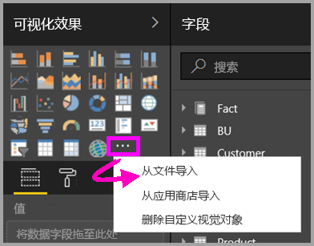

3. 从“打开文件”菜单中，选择你想要导入的 `.pbiviz` 文件，然后选择“打开”。 自定义视觉对象图标会被添加到“可视化效果”窗格底部，供用户在报表中使用。

    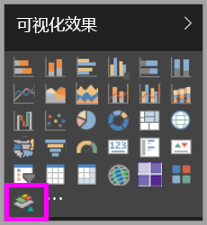

### 导入组织视觉对象

1. 选择“可视化效果”窗格底部的省略号。

    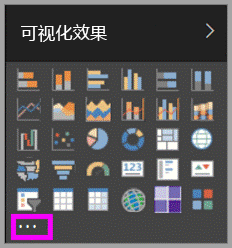

2. 在下拉列表中，选择“从市场导入”。

    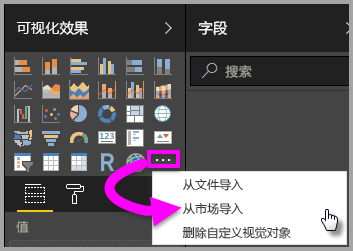

3. 从顶部的选项卡菜单中选择“我的组织”。

    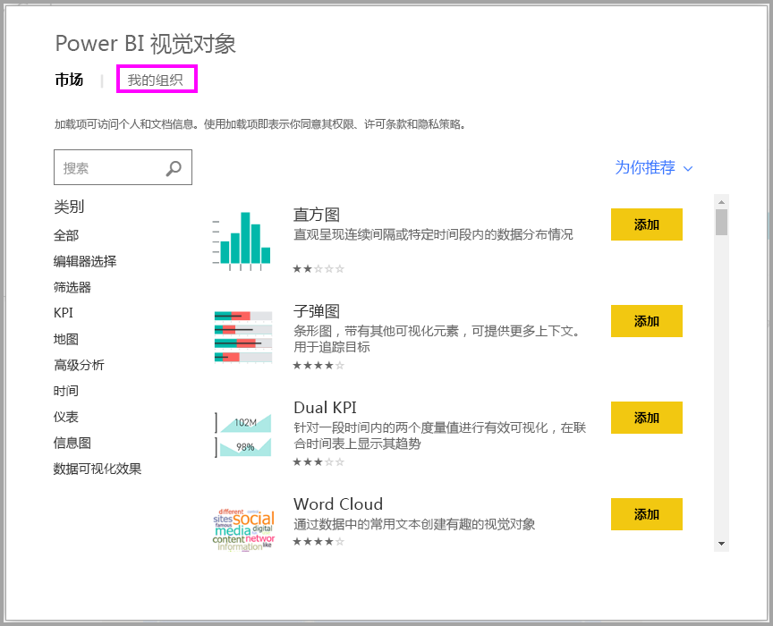

4. 滚动浏览列表，找到要导入的视觉对象。

    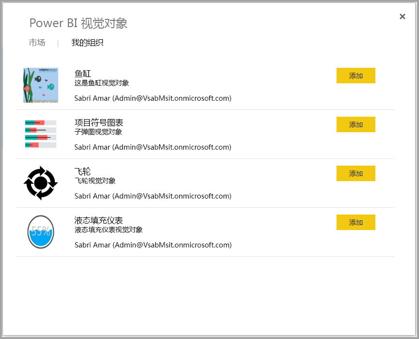

5. 选择“添加”，导入自定义视觉对象。 自定义视觉对象图标会被添加到“可视化效果”窗格底部，供用户在报表中使用。

    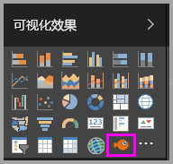

## 从 Microsoft AppSource 下载或导入自定义视觉对象

下载和导入自定义视觉对象的方法有两种，可以在 Power BI 中获取，也可以从 AppSource 网站获取。

### 在 Power BI 中导入自定义视觉对象

1. 选择“可视化效果”窗格底部的省略号。

    

2. 在下拉列表中，选择“从市场导入”。

    

3. 滚动浏览列表，找到要导入的视觉对象。

    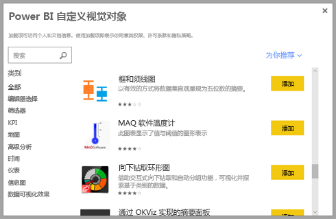

4. 若要详细了解某个视觉对象，请选中它。

    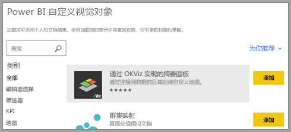

5. 在详细信息页中，可以查看屏幕截图、视频、详细说明等内容。

    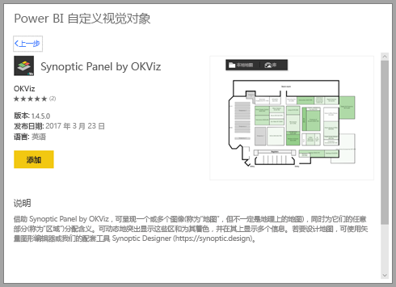

6. 滚动到底部可以查看评论。

    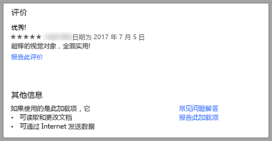

7. 选择“添加”，导入自定义视觉对象。 自定义视觉对象图标会被添加到“可视化效果”窗格底部，供用户在报表中使用。

    

### 从 Microsoft AppSource 下载和导入自定义视觉对象

1. 首先，访问 [Microsoft AppSource](https://appsource.microsoft.com)，并选择“应用”选项卡。

    

2. 转到[应用结果页](https://appsource.microsoft.com/marketplace/apps)。在此页中，可以查看每种类别的热门应用，包括 Power BI 应用。 由于要找的是自定义视觉对象，因此可以选择左侧导航列表中的“Power BI 视觉对象”，从而缩小结果范围。

    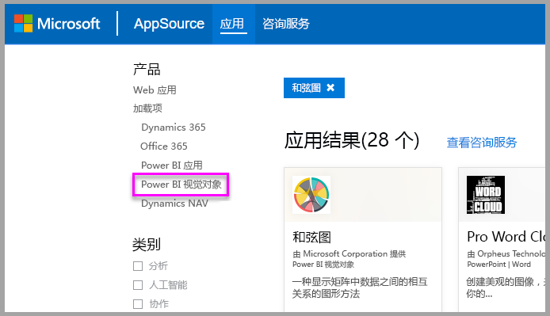

3. AppSource 会显示每个自定义视觉对象的磁贴。  每个磁贴均有自定义视觉对象的快照、简短说明和下载链接。 如需了解更多详情，请选择磁贴。

    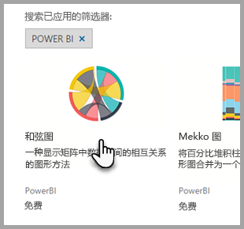

4. 在详细信息页中，可以查看屏幕截图、视频、详细说明等内容。 通过选择“立即获取”，并同意使用条款，可以下载自定义视觉对象。

    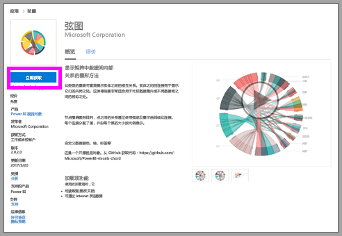

5. 单击自定义视觉对象下载链接。

    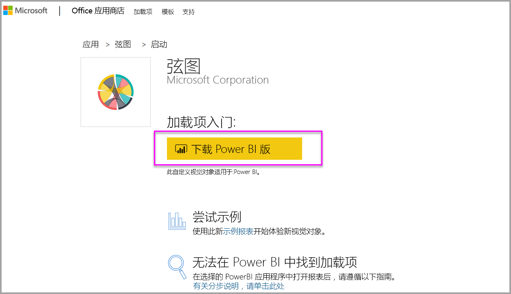

    下载页还介绍了如何将自定义视觉对象导入 Power BI Desktop 和 Power BI 服务。

    还可以下载包含自定义视觉对象并展示其功能的示例报表。

    

6. 保存“.pbiviz”文件，然后打开 Power BI。

7. 将“.pbiviz”文件导入报表（请参阅上面的[从文件导入自定义视觉对象](#import-a-custom-visuals-from-a-file)部分）

## 注意事项和限制

* 导入完成后，自定义视觉对象就已添加到特定报表中。 若要在其他报表中使用此视觉对象，还需要将它导入到相应报表。 使用“另存为”选项保存包含自定义视觉对象的报表时，自定义视觉对象的副本会与新报表一同保存。

* 如果看不到“可视化效果”窗格，表示无权编辑报表。  只能将自定义视觉对象添加到有权编辑的报表，不能添加到与自己共享的报表。

## 疑难解答

有关疑难解答的信息，请访问 [Power BI 自定义视觉对象疑难解答](power-bi-custom-visuals-troubleshoot.md)。

## 常见问题解答

有关详细信息和问题的答案，请访问[关于 Power BI 自定义视觉对象的常见问题解答](power-bi-custom-visuals-faq.md#organizational-custom-visuals)。

## 后续步骤

* [Power BI 中的可视化效果](visuals/power-bi-report-visualizations.md)

更多问题？ [尝试参与 Power BI 社区](http://community.powerbi.com/)。
