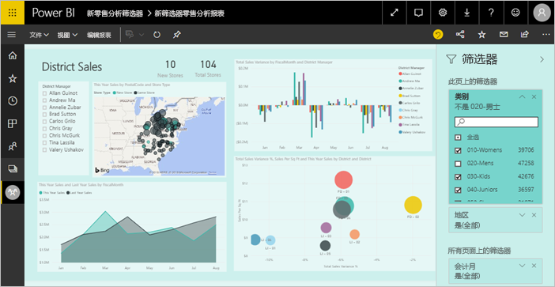
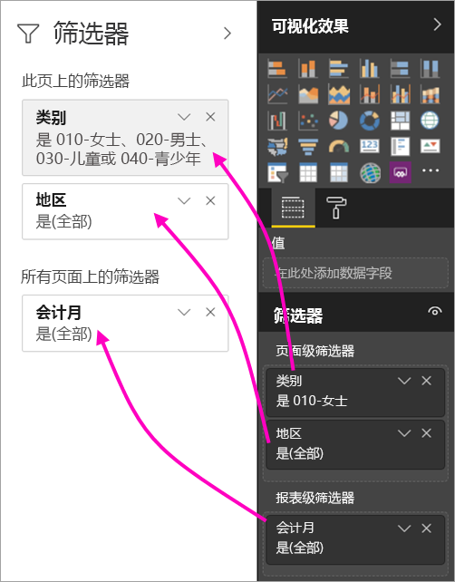
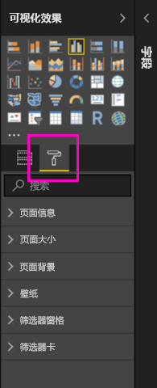
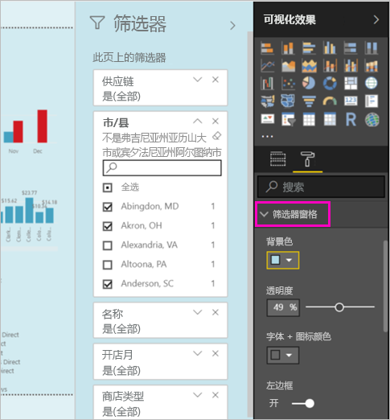
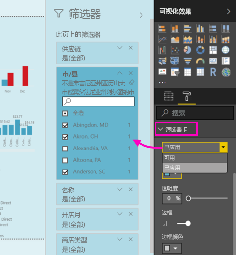
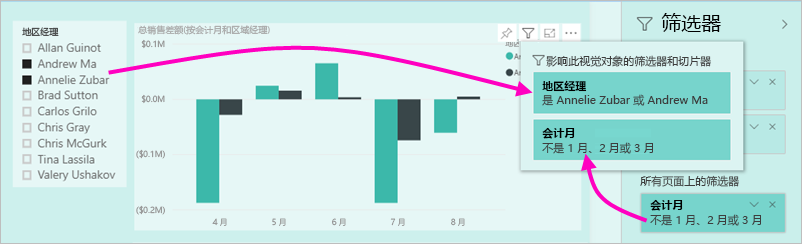

# Power BI 报表中的新筛选器体验（预览）

本文详细介绍了新的筛选器体验：Power BI 中的筛选器添加了新功能和新设计。 在 Power BI Desktop 或 Power BI 服务中设计报表时，可以使筛选器窗格的外观类似于整个报表并与其一起使用。 在新体验中，旧筛选器窗格充当筛选器编辑窗格，而新筛选器窗格是报表使用者能够看到的唯一窗格。 
 

作为报表设计器，以下是使用新筛选器可以实现的功能：

- 在视觉对象标头中显示筛选器的只读视图，以便使用者能够清楚地知道影响给定视觉对象的筛选器或切片器是什么。
- 设置筛选器窗格的格式并对其进行自定义，使其外观类似于报表的一部分。
- 定义当使用者打开报表时，筛选器窗格在默认情况下为打开状态还是折叠状态。
- 隐藏你不想让报表使用者看到的整个筛选器窗格或特定筛选器。
- 控制新筛选器窗格，甚至用书签标记其可见性、打开和折叠状态。
- 锁定你不希望使用者编辑的筛选器。

## 打开新筛选器体验 

在 Power BI Desktop 中启用新体验。 然后，可在此处或在 Power BI 服务 (https://app.powerbi.com)) 中修改筛选器。 因为这一新筛选器体验为预览功能，所以必须先在 Power BI Desktop 启用该功能。 如果先在 Power BI 服务中创建报表，则不会有新筛选器。

### 打开所有新报表的新筛选器

1. 在 Power BI Desktop 中，选择“文件” > “选项和设置” > “选项” > “预览功能”，然后选中“新筛选器体验”复选框。 
2. 重新启动 Power BI Desktop 以查看所有新报表中的新筛选器体验。

重新启动 Power BI Desktop 后，默认情况下为你创建的所有新报表启用它。  

### 打开现有报表的新筛选器

也可以启用现有报表的新筛选器。

1. 在 Power BI Desktop 的现有报表中，选择“文件” > “选项和设置” > “选项”
2. 在“报表设置”下，选择“启用更新后的筛选器窗格，并在视觉对象标头中显示此报表的筛选器”。

## 生成新筛选器窗格

启用新筛选器窗格后，将在报表页面右侧看到该窗格，在默认情况下将基于你的当前报表设置来设置其格式。 旧筛选器窗格现在充当筛选器编辑窗格。 新筛选器窗格显示在你发布报表时你的报表使用者将看到的内容。 可以在新窗格中更新现有筛选器，但使用旧筛选器窗格来配置要包含的筛选器。

1. 首先决定是否希望报表使用者看到筛选器窗格。 如果希望他们看到该窗格，请选择筛选器旁眼睛图标  。

2. 若要开始构建新筛选器窗格，请将感兴趣的字段拖动到筛选器编辑窗格作为视觉对象、页面或报表级筛选器。 将在新筛选器窗格中看到这些字段。

    

将视觉对象添加到报表画布时，Power BI 将为视觉对象中的每个字段自动添加筛选器。 Power BI 不会将这些自动筛选器添加到只读筛选器窗格。 必须选择眼睛图标才能显式添加它们。

 
## 锁定或隐藏筛选器

可以锁定或隐藏单个筛选器卡。 如果锁定某个筛选器，则报表使用者可以查看它，但不能更改它。 如果隐藏它，则报表使用者甚至无法看到它。 当你需要隐藏排除空值或意外值的数据清除筛选器时，隐藏筛选器卡很有用。 

- 在筛选器编辑窗格中，选择或清除筛选器卡中的“锁定筛选器”或“隐藏筛选器”图标。

   

在筛选器编辑窗格中打开和关闭这些设置时，将看到这些更改反映在新筛选器窗格中。 隐藏的筛选器不会显示在视觉对象的筛选器弹出窗口中。

也可以使用报表书签将筛选器窗格状态配置为流。 窗格的打开、关闭和可见性状态都可以使用书签进行标记。
 
## 设置新筛选器窗格的格式

此新体验的一个重要功能是，现在可以设置筛选器窗格的格式，以匹配你的报表的外观。 可以设置报表中的每个页面的筛选器窗格的不同格式。 以下是可以设置格式的元素： 

- 背景色
- 背景透明度
- 筛选器窗格边框打开或关闭
- 筛选器窗格边框颜色

也可以设置这些筛选器卡的元素的格式，具体取决于是否应用了这些元素（设置为某些内容）或其是否可用（清除）： 

- 背景色
- 背景透明度
- 边框：打开或关闭
- 边框颜色

### 设置筛选器窗格和筛选器卡的格式

1. 在报表中，单击报表本身或背景（墙纸），然后在“可视化效果”窗格中，选择“格式”。 
    将看到设置报表页面、墙纸以及筛选器窗格和筛选器卡的格式的选项。

        

1. 展开“筛选器窗格”以设置背景色、图标和左边框，以补充报表页。

    

1. 展开“筛选器卡”以设置“可用”的“已应用”颜色和边框。 如果将可用和已应用卡设置为不同的颜色，则可以明显地区分所应用的筛选器。 
  
    

## 在阅读模式下查看视觉对象的筛选器

在阅读模式下，可以将鼠标悬停在视觉对象上方并查看含有所有筛选器、切片器等影响该视觉对象的弹出窗口。 设置弹出窗口格式的步骤与设置筛选器窗格格式的步骤相同。 

以下是此视图显示的筛选器类型： 
- 基本筛选器
- 切片器
- 交叉突出显示 
- 交叉筛选
- 高级筛选器
- 前 N 个筛选器
- 相对日期筛选器
- 同步切片器
- 包括/排除筛选器
- 通过 URL 传递的筛选器

## 即将推出

在未来数月，我们计划添加以下改进：
- 更改筛选器卡的顺序的功能
- 适用于报表创建者的单个筛选器窗格体验 
- 更多格式设置选项

试用新筛选器体验。 向我们提供此功能的反馈以及我们如何继续改进此体验。 

## 后续步骤
[如何使用报表筛选器](consumer/end-user-report-filter.md)

[报表中的筛选器和突出显示](power-bi-reports-filters-and-highlighting.md)

[在报表的“阅读视图”中与筛选器和突出显示交互](consumer/end-user-reading-view.md)

[更改报表视觉对象相互交叉筛选和交叉突出显示的方式](consumer/end-user-interactions.md)

更多问题？ [尝试参与 Power BI 社区](http://community.powerbi.com/)

