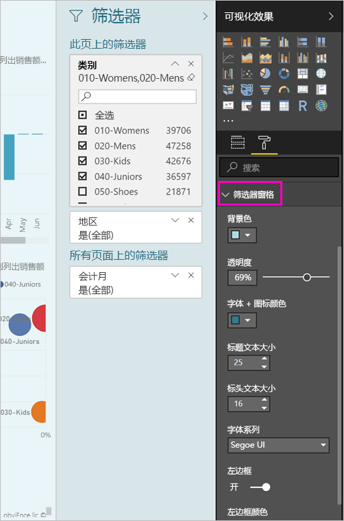
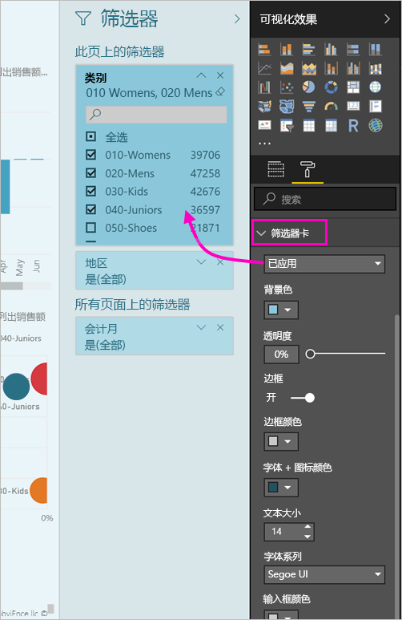

# <a name="the-new-filter-experience-in-power-bi-reports-preview"></a>Power BI 报表中的新筛选器体验（预览）

在 Power BI 中的筛选器具有新功能和新的设计。 当您选择新的筛选器体验时，可以设置格式筛选器窗格中以看起来像报表的其余部分。 可以锁定，并甚至隐藏筛选器。 在设计报表时，不再会看到旧筛选器窗格可视化效果窗格中的一切。 不要编辑和单个筛选器窗格中的格式设置所有筛选器。 


> [!NOTE]
> 新的筛选器体验处于预览状态。 新版本可能会覆盖已设置的格式。

为报表设计器中，下面是可以在新的单个筛选器窗格中执行的操作：

- 添加和删除要作为筛选依据的字段。 
- 更改筛选器状态。
- 格式化并自定义筛选器窗格中，以便它感觉您的报表的一部分。
- 定义当使用者打开报表时，筛选器窗格在默认情况下为打开状态还是折叠状态。
- 隐藏整个筛选器窗格或不希望报表使用者，若要查看的特定筛选器。
- 控制和可见性，甚至书签打开，并且折叠新筛选器窗格的状态。
- 锁定你不希望使用者编辑的筛选器。

使用新的筛选器体验，报表使用者还可以悬停任何视觉对象以查看所有筛选器或切片器会影响该视觉对象的只读列表。


## <a name="turn-on-the-new-filter-experience"></a>打开新筛选器体验 

在 Power BI Desktop 中启用新体验。 然后，可在此处或在 Power BI 服务 (https://app.powerbi.com)) 中修改筛选器。 因为这一新筛选器体验为预览功能，所以必须先在 Power BI Desktop 启用该功能。 如果先在 Power BI 服务中创建报表，则不会有新筛选器。

### <a name="turn-on-new-filters-for-all-new-reports"></a>打开所有新报表的新筛选器

1. 在 Power BI Desktop 中，选择“文件”   > “选项和设置”   > “选项”   > “预览功能”  ，然后选中“新筛选器体验”  复选框。 
2. 重新启动 Power BI Desktop 以查看所有新报表中的新筛选器体验。

重新启动 Power BI Desktop 后，默认情况下为你创建的所有新报表启用它。  

### <a name="turn-on-new-filters-for-an-existing-report"></a>打开现有报表的新筛选器

也可以启用现有报表的新筛选器。

1. 在 Power BI Desktop 的现有报表中，选择“文件”   > “选项和设置”   > “选项” 
2. 在左侧的导航栏中下,**当前文件**，选择**报告设置**。
3. 下**筛选体验**，选择**启用更新筛选器窗格中，并在该报表视觉对象标头中显示的筛选器**。

## <a name="view-filters-for-a-visual-in-reading-mode"></a>在阅读模式下查看视觉对象的筛选器

在阅读模式下，将鼠标悬停在视觉对象的筛选器图标上方，可看到一个弹出窗口，其中含有影响该视觉对象的所有筛选器、切片器等。 弹出窗口中的格式设置是相同的筛选器窗格的格式设置。 


以下是此视图显示的筛选器类型： 
- 基本筛选器
- 切片器
- 交叉突出显示 
- 交叉筛选
- 高级筛选器
- 前 N 个筛选器
- 相对日期筛选器
- 同步切片器
- 包括/排除筛选器
- 通过 URL 传递的筛选器

## <a name="build-the-new-filters-pane"></a>生成新的筛选器窗格

启用新的筛选器窗格后，你看不到报表页上，根据当前报表设置的默认值进行格式设置的右侧。 使用新的筛选器窗格配置以包括，并更新新窗格中的现有筛选器的筛选器。 新的筛选器窗格中显示哪些报表使用者将看到当您发布报表时。 

1. 默认情况下，报表使用者可以看到筛选器窗格。 如果不希望他们看到它，选择的眼睛图标旁边**筛选器**。

    

2. 若要开始构建新的筛选器窗格中，作为视觉对象，页上，将感兴趣的字段拖到新的筛选器窗格或报表级筛选器。

将视觉对象添加到报表画布，Power BI 自动将筛选器添加到视觉对象中的每个字段的筛选器窗格。 

## <a name="lock-or-hide-filters"></a>锁定或隐藏筛选器

可以锁定或隐藏单个筛选器卡。 如果锁定某个筛选器，则报表使用者可以查看它，但不能更改它。 如果隐藏它，则报表使用者甚至无法看到它。 当你需要隐藏排除空值或意外值的数据清除筛选器时，隐藏筛选器卡很有用。 

- 在新的筛选器窗格中，选中或清除**锁筛选器**或**隐藏筛选器**筛选器卡中的图标。

   

随着新的筛选器窗格中启用和禁用这些设置，会出现在报表中反映的更改。 隐藏的筛选器不会显示在视觉对象的筛选器弹出窗口中。

此外可以配置要与您的报表书签流的新筛选器窗格状态。 窗格的打开、关闭和可见性状态都可以使用书签进行标记。
 
## <a name="format-the-new-filters-pane"></a>设置新筛选器窗格的格式

此新体验的重要部分是报表的您可以设置格式的筛选器窗格，以匹配您的外观。 您可以设置不同的方式针对报表中的每个页面的筛选器窗格的格式。 以下是可以设置格式的元素： 

- 背景色
- 背景透明度
- 边框打开或关闭
- 边框颜色
- 标题和页眉的字体、 颜色和文本大小

也可以设置这些筛选器卡的元素的格式，具体取决于是否应用了这些元素（设置为某些内容）或其是否可用（清除）： 

- 背景色
- 背景透明度
- 边框：打开或关闭
- 边框颜色
- 字体、颜色和文本大小
- 输入框颜色

### <a name="format-the-filters-pane-and-cards"></a>设置格式的筛选器窗格和卡

1. 在报表中，单击报表本身或背景（墙纸  ），然后在“可视化效果”  窗格中，选择“格式”  。 
    请参阅设置格式的报表页、 墙纸、 和还筛选器窗格和筛选器卡的选项。

        

1. 展开“筛选器窗格”  以设置背景色、图标和左边框，以补充报表页。

    

1. 展开“筛选器卡”  以设置“可用”  的“已应用”  颜色和边框。 如果将可用和已应用卡设置为不同的颜色，则可以明显地区分所应用的筛选器。 
  
    

## <a name="theming-for-filter-pane"></a>筛选器窗格中的主题设置
现在可以与主题文件中修改筛选器窗格的默认设置。 下面是帮助你入门的示例主题代码段：

 
```
"outspacePane": [{ 

"backgroundColor": {"solid": {"color": "#0000ff"}}, 

"foregroundColor": {"solid": {"color": "#00ff00"}}, 

"transparency": 50, 

"titleSize": 35, 

"headerSize": 8, 

"fontFamily": "Georgia", 

"border": true, 

"borderColor": {"solid": {"color": "#ff0000"}} 

}], 

"filterCard": [ 

{ 

"$id": "Applied", 

"transparency": 0, 

"backgroundColor": {"solid": {"color": "#ff0000"}}, 

"foregroundColor": {"solid": {"color": "#45f442"}}, 

"textSize": 30, 

"fontFamily": "Arial", 

"border": true, 

"borderColor": {"solid": {"color": "#ffffff"}}, 

"inputBoxColor": {"solid": {"color": "#C8C8C8"}} 

}, 

{ 

"$id": "Available", 

"transparency": 40, 

"backgroundColor": {"solid": {"color": "#00ff00"}}, 

"foregroundColor": {"solid": {"color": "#ffffff"}}, 

"textSize": 10, 

"fontFamily": "Times New Roman", 

"border": true, 

"borderColor": {"solid": {"color": "#123456"}}, 

"inputBoxColor": {"solid": {"color": "#777777"}} 

}] 
```

## <a name="sort-the-filter-pane"></a>排序筛选器窗格

自定义排序功能是新的筛选器窗格体验的一部分。 报表创建者可以拖放筛选器，以便他们所需的顺序重新排列它们。


默认的排序顺序是按字母顺序的筛选器。 若要开始自定义排序模式下，只需将任何筛选器拖至新位置。 您只能在排序中的级别应用于-例如，视觉对象级别、 页面级别或报表级筛选器的筛选器。

## <a name="filters-pane-scaling"></a>筛选器窗格缩放

新的筛选器窗格会随着报表页和视觉对象，因此报表页和筛选器窗格中保留在与每个其他的比例。

## <a name="improved-filters-pane-accessibility"></a>改进了筛选器窗格的辅助功能

我们改进了新的筛选器窗格中的键盘导航。 可以通过筛选器窗格中的每个部分选项卡，并使用键盘或 Shift + F10 上下文键打开上下文菜单。


## <a name="rename-filters"></a>重命名筛选器
当编辑筛选器窗格时，可以双击该标题以对其进行编辑。 重命名为你想要更新筛选器卡以更有意义的最终用户的情况下很有用。 请记住重命名筛选器卡 does*不*重命名字段列表中的字段的显示名称。 它只需更改筛选器卡中使用的显示名称。


## <a name="restrict-changes-to-filter-type"></a>若要筛选器类型的更改限制

在筛选体验有一个选项来控制如果用户可以更改筛选器类型的报表设置的部分。


## <a name="next-steps"></a>后续步骤

试用新筛选器体验。 向我们提供的这项功能及如何我们继续改进它，在你的反馈[Power BI Ideas 站点](https://ideas.powerbi.com/forums/265200-power-bi)。 

- [如何使用报表筛选器](consumer/end-user-report-filter.md)
- [报表中的筛选器和突出显示](power-bi-reports-filters-and-highlighting.md)

更多问题？ [尝试参与 Power BI 社区](http://community.powerbi.com/)

