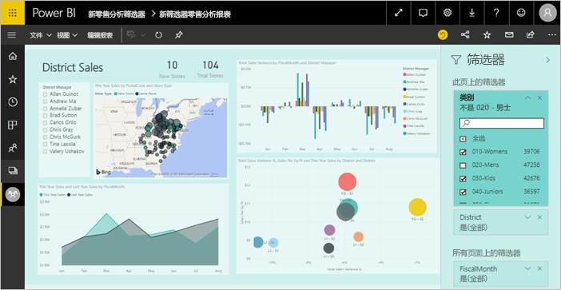
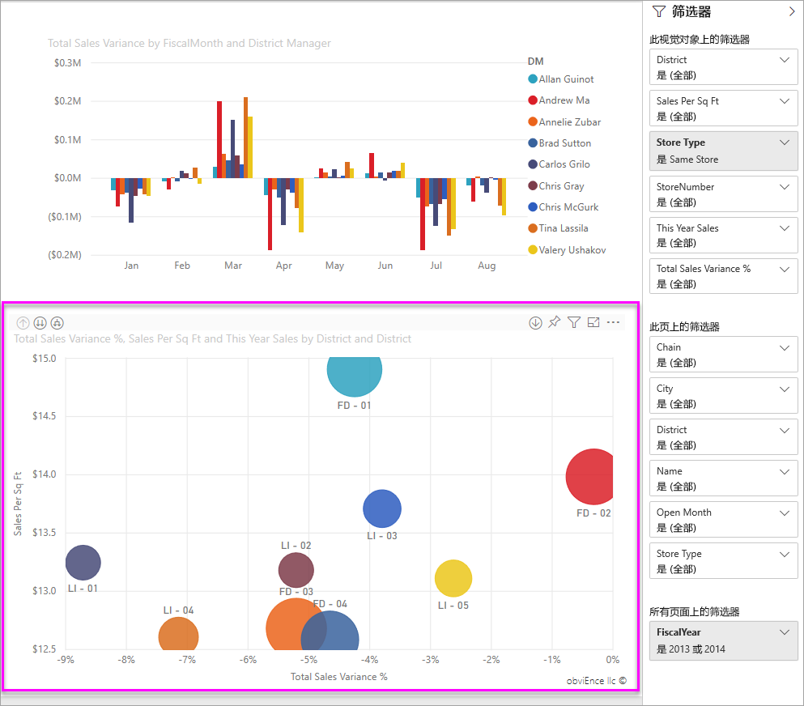
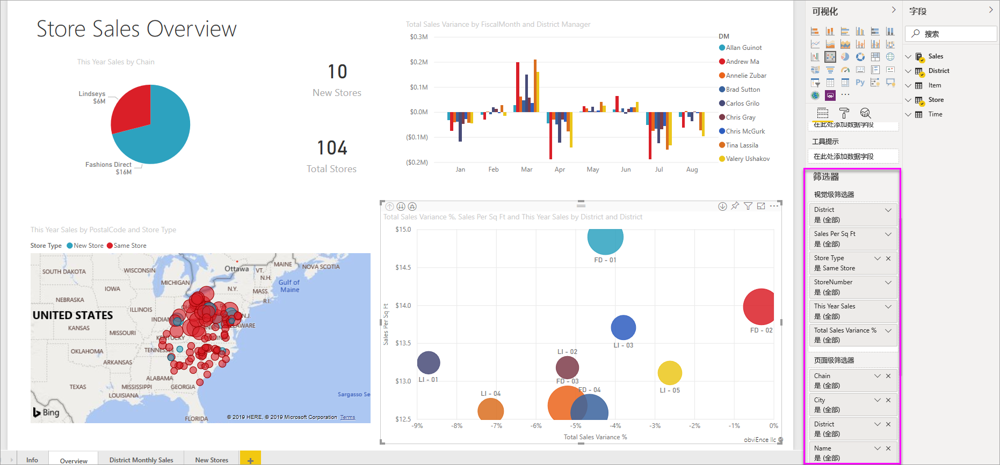

# Power BI 报表中的筛选器和突出显示
 本文介绍如何在 Power BI 服务中进行筛选和突出显示。 这与 Power BI Desktop 中的体验几乎完全相同。 *筛选器*可保留你最关切的数据，而将其他所有数据删除。 突出显示不是筛选  。 它不会删除数据，而是突出显示部分可见数据；未突出显示的数据虽然仍可见，但会变暗。

对 Power BI 中的报表进行筛选并对其突出显示有多种不同的方法。 由于在一篇文章中介绍所有这些信息会产生混淆，因此分成下面这几个部分进行介绍：

* 筛选器和突出显示的介绍（你现在正在阅读的文章）。
* 如何在 Power BI Desktop 和 Power BI 服务的报表[“编辑”视图中创建和使用筛选器](power-bi-report-add-filter.md)。 拥有报表编辑权限后，便能创建、修改和删除报表中的筛选器。
* 如何在 Power BI 服务的报表“阅读”视图中[在与你共享的报表中筛选和突出显示](consumer/end-user-interactions.md)视觉对象。 虽然这样做的限制更多，但仍有大量筛选器和突出显示选项可用。  
* 详细介绍 Power BI Desktop 和 Power BI 服务[“编辑”视图中可用的筛选和突出显示控件](power-bi-report-add-filter.md)。 本文详细介绍日期和时间、数字以及文本等筛选器的类型。 还介绍基本选项和高级选项之间的差异。
* 了解筛选器和突出显示功能的默认工作方式后，继续[了解如何更改页面上的可视化效果相互筛选和突出显示的方式](service-reports-visual-interactions.md)

**你知道吗？** Power BI 提供新的筛选器体验。 阅读有关 [Power BI 报表中的新筛选器体验](power-bi-report-filter.md)的详细信息。

## “筛选器”窗格简介

可以在“筛选器”  窗格中应用筛选器，也可以直接在报表本身中[选择切片器](visuals/power-bi-visualization-slicers.md)。 “筛选器”窗格显示报表中使用的表和字段，以及已应用的任何筛选器。 

有四种类型的筛选器。

- **页面筛选器**可应用于报表页面上的所有视觉对象     
- 视觉对象筛选器  应用于报表页上的一个视觉对象。 如果选择了报表画布上的视觉对象，只会看到视觉对象级筛选器。    
- **报表筛选器**可应用于报表中的所有页面    
- **钻取筛选器**可应用于报表中的单个实体    

可以在阅读视图或编辑视图中搜索页面级、视觉对象级和报表级筛选器，以查找并选择所需的值。 

如果筛选器旁边显示“全部”  一词，表示字段中的所有值都包含在筛选器中。  例如，下面屏幕截图中的“连锁店(全部)”  表示，此报表页包含所有连锁店的数据。  相比之下，“FiscalYear 是 2013 或 2014”  的报表级筛选器指明，报表仅包含 2013 和 2014 会计年度数据。

## 阅读视图或编辑视图中的筛选器
报表交互模式有以下两种：[阅读视图](consumer/end-user-reading-view.md)和编辑视图。 筛选功能是否可用取决于所处的模式。

* 在编辑视图中，可以添加报表级、页面级、钻取级和视觉对象级筛选器。 在你保存报表后，筛选器也随之保存，即使是在移动应用中打开它，也不例外。 如果用户在阅读视图中查看报表，可以与你添加的筛选器进行交互，但无法添加新筛选器。
* 在阅读视图中，可以与报表中的全部现有筛选器进行交互，并保存所做的选择。 不过，无法添加新筛选器。

### 阅读视图中的筛选器
如果只拥有对阅读视图中报表的访问权限，“筛选器”窗格如下所示：

所以，此报表页有 6 个页面级筛选器和 1 个报表级筛选器。

每个视觉对象都可以包含针对此视觉对象中所有字段的筛选器，并且报表作者可以添加更多筛选器。 在下图中，气泡图有 6 个筛选器。

在阅读视图中，可通过修改现有筛选器来浏览数据。 你所做的更改会随报表一起保存，即使是使用移动应用打开该报表。 了解如何[导览报表的“筛选器”窗格](consumer/end-user-report-filter.md)

筛选器在你退出报表时保存。 若要撤消筛选并恢复报表作者设置的默认筛选、切片、钻取和排序，请选择顶部菜单栏中的“重置为默认值”  。

### 编辑视图中的筛选器
如果对报表拥有所有者权限，且在编辑视图中打开报表，便会发现“筛选器”  只是多个可用编辑窗格之一。

在阅读视图中，此报表页有 6 个页面级筛选器和 1 个报表级筛选器。 选择气泡图后，便会发现它应用了 6 个视觉对象级筛选器。

在编辑视图中，可以使用筛选器和突出显示功能执行更多操作。 主要是可以添加新筛选器。 了解如何[向报表添加筛选器](power-bi-report-add-filter.md)等。

## 即席突出显示
选择视觉对象中的值或轴标签以突出显示页面上的其他视觉对象。 若要删除突出显示，则再次选择该值，或选择同一视觉对象中任意空白区域。 突出显示功能是快速浏览数据影响的有趣方式。 若要微调此类交叉突出显示的工作方式，请参阅[视觉对象交互](service-reports-visual-interactions.md)。

## 后续步骤

[Power BI 报表中的新筛选器体验](power-bi-report-filter.md)

[向报表添加筛选器（在编辑视图中）](power-bi-report-add-filter.md)

[了解报表筛选器](consumer/end-user-report-filter.md)

[更改报表视觉对象相互交叉筛选和交叉突出显示的方式](consumer/end-user-interactions.md)

更多问题？ [尝试参与 Power BI 社区](https://community.powerbi.com/)

