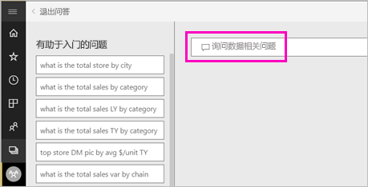
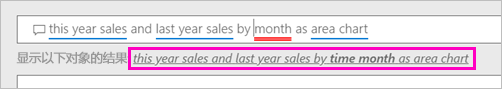

# 使用 Power BI 问答创建视觉对象

有时从你的数据中获得答案的最快方法是使用自然语言提问。  在本文中，我们介绍两种不同方式创建相同的可视化效果的： 首先，要求使用问答，问题，但第二，在报表中生成它。 我们使用 Power BI 服务来构建视觉对象在报表中，但过程几乎完全相同，使用 Power BI Desktop。

必须使用可以编辑的报表，才能跟着介绍一起操作。因此，本文将使用可用于 Power BI 的示例之一。

## 使用问答创建视觉对象

将我们如何着手创建此折线图中使用问答？

1. 在 Power BI 工作区中，选择“获取数据”  \>“示例”  \>“零售分析示例”   > “连接”  。

1. 打开零售分析示例仪表板并将光标放在问答框中，**提出你的数据有关的问题**。

    

2. 在问答框中，键入类似于此问题的内容：
   
    **本年度销售额和上年度销售额按月以分区图**
   
    当你键入问题时，Q&A 选择最佳的可视化效果显示你的回答；并且可视化效果会随着问题的修改而动态更改。 此外，问答还会通过建议、自动完成和拼写更正等功能来帮助你设置问题的格式。 问答建议小措辞更改:"本年度销售额和去年销售额*时间月*以分区图"。  

    

4. 选择要接受建议的句子。 
   
   完成键入你的问题后，结果将是您在仪表板中看到在同一个图表。
   
   

4. 要将图表固定到仪表板中，请选择固定图标  。

## 在报表编辑器中创建视觉对象

1. 重新导航到“零售分析示例”仪表板。
   
2. 仪表板"上年度销售额和本年度销售额。"包含相同的面积图磁贴  选择此磁贴。 不选择使用问答创建的磁贴 选择它会打开问答。 创建在报表中，原始的面积图磁贴，以便报表会打开包含此可视化效果的页。

    

1. 在编辑视图中打开报表，方法是选择**编辑报表**。  如果你不是报表的所有者，则无法在编辑视图中打开报表。
   
    
4. 选择此面积图，然后在**字段**窗格中检查设置。  报表创建者通过选择这三个值来生成此图表 (**去年销售额**并**本年度销售额 > 值**从**销售**表中，和**FiscalMonth**从**时间**表) 和中组织它们**轴**并**值**wells。
   
    

    您会看到他们最终得到了相同的视觉对象。 以此方式创建它并不是太复杂。 但使用问答创建却更容易 ！

## 后续步骤

- [在仪表板和报表中使用问答](power-bi-tutorial-q-and-a.md)  
- [对于使用者的问答](consumer/end-user-q-and-a.md)
- [让你的数据在 Power BI 中很好地与“问答”协作](service-prepare-data-for-q-and-a.md)

更多问题？ [尝试参与 Power BI 社区](http://community.powerbi.com/)

